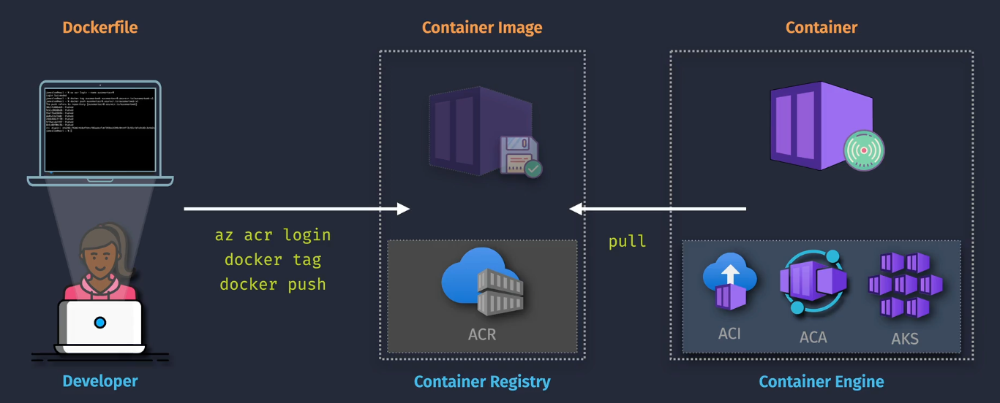

# Azure Container Registry (ACR)



## What is Azure Container Registry?

**Azure Container Registry (ACR)** is a private Docker registry service provided by Microsoft Azure. It allows you to store and manage container images and artifacts securely within your Azure environment. ACR integrates seamlessly with Azure Kubernetes Service (AKS), Azure Container Instances (ACI), and other Azure services, facilitating streamlined development and deployment workflows.

- **Private Registry:** Securely store your container images.
- **Integration:** Seamlessly integrates with Azure DevOps, GitHub Actions, and other CI/CD tools.
- **Scalability:** Supports large-scale container deployments with geo-replication and high availability.

## Key Features

- **Automated Builds:** Automatically build container images from your source code repositories.
- **Geo-Replication:** Distribute your container images across multiple Azure regions for faster access and redundancy.
- **Security:** Supports image signing and vulnerability scanning to ensure the integrity and security of your container images.
- **ACR Tasks:** Automate container image builds and deployments with customizable pipelines.
- **Webhook Support:** Trigger external processes or notifications based on registry events.
- **Integrated with Azure Active Directory (Azure AD):** Manage access using role-based access control (RBAC).

## Pricing and Plans

Azure Container Registry offers different tiers to suit various needs:

| **Tier**     | **Features**                                                    | **Approximate Monthly Cost**                   |
| ------------ | --------------------------------------------------------------- | ---------------------------------------------- |
| **Basic**    | - Suitable for development and testing<br>- Single Azure region | Starting at **\$0.167 per day** (≈ \$5/month)  |
| **Standard** | - Geo-replication<br>- Increased storage and throughput         | Starting at **\$0.550 per day** (≈ \$16/month) |
| **Premium**  | - Advanced security features<br>- Unlimited geo-replication     | Starting at **\$2.750 per day** (≈ \$82/month) |

**Factors Affecting Cost:**

- **Storage Usage:** Amount of data stored in the registry.
- **Data Transfer:** Outbound data transfers across regions.
- **Geo-Replication:** Number of replicated regions.

**Note:** Prices are approximate and can vary based on the Azure region. For precise estimates, visit the [Azure Pricing Calculator](images/https://azure.microsoft.com/pricing/calculator/).

## Building and Pushing Images Without ACR Tasks

1. Install Docker.
2. Log in to ACR using Azure CLI.
3. Build the Docker image locally.
4. Push the image to ACR.

### Step 1: Install Docker

Ensure Docker is installed on your local machine. You can download it from the [Docker website](images/https://www.docker.com/get-started).

### Step 2: Log in to ACR

Use the Azure CLI to log in to your Azure Container Registry.

```bash
az login
az acr login --name <YourACRName>
```

### Step 3: Build the Docker Image

Navigate to your project directory and build the Docker image.

```bash
docker build -t <YourACRName>.azurecr.io/<RepositoryName>:<Tag> .

docker build -t myacr.azurecr.io/myapp:v1 .
```

### Step 4: Push the Image to ACR

Push the built image to your Azure Container Registry.

```bash
docker push <YourACRName>.azurecr.io/<RepositoryName>:<Tag>

docker push myacr.azurecr.io/myapp:v1
```

## Building and Pushing Images With ACR Tasks

1. Install Azure CLI and log in.
2. Create an ACR Task linked to your source repository.
3. Configure triggers for automatic builds.
4. Run the task manually or automatically based on triggers.
5. Verify the built image in ACR.

### Step 1: Install Azure CLI

Ensure you have the [Azure CLI](images/https://docs.microsoft.com/cli/azure/install-azure-cli) installed on your machine.

### Step 2: Log in to Azure

```bash
az login
```

### Step 3: Create an ACR Task

Use the Azure CLI to create a task that builds and pushes your container image whenever there is a commit to your source repository.

```bash
az acr task create \
  --registry <YourACRName> \
  --name <TaskName> \
  --image <RepositoryName>:{{.Run.ID}} \
  --context <RepositoryURL> \
  --file <DockerfilePath> \
  --git-access-token <YourGitAccessToken>
```

**Parameters:**

- `<YourACRName>`: Your Azure Container Registry name.
- `<TaskName>`: A name for your ACR Task.
- `<RepositoryName>`: Name of your container repository.
- `<RepositoryURL>`: URL of your source code repository (e.g., GitHub).
- `<DockerfilePath>`: Path to your Dockerfile in the repository.
- `<YourGitAccessToken>`: Personal access token for your Git repository.

**Example:**

```bash
az acr task create \
  --registry myacr \
  --name myapp-task \
  --image myapp:{{.Run.ID}} \
  --context https://github.com/username/myapp.git \
  --file Dockerfile \
  --git-access-token ghp_XXXXXXXXXXXXXXXXXXXX
```

### Step 4: Run the ACR Task

Trigger the task manually or set up automatic triggers based on repository events.

**Manual Trigger:**

```bash
az acr task run --registry <YourACRName> --name <TaskName>

az acr task run --registry myacr --name myapp-task
```

**Automatic Triggers:**

You can configure the task to automatically trigger on code commits or on a schedule by specifying additional parameters during task creation.

### Step 5: Verify the Image in ACR

List the images in your registry to verify that the image has been built and pushed successfully.

```bash
az acr repository list --name <YourACRName> --output table

az acr repository list --name myacr --output table
```
