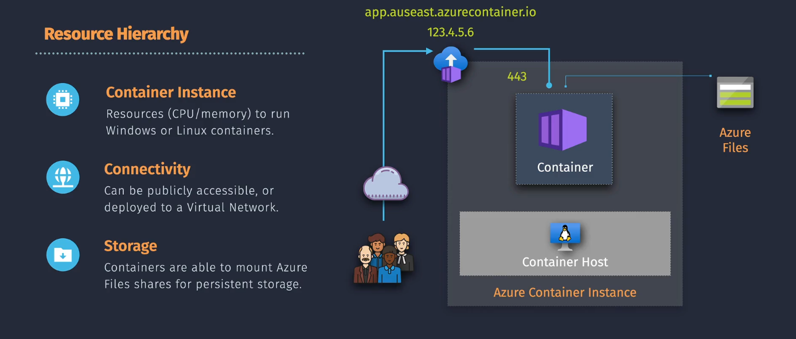
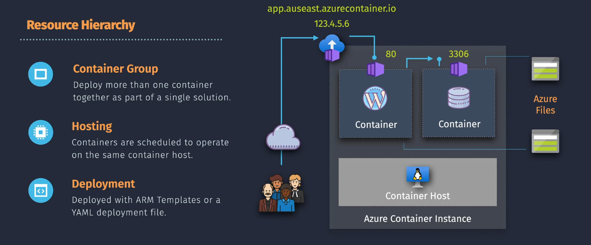

# 🚀 **Azure Container Instances (ACI)**

## 📖 **What is ACI?**

**Azure Container Instances (ACI)** is a serverless container service that allows you to run containers on-demand without managing the underlying infrastructure. It's ideal for scenarios where you need to quickly deploy containers without the overhead of managing virtual machines or orchestration platforms.

- Run containers **without managing VMs** or clusters (no Kubernetes overhead).
- Pay only for **CPU + memory usage per second** ⏱️.
- Super fast startup — ideal for short-lived jobs or event-driven workloads.

---

## 🗝️ **Key Features**

- **Serverless containers** → Azure runs your image, you don’t manage infra.
- **Linux & Windows containers** supported.
- **Custom sizes** → up to 4 vCPUs and 16 GB RAM.
- **Networking**:

  - Public IP → exposed to internet
  - VNET integration → secure internal apps

- **Storage** → mount **Azure File Shares** for persistence.
- **Scaling** → manual (not auto like AKS).
- **Billing** → per second, based on CPU + memory.

---

## 💭 **Common Use Cases**

- ✅ Run batch jobs (image processing, ETL, ML preprocessing).
- ✅ Event-driven workloads (trigger ACI when a blob is uploaded).
- ✅ API backend or microservices (if lightweight).
- ✅ Test environments (spin up quickly, tear down when done).
- ✅ Proof-of-concepts (no infra setup headache).

---

## 💰 Pricing and Plans

ACI charges based on the resources you allocate and the duration they run.

| **Resource**   | **Unit**                | **Approximate Cost**                   |
| -------------- | ----------------------- | -------------------------------------- |
| **CPU**        | Per vCPU per second     | **\$0.000016** per vCPU-second         |
| **Memory**     | Per GB per second       | **\$0.000004** per GB-second           |
| **Storage**    | Per GB per month        | **\$0.06** per GB-month (Standard HDD) |
| **Networking** | Per GB of outbound data | **\$0.087** per GB                     |

✍🏻 **Example:**

Running a container with 2 vCPUs and 4 GB memory for 24 hours:

- **CPU Cost:** 2 vCPUs × 24 × 3600 seconds × $0.000016 = **$2.7648\*\*
- **Memory Cost:** 4 GB × 24 × 3600 seconds × $0.000004 = **$1.3824\*\*
- **Total Cost:** Approximately **\$4.1472** (excluding storage and networking)

> 💡 **Note:** Prices are approximate and can vary based on the Azure region. For precise estimates, visit the [Azure Pricing Calculator](images/https://azure.microsoft.com/pricing/calculator/).  
> 💡 **Factors Affecting Cost:**
>
> - **Resource Allocation:** Number of vCPUs and amount of memory allocated.
> - **Runtime Duration:** Total time containers are running.
> - **Data Transfer:** Amount of outbound data transferred.

---

## 🎭 **Container Instance Model Types**

### 🧍🏻 **Single Container Instance**

- **Description:** Run individual containers independently, ideal for isolated tasks or simple applications.
- **Benefits:** Minimal setup, quick deployment, and cost-effective for short-lived containers.

<div align="left">
  
</div>

✍🏻 **Example: Deploying a Simple Web Server:**

1. **Run a Docker Container:**

   ```bash
   az container create \
     --resource-group myResourceGroup \
     --name mycontainer \
     --image nginx \
     --cpu 1 \
     --memory 1.5 \
     --port 80 \
     --ip-address public
   ```

2. **Access the Web Server:**

   After deployment, retrieve the public IP address and navigate to it in your browser to see the Nginx welcome page.

---

### 👯‍♂️ **Group Container Instances**

- **Description:** Run multiple containers together in a group, sharing resources and networking.
- **Benefits:** Enables multi-container applications, such as a web server and a database running side by side.
- **Limits:** maximum number of containers you can have in a single container group are 5

<div align="left">
  
</div>

✍🏻 **Example: Deploying a Multi-Container Application:**

1. **Create a YAML Configuration File (`container-group.yaml`):**

   ```yaml
   apiVersion: 2018-10-01
   location: eastus
   name: mycontainergroup
   properties:
     containers:
       - name: webapp
         properties:
           image: nginx
           resources:
             requests:
               cpu: 1
               memoryInGB: 1.5
           ports:
             - port: 80
       - name: backend
         properties:
           image: busybox
           command: ["sh", "-c", "echo Hello from backend && sleep 3600"]
           resources:
             requests:
               cpu: 0.5
               memoryInGB: 1
     osType: Linux
     ipAddress:
       type: Public
       ports:
         - protocol: TCP
           port: 80
   ```

2. **Deploy the Container Group:**

   ```bash
   az container create --resource-group myResourceGroup --file container-group.yaml
   ```

3. **Access the Web Application:**

   Retrieve the public IP address and navigate to it in your browser to access the Nginx web server. The backend container runs alongside the web server, handling backend processes.

## ✍🏻 Deploying ACI (Hands-On Demo)

### 🔹 Step 1: Pull a container image

You can use **Docker Hub** or **Azure Container Registry (ACR)**. Example: `mcr.microsoft.com/azuredocs/aci-helloworld`.

### 🔹 Step 2: Deploy with Azure CLI

```bash
# Variables
RG=myResourceGroup
ACR_NAME=myregistry
ACI_NAME=myaci

# Create resource group
az group create --name $RG --location eastus

# Deploy container instance
az container create \
  --resource-group $RG \
  --name $ACI_NAME \
  --image mcr.microsoft.com/azuredocs/aci-helloworld \
  --cpu 1 --memory 1 \
  --ports 80
```

👉 This runs a simple web app inside ACI with **1 vCPU, 1 GB RAM**, exposed on port 80.

---

### 🔹 Step 3: Get the public IP

```bash
az container show -g $RG -n $ACI_NAME \
  --query ipAddress.fqdn -o tsv
```

🌍 Paste the IP/URL in your browser → you’ll see the demo app running.

---

### 🔹 Step 4: Secure with ACR (private images)

If your image is in **Azure Container Registry**:

```bash
az container create \
  --resource-group $RG \
  --name myprivateaci \
  --image myregistry.azurecr.io/myimage:v1 \
  --cpu 2 --memory 4 \
  --registry-login-server myregistry.azurecr.io \
  --registry-username <acr-username> \
  --registry-password <acr-password>
```

💡 Better: Use **Managed Identity** so you don’t store secrets.

---

## 🎯 Summary

- **ACI = serverless containers** (no infra mgmt).
- **Best for short-lived, bursty, or dev/test workloads**.
- **Deploy in seconds** using CLI, Portal, or ARM templates.
- **Cheaper & faster** than VMs, but less control than AKS.
