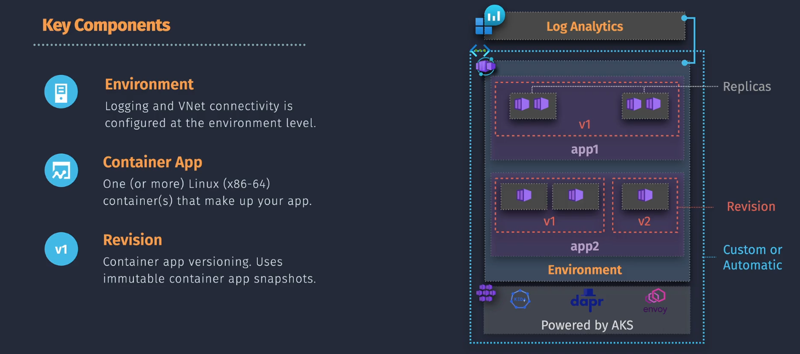
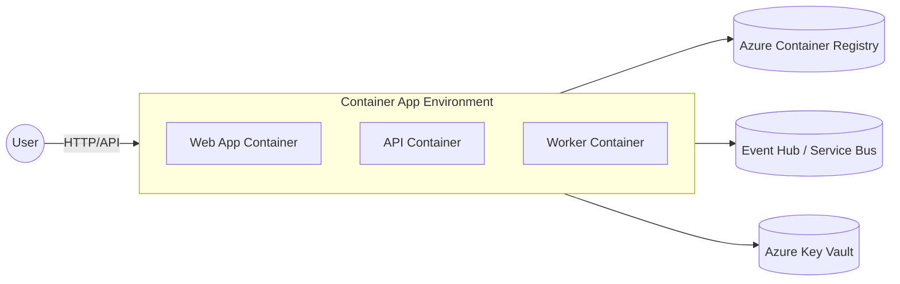

# 🐳 Azure Container Apps (ACA) – Explained

## 📖 What is ACA?

Azure Container Apps is a **serverless container platform** for running microservices, APIs, background jobs, or event-driven workloads **without managing Kubernetes directly**.

Think of it as:

- **ACI** = single container/group, simple workloads.
- **AKS (Kubernetes Service)** = full Kubernetes cluster, max control but complex.
- **ACA** = sweet spot in the middle 🏖️ → serverless, but with **Kubernetes features under the hood**.

---



---

## ✨ Key Features

- **Serverless scaling**:

  - Scale **to zero** (no requests → no cost).
  - Auto-scale based on **HTTP requests, CPU, memory, or even events** (KEDA integration).

- **Multiple revisions (blue/green)**:

  - Deploy multiple versions of the same app → split traffic 50/50 or 90/10.

- **Microservice friendly**:

  - Supports **Dapr (Distributed Application Runtime)** → service-to-service calls, pub/sub, secrets, state.

- **Networking options**:

  - Public endpoint, internal only, or VNET integrated.

- **Secrets and Config**:

  - Inject secrets via Azure Key Vault or directly from Container App environment.

---

## 🏗️ ACA Architecture (High-Level)

🔹 **Environment** = a secure boundary where your Container Apps live.  
🔹 Inside, you can run **multiple Container Apps** (like namespaces in Kubernetes).  
🔹 Each app can have **revisions** (versions).  
🔹 Scaling & secrets are managed for you.

---



---

## ⚡ ACA vs ACI

| Feature                | ACI 🐣                        | ACA 🚀                                  |
| ---------------------- | ----------------------------- | --------------------------------------- |
| Purpose                | Simple, single-container jobs | Long-running microservices & APIs       |
| Scaling                | Manual or fixed               | Autoscale (incl. scale-to-zero)         |
| Networking             | Public IP, basic DNS          | Ingress controller, VNET, internal-only |
| Secrets                | Env vars                      | Env vars + Key Vault integration        |
| Revisions / Blue-Green | ❌                            | ✅                                      |
| Event-driven (KEDA)    | ❌                            | ✅                                      |
| Dapr microservices     | ❌                            | ✅                                      |

---

## 🛠️ Hands-On: Deploy a Simple ACA

### 1️⃣ Create Resource Group

```bash
RG=rg-aca-demo
LOC=eastus
az group create -n $RG -l $LOC
```

### 2️⃣ Create ACA Environment

```bash
az containerapp env create \
  -n aca-env-demo \
  -g $RG \
  --location $LOC
```

### 3️⃣ Deploy Container App (Public Hello World)

```bash
az containerapp create \
  -n aca-hello \
  -g $RG \
  --environment aca-env-demo \
  --image mcr.microsoft.com/azuredocs/containerapps-helloworld:latest \
  --target-port 80 \
  --ingress 'external' \
  --min-replicas 0 \
  --max-replicas 5
```

### 4️⃣ Get URL

```bash
az containerapp show -n aca-hello -g $RG --query properties.configuration.ingress.fqdn -o tsv
```

Open in browser 🎉.

---

## 📦 CI/CD with ACA

- Push image to **ACR** or **DockerHub**.
- Deploy with `az containerapp update --image <your-registry>/<image>:tag`.
- Or integrate with **GitHub Actions** / **Azure DevOps pipelines**.

---

## 💡 When to use ACA?

- ✅ Build **APIs / web apps** without Kubernetes overhead
- ✅ Run **event-driven workers** that scale on Service Bus, Event Hub, or Queue messages
- ✅ Deploy **microservices** with Dapr service-to-service comms
- ✅ Use **blue/green rollouts** safely

- ❌ If you need **full Kubernetes control** → use AKS.
- ❌ If it’s just a quick one-off container → ACI is simpler.

---

## 💰 Pricing and Plans

ACA offers a serverless pricing model, charging based on the resources consumed during execution.

| **Resource**           | **Unit**                 | **Approximate Cost**            |
| ---------------------- | ------------------------ | ------------------------------- |
| **vCPU**               | Per vCPU-second          | **\$0.000013** per vCPU-second  |
| **Memory**             | Per GB-second            | **\$0.0000018** per GB-second   |
| **Environment**        | Per instance per hour    | **\$0.20** per environment-hour |
| **Ingress and Egress** | Per GB of data processed | **\$0.087** per GB              |

✍🏻 **Example:**

Running a container app with 1 vCPU and 2 GB memory for 1,000 seconds:

- **CPU Cost:** 1 vCPU × 1,000 seconds × $0.000013 = **$0.013\*\*
- **Memory Cost:** 2 GB × 1,000 seconds × $0.0000018 = **$0.0036\*\*
- **Total Cost:** Approximately **\$0.0166** (excluding environment and networking costs)

📌 **Factors Affecting Cost:**

- **Resource Consumption:** Number of vCPUs and amount of memory used during execution.
- **Execution Time:** Duration of container execution.
- **Data Transfer:** Amount of data processed and transferred.

📒 **Note:** Prices are approximate and can vary based on the Azure region. For precise estimates, visit the [Azure Pricing Calculator](images/https://azure.microsoft.com/pricing/calculator/).
