# 🔐 Authentication & Authorization in Azure Container Apps

Think of ACA as having two planes of security:

1. **Control plane identity** → how the **apps themselves** pull images, talk to Key Vault, Storage, etc. (Managed Identity, SPN, ACR tokens).

   > This is infra-level identity (auth _outbound_ from your app).

2. **Data plane identity** → how **end users** authenticate when hitting your app’s HTTP endpoint.

   > This is inbound auth — ACA acts as an **identity-aware ingress gateway**.

We’re talking about **#2 here**: **end-user authn/authz**.

---

## 🧩 The ACA AuthN/AuthZ Pipeline

When you enable authentication on a container app, ACA inserts a **built-in Envoy-based gateway** in front of your app:

```mermaid
flowchart LR
  Client[🌍 User / Client App] -->|HTTP| ACAIngress[🔐 ACA Ingress Gateway]
  ACAIngress -->|validated JWT/claims| App[📦 Your Container]
```



🔹 All traffic goes through the **ACA Ingress Gateway**.  
🔹 It integrates with **identity providers** (IdPs).  
🔹 If auth is **required**, users must log in via an IdP → ACA validates → passes tokens & claims as **headers** to your container.

Your app doesn’t need an auth library unless you want to **parse claims** deeper.

---

## 🔑 Supported Identity Providers

ACA supports common OpenID Connect (OIDC) providers:

- **Microsoft Entra ID (Azure AD)** (most used in enterprise)
- **GitHub**
- **Twitter**
- **Facebook**
- **Google**
- **Apple**
- **Any custom OIDC provider** (bring your own)

> You can enable **multiple providers** for one app (e.g., allow both AAD and GitHub users).

---

## ⚙️ Config Modes

There are 2 key knobs:

1. **Login requirement**

   - `requireAuthentication: true` → unauthenticated requests are blocked until user logs in.
   - `requireAuthentication: false` → users can hit anonymously, but if they provide a valid JWT, ACA still validates and passes claims.

2. **Forwarding token/claims**

   - ACA injects headers like:

     - `X-MS-CLIENT-PRINCIPAL-NAME`
     - `X-MS-CLIENT-PRINCIPAL-ID`
     - `X-MS-TOKEN-AAD-ID-TOKEN` (or provider-specific access tokens)

   - Your container can read them like normal HTTP headers.

---

## 🧭 Example: Enable Entra ID (AAD) Login

<div align="center">
  
</div>

### Step 1: Create an App Registration

```bash
az ad app create --display-name "aca-demo-auth"
APP_ID=$(az ad app list --display-name aca-demo-auth --query "[0].appId" -o tsv)
```

Redirect URI must point to your ACA FQDN (e.g., `https://myapp.gray-hill-123456.eastus.azurecontainerapps.io`).

---

### Step 2: Enable ACA Auth

```bash
az containerapp auth microsoft update \
  --name myapp \
  --resource-group myrg \
  --client-id $APP_ID \
  --issuer https://login.microsoftonline.com/<tenant-id>/v2.0 \
  --allowed-token-audiences $APP_ID \
  --enable-auth true \
  --require-auth true
```

---

### Step 3: What happens now

- A user hits `https://myapp.azurecontainerapps.io`.
- ACA redirects them to the **AAD login page**.
- After login, ACA validates the token.
- Your app receives claims in headers:

```http
GET / HTTP/1.1
Host: myapp.azurecontainerapps.io
X-MS-CLIENT-PRINCIPAL-NAME: alice@contoso.com
X-MS-CLIENT-PRINCIPAL-ID: 72f988bf-86f1-41af-91ab-2d7cd011db47
X-MS-TOKEN-AAD-ID-TOKEN: eyJ0eXAiOiJKV1Qi...
```

Your app doesn’t need to handle OIDC dance—ACA offloads it.

---

## 🧮 Authorization

There’s **two layers** of authz:

1. **Coarse-grained (gateway enforced):**

   - ACA can allow/block requests entirely if no valid JWT.
   - You can also configure provider-specific settings (e.g., only org members in GitHub).

2. **Fine-grained (app enforced):**

   - Your app reads claims (e.g., groups, roles, email).
   - Example: only allow `role=Admin` to call `/admin`.

Example in Node.js:

```js
app.get("/admin", (req, res) => {
  const user = req.headers["x-ms-client-principal-name"];
  const roles = JSON.parse(Buffer.from(req.headers["x-ms-client-principal"], "base64").toString())
    .claims.filter((c) => c.typ === "roles")
    .map((c) => c.val);

  if (!roles.includes("Admin")) {
    return res.status(403).send("Forbidden");
  }
  res.send(`Welcome admin ${user}!`);
});
```

---

## 🔄 Advanced Scenarios

- **Multiple providers** → enable both GitHub and AAD, app decides per endpoint who can access.
- **Bring your own OIDC** → integrate with Auth0, Okta, or internal IdP.
- **Token forwarding** → ACA can forward refresh tokens so your app can call downstream APIs on behalf of user.
- **Per-revision config** → auth settings are revision-specific (blue/green can change login requirements).

---

## 🧠 Key Takeaways

- **AuthN** = ACA validates inbound requests via OIDC (no library in your code required).
- **AuthZ** = coarse-grained (block unauthenticated) + fine-grained (check claims in your app).
- ACA = **built-in Identity-Aware Proxy** (like GCP IAP, AWS Cognito integration).
- Your app focuses on **business logic**, ACA handles **token validation + login redirects**.
