# 🔄 Managing Revisions in Azure Container Apps

## 📖 1. What is a Revision?

- In ACA, **every update to your app configuration** (container image, env vars, secrets, scaling rules, etc.) creates a **new immutable revision**.
- A revision is essentially:

  - **Snapshot of configuration** (like a ReplicaSet template in K8s).
  - **Unique endpoint** (with a stable FQDN, e.g. `myapp--rev1.myenv.azurecontainerapps.io`).
  - **Traffic routing rules** attached to it.

👉 This makes ACA behave like a **serverless deployment engine** with **built-in blue/green + canary** features.

---

## ⚙️ 2. Revision Modes

ACA has **two modes** for managing revisions:

### 🔹 _Single Revision Mode_

- Only **one revision is active** at a time.
- New deployments replace the old one.
- Best for **non-production** or when you don’t need A/B traffic.

```bash
az containerapp update -g $RG -n myapp --revision-mode Single
```

### 🔹 _Multiple Revision Mode_

- Multiple revisions can be active **at the same time**.
- You can split traffic between them (e.g. 90% → v2, 10% → v3).
- Perfect for **canary releases, A/B testing, gradual rollouts**.

```bash
az containerapp update -g $RG -n myapp --revision-mode Multiple
```

---

## 🔍 3. Working with Revisions

### List revisions

```bash
az containerapp revision list -g $RG -n myapp -o table
```

Example output:

```ini
Name                   Active  Traffic Weight  Created
---------------------  ------  ---------------  -------------------
myapp--7zq8q           True    80%              2025-09-23T10:22Z
myapp--x4d2k           True    20%              2025-09-24T11:55Z
myapp--1n5kf           False   0%               2025-09-20T08:10Z
```

---

### Activate/deactivate a revision

```bash
# Deactivate a revision (no traffic, scaled to 0)
az containerapp revision deactivate -g $RG -n myapp --revision myapp--1n5kf

# Reactivate it later
az containerapp revision activate -g $RG -n myapp --revision myapp--1n5kf
```

---

### Set traffic split

```bash
# Send 80% to new rev, 20% to old rev
az containerapp ingress traffic set -g $RG -n myapp \
  --revision-weight myapp--7zq8q=80 myapp--x4d2k=20
```

Now:

- `https://myapp.myenv.azurecontainerapps.io` → split traffic
- `https://myapp--x4d2k.myenv.azurecontainerapps.io` → direct access to revision

---

### Roll back to a previous revision

Rollback is just **activating + rerouting traffic**:

```bash
az containerapp ingress traffic set -g $RG -n myapp \
  --revision-weight myapp--oldrev=100
```

No rebuild needed 🚀

---

## 📐 4. Diagram (ACA Revision Flow)

```mermaid
flowchart LR
    User["🌍 User Request"] --> Ingress["Ingress (FQDN)"]
    Ingress -->|80%| Rev1["Revision A (v1)"]
    Ingress -->|20%| Rev2["Revision B (v2)"]
    Rev1 --> Pods1["App Pods"]
    Rev2 --> Pods2["App Pods"]
```



- Each **revision** is immutable.
- ACA ingress splits traffic **per weights**.
- You can hit revision-specific FQDNs for testing.

---

## 🎛️ 5. Common Use Cases

1. **Blue/Green Deployment**

   - Deploy new revision, test with **direct FQDN**.
   - When ready, reroute **100% traffic**.

2. **Canary Release**

   - Send 5% → new revision.
   - Monitor logs/metrics (Dapr, App Insights, Log Analytics).
   - Gradually increase to 100%.

3. **Quick Rollback**

   - If new revision is buggy, instantly send all traffic back to previous revision.

4. **A/B Testing**

   - Keep multiple revisions running.
   - Permanently split traffic (e.g. 50/50).
   - Compare metrics.

---

## 🧠 6. Things to Keep in Mind

- **Revisions scale independently** (based on their autoscaling rules).
- **Inactive revisions** scale to 0 → no billing for compute.
- You can **label revisions** with friendly names (`--revision-suffix v1`).
- By default, ACA keeps **100 revisions** (older ones can be garbage-collected).
- Each revision has **its own logs/metrics** in Log Analytics.

---

## ⚡ 7. Example: Canary Rollout in Practice

```bash
# Deploy new image → creates new revision
az containerapp update -g $RG -n myapp --image myacr.azurecr.io/webapp:v2

# Route 10% traffic to it
az containerapp ingress traffic set -g $RG -n myapp \
  --revision-weight myapp--rev1=90 myapp--rev2=10

# Monitor logs
az containerapp logs show -g $RG -n myapp --revision myapp--rev2 --follow
```

If logs/metrics are healthy:

```bash
# Shift 100% to v2
az containerapp ingress traffic set -g $RG -n myapp \
  --revision-weight myapp--rev2=100
```

---

## ✅ **Summary for a K8s expert**:

ACA revisions are **ReplicaSet-like immutable snapshots** with **built-in ingress traffic routing**. Instead of building your own canary/blue-green via Istio/NGINX, ACA gives you **first-class revision management**, traffic splitting, and instant rollback with **zero YAML gymnastics**.
