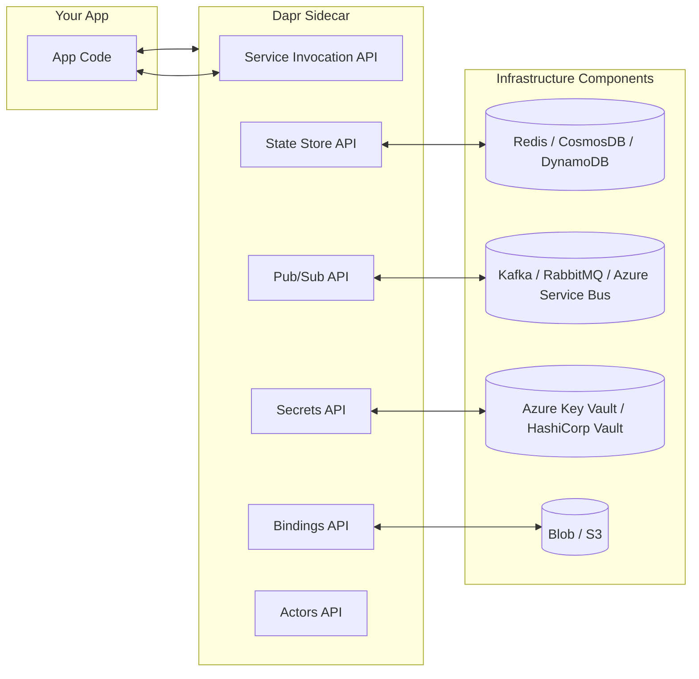

# ⚡ Dapr — Distributed Application Runtime

## 🧩 What is Dapr?

> **Definition (official):** > _Dapr is a portable, event-driven runtime that makes it easier for developers to build resilient, microservice-based applications._

Think of Dapr as a **sidecar runtime** that gives your app **batteries included** for common distributed system challenges:

- Service-to-service communication
- Pub/Sub messaging
- State management
- Secrets management
- Bindings to external systems
- Actors (virtual actors pattern)

👉 Instead of rewriting plumbing code, you talk to Dapr **over HTTP/gRPC** (localhost). Dapr handles the heavy lifting.

---

## 🎯 Why Dapr?

Building microservices = pain:

- 🔌 Connecting services securely (HTTP/gRPC, retries, discovery, mTLS)
- 💾 Persisting state across containers
- 🔑 Storing secrets safely
- 📨 Event-driven async workflows
- 🔄 Vendor lock-in if you code against cloud-specific SDKs

**Dapr solves this** by providing **building blocks** (APIs) that abstract away infra vendors.

---

## 🏗️ Dapr Architecture



- Each app container runs with a **Dapr sidecar** (just like Istio).
- Your app calls `http://localhost:<dapr-port>/v1.0/state/...` instead of SDKs.
- Dapr sidecar translates → calls underlying infra → returns result.

---

## 🔑 Core Building Blocks

### 1. Service Invocation

- Secure service-to-service calls
- With retries, timeouts, tracing
- Call: `http://localhost:3500/v1.0/invoke/<app-id>/method/<endpoint>`

### 2. State Management

- Key-value store (Redis, CosmosDB, DynamoDB, PostgreSQL, etc.)
- API: `POST /v1.0/state/<store>`
- Supports ETag (concurrency control)

### 3. Publish & Subscribe

- Abstracts messaging infra (Kafka, RabbitMQ, Azure Service Bus)
- API: `POST /v1.0/publish/<pubsub-name>/<topic>`
- Subscriber services auto-register endpoints.

### 4. Bindings

- Trigger from external systems (cron jobs, queues, storage events)
- Output bindings (send messages/files/etc.)

### 5. Secrets Management

- Uniform API for retrieving secrets from providers.
- `GET /v1.0/secrets/<secret-store>/<key>`

### 6. Actors

- Virtual actor model
- Good for IoT devices, gaming sessions, shopping carts
- Dapr ensures state + lifecycle mgmt.

---

## 🔌 How Dapr Runs

- **Local dev:** Run `dapr run` alongside your app → inject sidecar.
- **Kubernetes:** Dapr sidecar injector webhook adds it to pods (like Istio).
- **Anywhere:** Dapr is **cloud-agnostic**.

Example pod with sidecar:

```yaml
apiVersion: apps/v1
kind: Deployment
metadata:
  name: order-service
spec:
  replicas: 1
  template:
    metadata:
      annotations:
        dapr.io/enabled: "true"
        dapr.io/app-id: "orders"
        dapr.io/app-port: "5000"
    spec:
      containers:
        - name: order-service
          image: myrepo/orders:1.0
```

---

## 💡 Example: Pub/Sub with Dapr

**Publisher (Python):**

```python
import requests, json

url = "http://localhost:3500/v1.0/publish/pubsub/orders"
payload = { "orderId": "123", "status": "pending" }

requests.post(url, json=payload)
```

**Subscriber (Express.js):**

```js
const express = require("express");
const app = express();
app.use(express.json());

app.post("/orders", (req, res) => {
  console.log("Got order:", req.body);
  res.sendStatus(200);
});

app.listen(5000, () => console.log("Orders API listening"));
```

Dapr handles the broker integration.
Change `pubsub` component → switch from Redis to Kafka → **no app code changes**.

---

## 🔐 Dapr vs Service Mesh

| Feature             | Dapr                     | Service Mesh (Istio/Linkerd) |
| ------------------- | ------------------------ | ---------------------------- |
| Service discovery   | ✅                       | ✅                           |
| mTLS                | ✅                       | ✅                           |
| Retries/Resiliency  | ✅                       | ✅                           |
| State mgmt          | ✅ (Redis/CosmosDB etc.) | ❌                           |
| Pub/Sub abstraction | ✅                       | ❌                           |
| Secrets             | ✅                       | ❌                           |
| Actor model         | ✅                       | ❌                           |

👉 They’re complementary:

- **Mesh** = traffic routing + security.
- **Dapr** = app developer APIs (state, pub/sub, bindings).

---

## 🌍 Real-World Use Cases

- **E-commerce**: shopping cart = Dapr actors, pub/sub for order events.
- **IoT**: millions of devices, stateful actors per device.
- **Finance**: state + secrets integration with Vault.
- **Gaming**: session state management at scale.

---

## 🧪 Hands-On Starter (Local)

Install Dapr CLI:

```bash
brew install dapr/tap/dapr-cli   # mac
choco install dapr-cli           # windows
```

Init runtime:

```bash
dapr init
```

Run app with sidecar:

```bash
dapr run --app-id myapp --app-port 5000 -- dotnet run
```

Call service:

```bash
curl http://localhost:3500/v1.0/invoke/myapp/method/hello
```

---

✅ That’s the **full mental model of Dapr**:

- Sidecar runtime
- Vendor-neutral APIs
- Solves _developer-facing_ distributed systems problems
- Complements service mesh

---

👉 Do you want me to prepare a **hands-on ACA project with Dapr enabled** (e.g., two apps talking via Dapr Pub/Sub and state store in Redis)? That will tie together ACA + Dapr beautifully.
