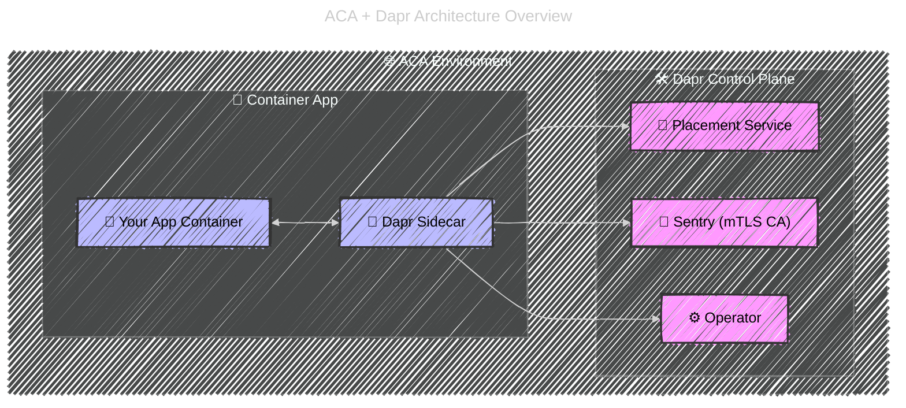

# ⚡ Dapr in Azure Container Apps (ACA)

## 🏗️ ACA Architecture Recap (with Dapr)

<div align="center">



</div>

- Each **Container App** can opt-in to Dapr with a simple flag.
- ACA provisions the **Dapr sidecar** for you (no YAML boilerplate).
- Control plane (placement, sentry, operator) is **managed by Microsoft** → you don’t run/patch it.

---

## ⚙️ Enabling Dapr in ACA

When you define a Container App, you just add a `dapr` block:

```yaml
properties:
  configuration:
    dapr:
      enabled: true
      appId: orders
      appPort: 5000
      logLevel: debug
```

That’s it. Your app now has a sidecar with:

- Service invocation (`/v1.0/invoke/...`)
- State store (`/v1.0/state/...`)
- Pub/Sub
- Secrets
- Actors

---

## 🔑 How Dapr + ACA Work Together

### 1️⃣ Service Invocation

- Call another container app by its **Dapr App ID**:

  ```bash
  curl http://localhost:3500/v1.0/invoke/payments/method/charge
  ```

- ACA **knows app IDs across the environment** → internal DNS/routing handled.

### 2️⃣ Pub/Sub

- Configure pub/sub component (e.g., Service Bus, RabbitMQ, Kafka, Redis) in ACA.
- Publish in one app:

  ```http
  POST http://localhost:3500/v1.0/publish/pubsub/orders
  ```

- Subscriber app automatically gets messages at `/orders` endpoint.

### 3️⃣ State Management

- Drop in Redis (or Cosmos DB) as a state store component.
- Your app does:

  ```http
  POST /v1.0/state/statestore
  [
    { "key": "cart1", "value": { "item": "book", "qty": 2 } }
  ]
  ```

- ACA/Dapr persists state → no SDKs needed.

### 4️⃣ Secrets Management

- Bind Key Vault to Dapr secrets store.
- App retrieves secrets from `http://localhost:3500/v1.0/secrets/keyvault/mySecretKey`.

### 5️⃣ Actors

- ACA supports **Dapr actors** natively.
- Great for IoT, gaming, session state, etc.
- You don’t worry about placement → ACA’s Dapr control plane manages it.

---

## 🔐 Authentication & Security (ACA + Dapr)

- All **Dapr traffic between apps is mTLS secured** (via Dapr Sentry).
- Identity can integrate with **Azure Entra ID** for external requests.
- Secrets can be fetched securely from **Key Vault** using ACA-managed identities.

---

## 🧪 Hands-On: ACA + Dapr (Orders + Payments)

1. **Define components** (Redis for state, Service Bus for pub/sub) in ACA YAML.

   ```yaml
   components:
     - name: statestore
       type: state.azure.cosmosdb
       version: v1
       metadata:
         - name: connectionString
           secretRef: cosmos-conn
   ```

2. **Orders service** (writes state, publishes events).

   ```bash
   POST http://localhost:3500/v1.0/state/statestore
   ```

3. **Payments service** (subscribes to orders events).

   ```yaml
   routes:
     - path: /orders
   ```

4. Both apps run in ACA, both with Dapr enabled.
   → Orders publishes to topic → Dapr routes → Payments receives.

---

## 🚀 Why Dapr in ACA Rocks

- ✅ **Zero infra ops** → Dapr control plane is managed.
- ✅ **No sidecar setup** → ACA auto-injects.
- ✅ **Multi-cloud abstractions** → switch Service Bus → Kafka → RabbitMQ with config only.
- ✅ **First-class ACA citizen** → monitored in ACA logs, integrated with ACA secrets/env.

---

## 🌍 Real-world Example

Imagine an **e-commerce ACA environment**:

- `orders` app → exposes HTTP API
- `payments` app → invoked via Dapr service invocation
- `inventory` app → consumes messages from pub/sub
- `cart` app → uses state store (Redis/Cosmos DB)
- All wired by **Dapr**, no custom SDKs.

---

👉 That’s the power of **Dapr + ACA**: a managed, production-ready distributed app platform where you focus on code, not plumbing.

---

Do you want me to prepare a **full hands-on ACA project** (with YAML + CLI) showing:

- `orders` + `payments` apps
- Pub/Sub via Service Bus
- State store via Redis
- Secrets via Key Vault

so you can run it end-to-end?
