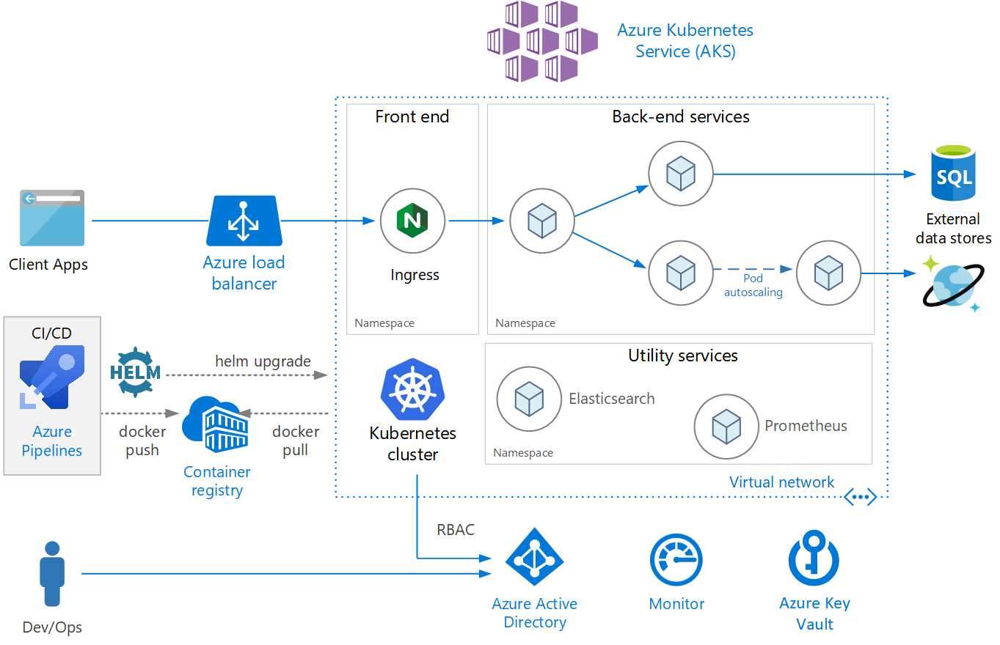

# Azure Kubernetes Service (AKS)




## What is Azure Kubernetes Service (AKS)?

**Azure Kubernetes Service (AKS)** is a managed Kubernetes service that simplifies deploying, managing, and scaling containerized applications using Kubernetes. AKS handles critical tasks such as health monitoring and maintenance, enabling you to focus on developing your applications rather than managing the infrastructure.

## Key Features

- **Managed Kubernetes:** Fully managed control plane, reducing the operational overhead of managing Kubernetes clusters.
- **Auto-Scaling:** Automatically scale your applications and nodes based on demand.
- **Integrated Developer Tools:** Seamlessly integrates with Azure DevOps, GitHub Actions, and other CI/CD tools.
- **Advanced Networking:** Supports Azure CNI, network policies, and service mesh integration.
- **Security and Compliance:** Integrates with Azure Active Directory and offers role-based access control (RBAC) for enhanced security.
- **Monitoring and Logging:** Built-in integration with Azure Monitor and Azure Log Analytics for comprehensive observability.

## Use Case

- **Complex Applications:** Deploy and manage complex, multi-container applications requiring orchestration.
- **Microservices Architecture:** Implement and manage microservices with Kubernetes.
- **Enterprise Solutions:** Suitable for large-scale, enterprise-grade applications requiring high availability and scalability.
- **DevOps and CI/CD:** Integrate with CI/CD pipelines for automated deployments and updates.

## Pricing and Plans

AKS itself is free; however, you pay for the underlying resources used by your Kubernetes clusters.

| **Resource**   | **Cost**                                                                                                             |
| -------------- | -------------------------------------------------------------------------------------------------------------------- |
| **Node VMs**   | Based on the VM size and number of nodes. For example, a Standard_DS2_v2 VM costs approximately **\$0.10 per hour**. |
| **Storage**    | Charges for persistent storage (e.g., Azure Disks). Starting at **\$0.05 per GB per month**                          |
| **Networking** | Inbound data is free; outbound data starts at **\$0.087 per GB**                                                     |
| **Add-ons**    | Additional services like Azure Monitor may incur extra costs.                                                        |

**Example:**

Running a cluster with 3 Standard_DS2_v2 VMs for 30 days:

- **VM Cost:** 3 VMs × 24 hours × 30 days × $0.10 = **$216\*\*
- **Storage Cost:** 100 GB × $0.05 = **$5\*\*
- **Total Cost:** Approximately **\$221** (excluding networking and add-ons)

**Factors Affecting Cost:**

- **Cluster Size:** Number and type of VM instances in the cluster.
- **Storage Requirements:** Amount and type of persistent storage used.
- **Networking:** Data transfer costs based on usage.
- **Additional Services:** Monitoring, logging, and other integrated services.

**Note:** Prices are approximate and can vary based on the Azure region. For precise estimates, visit the [Azure Pricing Calculator](images/https://azure.microsoft.com/pricing/calculator/).

## Examples

### Example 1: Deploying a Multi-Tier Web Application with AKS

1. **Create a Resource Group:**

   ```bash
   az group create --name myAKSResourceGroup --location eastus
   ```

2. **Create an AKS Cluster:**

   ```bash
   az aks create \
     --resource-group myAKSResourceGroup \
     --name myAKSCluster \
     --node-count 3 \
     --enable-addons monitoring \
     --generate-ssh-keys
   ```

3. **Connect to the AKS Cluster:**

   ```bash
   az aks get-credentials --resource-group myAKSResourceGroup --name myAKSCluster
   ```

4. **Deploy a Multi-Tier Application:**

   Create Kubernetes deployments and services for the frontend and backend.

   ```yaml
   # frontend-deployment.yaml
   apiVersion: apps/v1
   kind: Deployment
   metadata:
     name: frontend
   spec:
     replicas: 3
     selector:
       matchLabels:
         app: frontend
     template:
       metadata:
         labels:
           app: frontend
       spec:
         containers:
           - name: frontend
             image: myacr.azurecr.io/frontend:v1
             ports:
               - containerPort: 80
   ```

   ```yaml
   # backend-deployment.yaml
   apiVersion: apps/v1
   kind: Deployment
   metadata:
     name: backend
   spec:
     replicas: 3
     selector:
       matchLabels:
         app: backend
     template:
       metadata:
         labels:
           app: backend
       spec:
         containers:
           - name: backend
             image: myacr.azurecr.io/backend:v1
             ports:
               - containerPort: 8080
   ```

5. **Apply the Deployments:**

   ```bash
   kubectl apply -f frontend-deployment.yaml
   kubectl apply -f backend-deployment.yaml
   ```

6. **Expose the Deployments as Services:**

   ```bash
   kubectl expose deployment frontend --type=LoadBalancer --port=80 --target-port=80
   kubectl expose deployment backend --type=ClusterIP --port=8080 --target-port=8080
   ```

7. **Access the Application:**

   Retrieve the external IP address of the frontend service.

   ```bash
   kubectl get service frontend
   ```

   Open the external IP address in your browser to access the multi-tier web application.

#### Example 2: Scaling Applications Automatically with AKS

1. **Enable Cluster Autoscaler:**

   When creating the AKS cluster, you can enable autoscaling by specifying the `--enable-cluster-autoscaler` flag and setting the minimum and maximum node counts.

   ```bash
   az aks create \
     --resource-group myAKSResourceGroup \
     --name myAKSCluster \
     --node-count 3 \
     --enable-cluster-autoscaler \
     --min-count 1 \
     --max-count 5 \
     --enable-addons monitoring \
     --generate-ssh-keys
   ```

2. **Deploy an Application with Horizontal Pod Autoscaler (HPA):**

   ```yaml
   # hpa.yaml
   apiVersion: autoscaling/v2beta2
   kind: HorizontalPodAutoscaler
   metadata:
     name: frontend-hpa
   spec:
     scaleTargetRef:
       apiVersion: apps/v1
       kind: Deployment
       name: frontend
     minReplicas: 3
     maxReplicas: 10
     metrics:
       - type: Resource
         resource:
           name: cpu
           target:
             type: Utilization
             averageUtilization: 50
   ```

3. **Apply the HPA:**

   ```bash
   kubectl apply -f hpa.yaml
   ```

4. **Monitor Scaling:**

   The HPA automatically scales the number of frontend pods based on CPU utilization, ensuring optimal performance and resource usage.

### Example 3: Deploying a Stateful Application with AKS

1. **Create a Persistent Volume Claim (PVC):**

   ```yaml
   # pvc.yaml
   apiVersion: v1
   kind: PersistentVolumeClaim
   metadata:
     name: db-pvc
   spec:
     accessModes:
       - ReadWriteOnce
     resources:
       requests:
         storage: 10Gi
   ```

2. **Apply the PVC:**

   ```bash
   kubectl apply -f pvc.yaml
   ```

3. **Deploy a StatefulSet:**

   ```yaml
   # statefulset.yaml
   apiVersion: apps/v1
   kind: StatefulSet
   metadata:
     name: mongodb
   spec:
     serviceName: "mongodb"
     replicas: 3
     selector:
       matchLabels:
         app: mongodb
     template:
       metadata:
         labels:
           app: mongodb
       spec:
         containers:
           - name: mongodb
             image: mongo:4.2
             ports:
               - containerPort: 27017
             volumeMounts:
               - name: mongo-persistent-storage
                 mountPath: /data/db
     volumeClaimTemplates:
       - metadata:
           name: mongo-persistent-storage
         spec:
           accessModes: ["ReadWriteOnce"]
           resources:
             requests:
               storage: 10Gi
   ```

4. **Apply the StatefulSet:**

   ```bash
   kubectl apply -f statefulset.yaml
   ```

5. **Verify the Deployment:**

   ```bash
   kubectl get pods
   ```

   Ensure that the MongoDB pods are running with their respective persistent storage.

### Example 4: Implementing Blue-Green Deployment with AKS

1. **Deploy the Current Version (Blue):**

   ```yaml
   # blue-deployment.yaml
   apiVersion: apps/v1
   kind: Deployment
   metadata:
     name: myapp-blue
   spec:
     replicas: 3
     selector:
       matchLabels:
         app: myapp
         version: blue
     template:
       metadata:
         labels:
           app: myapp
           version: blue
       spec:
         containers:
           - name: myapp
             image: myacr.azurecr.io/myapp:blue
             ports:
               - containerPort: 80
   ```

2. **Apply the Blue Deployment:**

   ```bash
   kubectl apply -f blue-deployment.yaml
   ```

3. **Create a Service to Route Traffic to Blue:**

   ```yaml
   # service.yaml
   apiVersion: v1
   kind: Service
   metadata:
     name: myapp-service
   spec:
     selector:
       app: myapp
     ports:
       - protocol: TCP
         port: 80
         targetPort: 80
     type: LoadBalancer
   ```

4. **Apply the Service:**

   ```bash
   kubectl apply -f service.yaml
   ```

5. **Deploy the New Version (Green):**

   ```yaml
   # green-deployment.yaml
   apiVersion: apps/v1
   kind: Deployment
   metadata:
     name: myapp-green
   spec:
     replicas: 3
     selector:
       matchLabels:
         app: myapp
         version: green
     template:
       metadata:
         labels:
           app: myapp
           version: green
       spec:
         containers:
           - name: myapp
             image: myacr.azurecr.io/myapp:green
             ports:
               - containerPort: 80
   ```

6. **Apply the Green Deployment:**

   ```bash
   kubectl apply -f green-deployment.yaml
   ```

7. **Switch Traffic to Green:**

   Update the service selector to route traffic to the green version.

   ```yaml
   # service-update.yaml
   apiVersion: v1
   kind: Service
   metadata:
     name: myapp-service
   spec:
     selector:
       app: myapp
       version: green
     ports:
       - protocol: TCP
         port: 80
         targetPort: 80
     type: LoadBalancer
   ```

8. **Apply the Service Update:**

   ```bash
   kubectl apply -f service-update.yaml
   ```

9. **Verify the Deployment:**

   Ensure that traffic is now routed to the green version of the application. Monitor for any issues before decommissioning the blue deployment.
