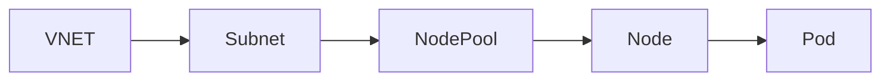
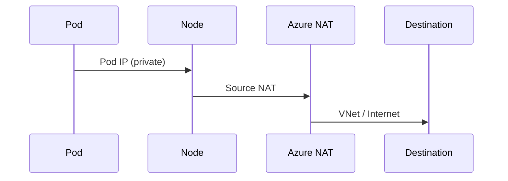
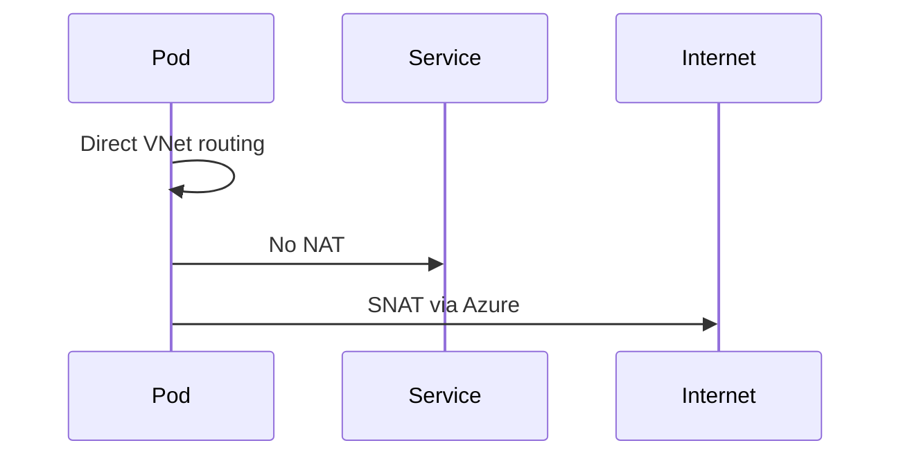
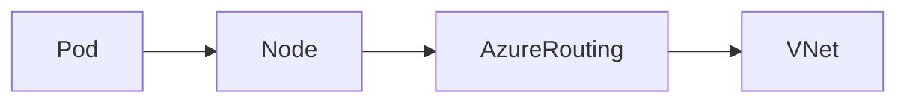
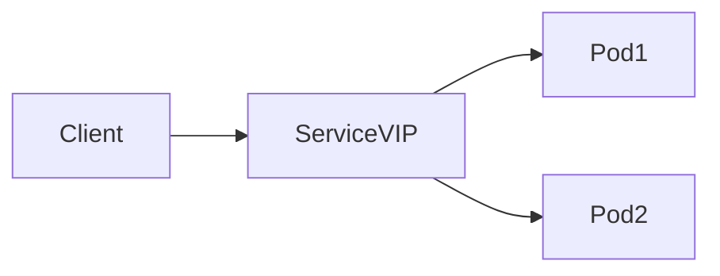
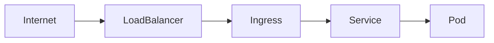
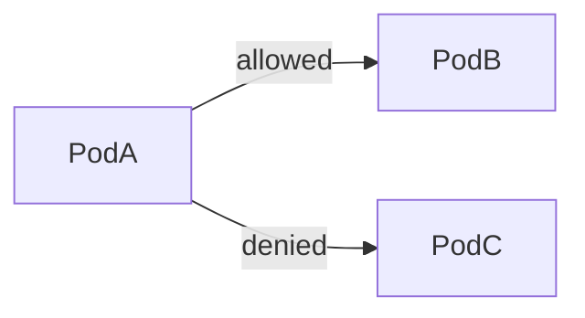

# 🌐 Azure AKS Networking

## 🧠 Big Picture (Mental Model First)

Before we touch modes, IPs, or plugins, **understand this core truth**:

> **AKS networking answers 3 questions**

1. **Where does a Pod get its IP from?**
2. **How does traffic flow inside the cluster?**
3. **How does traffic reach outside the cluster (and vice versa)?**

Everything else is just _implementation detail_.

---

## 🏗️ AKS Basic Building Blocks (Networking Context)



### Key Components

| Component   | Meaning                  |
| ----------- | ------------------------ |
| **VNet**    | Azure virtual network    |
| **Subnet**  | Where AKS nodes live     |
| **Node**    | Azure VM                 |
| **Pod**     | Smallest Kubernetes unit |
| **Service** | Stable virtual IP (VIP)  |

---

## 🚦 First Distinction (Very Important)

### 🔴 Node IP vs Pod IP

| Item     | Gets IP from                   |
| -------- | ------------------------------ |
| **Node** | Azure **VNet subnet**          |
| **Pod**  | Depends on **networking mode** |

⚠️ This is where confusion starts.

---

## 🧩 AKS Networking Modes (The Core Topic)

AKS supports **two primary networking models**:

1. **Kubenet** (Legacy / Simple)
2. **Azure CNI** (VNet-native)

   - Azure CNI **Classic**
   - Azure CNI **Overlay**

Let’s go one by one 👇

---

## 🟦 1️⃣ Kubenet (Basic / Legacy Mode)

### 🔍 What is Kubenet?

> **Pods do NOT get IPs from the VNet**

Instead:

- Nodes get VNet IPs
- Pods get IPs from an **internal virtual network**
- Traffic is **NATed** when leaving the node

---

### 🧠 IP Allocation (Very Important)

| Resource | IP Source                          |
| -------- | ---------------------------------- |
| Node     | VNet subnet                        |
| Pod      | Internal Pod CIDR (not Azure IPAM) |

---

### 🔁 Traffic Flow (Kubenet)



---

### 📌 Characteristics

✅ Pros

- Uses **fewer VNet IPs**
- Simple to set up
- Cheap

❌ Cons

- NAT overhead
- Harder troubleshooting
- Limited enterprise features
- **Not recommended for production anymore**

---

### 🧪 Example IPs

```ini
Node IP: 10.0.1.4
Pod IP: 10.244.0.5   (NOT routable in VNet)
```

---

## 🛑 When to use Kubenet?

👉 **Almost never in modern AKS**
Only for **learning or small test clusters**

---

## 🟩 2️⃣ Azure CNI (The Real Production Networking)

> **Pods get real IPs that are routable inside the VNet**

This is what most enterprises use.

---

### 🧠 Azure CNI — Core Idea

> **Every Pod becomes a first-class citizen in the VNet**

No NAT
No hidden networks
No tricks

---

### 🟩 Azure CNI — Two Variants (VERY IMPORTANT)

| Mode        | Pod IP Source                            |
| ----------- | ---------------------------------------- |
| **Classic** | VNet subnet (Azure IPAM)                 |
| **Overlay** | Overlay CIDR (VNet-routable via routing) |

Let’s deep dive 👇

---

## 🟢 Azure CNI (Classic)

### 🔍 What Happens Here?

- Nodes get IPs from subnet
- **Pods ALSO get IPs from the SAME subnet**
- Azure **IPAM** manages Pod IPs

---

### 🧠 IP Allocation

| Resource | IP Source           |
| -------- | ------------------- |
| Node     | VNet Subnet         |
| Pod      | **Azure VNet IPAM** |

---

### 🔁 Traffic Flow



---

### 📌 Example

```ini
Subnet: 10.0.1.0/24
Node IP: 10.0.1.10
Pod IP: 10.0.1.50
```

👉 **Pod is directly reachable from any VNet resource**

---

### ⚠️ BIG PROBLEM (Classic CNI)

❌ **IP exhaustion**

Each Pod consumes:

- 1 VNet IP
- Pre-allocated IPs per node

Example:

```ini
50 nodes × 30 pods = 1500 IPs 😬
```

---

## 🟢 Azure CNI Overlay (Modern & Recommended)

### 🔍 What is Overlay Mode?

> Pods get IPs from an **overlay network**, BUT
> traffic is **routable without NAT**

Best of both worlds 💎

---

### 🧠 IP Allocation

| Resource | IP Source                     |
| -------- | ----------------------------- |
| Node     | VNet subnet                   |
| Pod      | Overlay CIDR (not Azure IPAM) |

⚠️ Overlay IPs are **not** Azure IPAM IPs
But Azure knows **how to route them**

---

### 🔁 Traffic Flow



- ✔️ No NAT
- ✔️ Scales massively
- ✔️ No IP exhaustion

---

### 📌 Example

```ini
Node IP: 10.0.1.10
Pod IP: 192.168.0.5 (Overlay)
```

Still reachable inside the cluster without NAT 🎯

---

## 🏆 Azure CNI Overlay — Why It’s the Best Choice

✅ Massive scale
✅ Lower IP usage
✅ Full AKS features
✅ Better performance
✅ Future-proof

👉 **This is the default recommendation now**

---

## 🔌 Services Networking (Very Important)

### 🧩 Kubernetes Service Types

| Type         | IP Source               |
| ------------ | ----------------------- |
| ClusterIP    | Virtual IP (kube-proxy) |
| NodePort     | Node IP + Port          |
| LoadBalancer | Azure Load Balancer     |
| ExternalName | DNS only                |

---

### 🧠 ClusterIP (Virtual IP)



⚠️ Service IP is **NOT** from VNet
It’s a **virtual IP managed by kube-proxy**

---

## 🌍 Ingress & Egress

### 🔽 Ingress (Incoming Traffic)

Options:

- Azure Application Gateway Ingress Controller (AGIC)
- NGINX Ingress
- Azure Load Balancer



---

### 🔼 Egress (Outgoing Traffic)

| Method      | Use Case           |
| ----------- | ------------------ |
| SNAT        | Default            |
| NAT Gateway | Stable outbound IP |
| Firewall    | Enterprise control |

---

## 🔐 Network Policies (Security)

AKS supports:

- **Azure Network Policy**
- **Calico Network Policy**

Controls:

- Pod → Pod
- Namespace isolation
- Zero Trust networking



---

## 🧠 Advanced Topics (You WILL see these in real jobs)

### 🔹 Pod CIDR vs Service CIDR

### 🔹 kube-proxy (iptables vs IPVS)

### 🔹 SNAT port exhaustion

### 🔹 Private AKS clusters

### 🔹 VNet peering

### 🔹 UDRs & custom routing

### 🔹 Azure Firewall integration

### 🔹 DNS (CoreDNS + Azure DNS)

### 🔹 Dual-stack IPv4/IPv6

### 🔹 Overlay vs VNet latency

---

## 🏁 Final Recommendation (Real World)

| Scenario         | Best Choice                     |
| ---------------- | ------------------------------- |
| Learning         | Kubenet                         |
| Small prod       | Azure CNI Overlay               |
| Large enterprise | Azure CNI Overlay + NAT Gateway |
| Regulated env    | Azure CNI + Firewall            |

---

If you want, next we can:

- 🔥 Trace **real packet flow step-by-step**
- 🧪 Design an **AKS VNet from scratch**
- 🎯 Compare **AKS vs EKS networking**
- 📦 Deep dive **Ingress controllers**
- 🧠 Explain **Service Mesh networking (Istio / Linkerd)**

Just tell me what to attack next 😄
