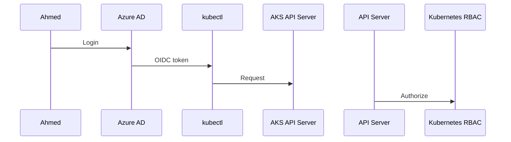
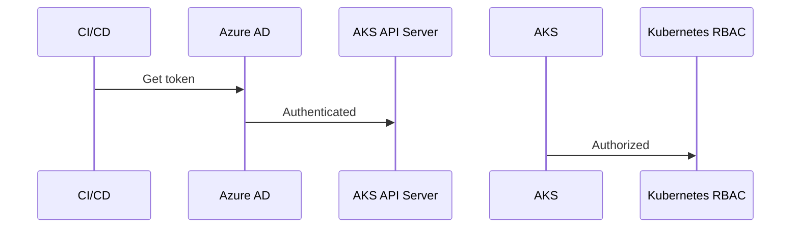
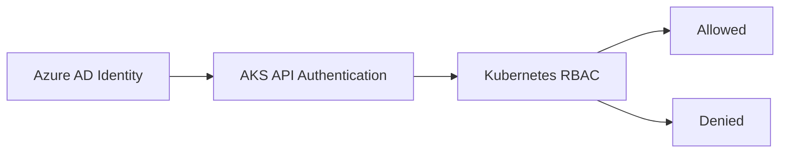

# 🔐 RBAC in AKS — The Clean Mental Model (No Confusion)

> **AKS does NOT replace Kubernetes RBAC. Ever.**

Instead:

> **Azure handles _who you are_** > **Kubernetes decides _what you can do_**

That’s it. Everything else is detail.

---

## 🧠 Step 1: Split the Problem (Very Important)

RBAC always has **two separate concerns**:

| Layer              | Question         | Owner                |
| ------------------ | ---------------- | -------------------- |
| **Authentication** | Who are you?     | **Azure (Entra ID)** |
| **Authorization**  | What can you do? | **Kubernetes RBAC**  |

AKS only helps with the **first** one.

---

## 🧩 What Azure Actually Adds to Kubernetes RBAC

In **vanilla Kubernetes**:

- Users are:

  - client certs
  - static usernames
  - external OIDC providers (manual)

In **AKS**:

- Azure plugs **Microsoft Entra ID (Azure AD)** into Kubernetes **OIDC**
- You get:

  - real users
  - real groups
  - real identities

- **But rules are still Kubernetes YAML**

---

## 🔑 Identity Types in AKS (All of Them Explained)

Let’s go one by one.

---

## 👤 1. Azure AD User (Human)

### Example

> “Ahmed is a DevOps engineer”

### Flow



### RBAC Binding Example

```yaml
apiVersion: rbac.authorization.k8s.io/v1
kind: RoleBinding
metadata:
  name: ahmed-dev-reader
  namespace: dev
subjects:
  - kind: User
    name: ahmed@company.com # Azure AD user
roleRef:
  kind: Role
  name: pod-reader
  apiGroup: rbac.authorization.k8s.io
```

✅ Azure proves **who Ahmed is**
✅ Kubernetes decides **what Ahmed can do**

---

## 👥 2. Azure AD Group (Best Practice)

> **You should almost always bind RBAC to groups, not users**

### Example

> “aks-devops-group”

```yaml
kind: ClusterRoleBinding
apiVersion: rbac.authorization.k8s.io/v1
metadata:
  name: devops-admins
subjects:
  - kind: Group
    name: aks-devops-group
roleRef:
  kind: ClusterRole
  name: cluster-admin
  apiGroup: rbac.authorization.k8s.io
```

### Why groups?

- Add/remove users in Azure
- **No YAML changes**
- Clean governance

---

## 🤖 3. Service Account (Kubernetes-native)

> This is **pure Kubernetes** — Azure is NOT involved

### Example

> “My app inside the cluster”

```yaml
apiVersion: v1
kind: ServiceAccount
metadata:
  name: app-sa
  namespace: prod
```

```yaml
kind: RoleBinding
apiVersion: rbac.authorization.k8s.io/v1
metadata:
  name: app-binding
  namespace: prod
subjects:
  - kind: ServiceAccount
    name: app-sa
roleRef:
  kind: Role
  name: configmap-reader
  apiGroup: rbac.authorization.k8s.io
```

### Key Point

- Used for **Pod → Kubernetes API**
- Uses **JWT token**
- No Azure RBAC
- No Entra ID

---

## 🧩 4. Azure Service Principal (External App / CI-CD)

> “Azure DevOps pipeline”
> “GitHub Actions”
> “Terraform”

### Flow



### Binding Example

```yaml
kind: ClusterRoleBinding
apiVersion: rbac.authorization.k8s.io/v1
metadata:
  name: cicd-deployer
subjects:
  - kind: User
    name: "spn://my-aks-deployer"
roleRef:
  kind: ClusterRole
  name: edit
  apiGroup: rbac.authorization.k8s.io
```

✅ Azure authenticates SP
✅ Kubernetes enforces RBAC

---

## 🧠 5. Managed Identity (Modern Replacement for SP)

> Same idea as Service Principal
> **No secrets** 🎉

### Example

> “Azure VM or App deploying to AKS”

```yaml
subjects:
  - kind: User
    name: "msi://aks-deployer-mi"
```

### Key Benefit

- Rotates automatically
- Secure
- Cloud-native

---

## ⚠️ Important Clarification (Common Confusion)

### ❌ Azure RBAC ≠ Kubernetes RBAC

| Azure RBAC                     | Kubernetes RBAC          |
| ------------------------------ | ------------------------ |
| Controls AKS resource          | Controls cluster actions |
| ARM-level                      | API-server-level         |
| `Microsoft.ContainerService/*` | Pods, nodes, secrets     |

### Example

> Azure RBAC lets you **create a cluster**
> Kubernetes RBAC lets you **delete a pod**

They are **completely separate systems**

---

## 🧠 Final Unified Mental Model (Remember This Forever)



### Translation in Human Language

> Azure says: **“Yes, this identity is real.”**
> Kubernetes says: **“Okay, but what are you allowed to do?”**

---

## 🏁 Summary (Short & Sharp)

- ✅ RBAC is **Kubernetes-native**
- ❌ Azure does NOT replace RBAC
- ✅ Azure only handles **identity federation**
- ✅ You still manage:

  - Roles
  - ClusterRoles
  - RoleBindings
  - ClusterRoleBindings
  - ServiceAccounts

- 🎯 Best practice:

  - Bind to **Azure AD groups**
  - Use **Managed Identities**
  - Keep YAML as source of truth

---

If you want next, I can:

- 🔥 Compare **AKS RBAC vs EKS IAM**
- 🧪 Design **real enterprise RBAC model**
- 🧠 Explain **kubectl auth can-i** deeply
- 🔐 Combine **NetworkPolicy + RBAC**
- 🏗️ Explain **AKS API server auth chain**

Just tell me where to go next 👊
