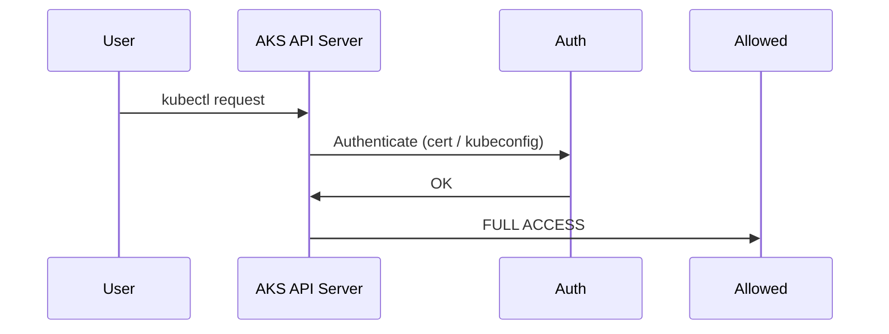
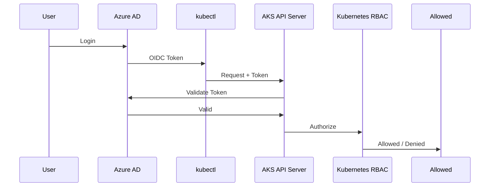

# 🔐 AKS RBAC — Disabled vs Enabled (Workflow Comparison)

## 🟥 Case 1: **RBAC DISABLED** in AKS

> ⚠️ This is legacy / insecure / strongly discouraged

### 🧠 What “Disabled” Really Means

- Kubernetes **RBAC engine is OFF**
- AKS uses **legacy authorization**
- Anyone who authenticates = **full access**
- No Roles, RoleBindings, ClusterRoles enforcement

---

## 🔁 Workflow (RBAC Disabled)



### Key Observation

❌ **No authorization check**
❌ **No role evaluation**
❌ **No least privilege**

---

## 🔑 Authentication (Disabled)

- Uses:

  - Admin kubeconfig
  - Client certificates

- Identity is basically:

  - `admin`
  - `clusterUser`

Azure AD is **not involved**.

---

## 🧩 RBAC Objects Behavior

| Object             | Behavior   |
| ------------------ | ---------- |
| Role               | ❌ Ignored |
| RoleBinding        | ❌ Ignored |
| ClusterRole        | ❌ Ignored |
| ClusterRoleBinding | ❌ Ignored |

You can create them — Kubernetes just doesn’t care.

---

## 🚨 Security Reality

- Anyone with kubeconfig can:

  - Delete namespaces
  - Read secrets
  - Exec into pods

- **Zero isolation**
- **Zero auditability**

---

## 🟢 Case 2: **RBAC ENABLED** in AKS (Correct Way)

> ✅ This is how **real production clusters** run

---

## 🔁 Workflow (RBAC Enabled)



---

## 🧠 What Changed?

### 🔹 Authentication

- Done by **Azure AD**
- Identity types:

  - Users
  - Groups
  - Service Principals
  - Managed Identities

### 🔹 Authorization

- Done by **Kubernetes RBAC**
- Enforced strictly

---

## 🧩 RBAC Objects (Now Active)

| Object             | Used?  |
| ------------------ | ------ |
| Role               | ✅ Yes |
| RoleBinding        | ✅ Yes |
| ClusterRole        | ✅ Yes |
| ClusterRoleBinding | ✅ Yes |

---

## 🎯 Example Comparison

### 🔴 Disabled

```bash
kubectl delete namespace prod
# Always succeeds
```

### 🟢 Enabled

```bash
kubectl delete namespace prod
# Forbidden unless explicitly allowed
```

---

## 🧑‍🤝‍🧑 Identity Binding Difference

### ❌ RBAC Disabled

- No concept of:

  - Users
  - Groups
  - Fine-grained access

### ✅ RBAC Enabled

You bind rules to **real identities**:

```yaml
subjects:
  - kind: User
    name: ahmed@company.com
  - kind: Group
    name: aks-admins
  - kind: ServiceAccount
    name: app-sa
```

---

## ⚠️ Azure RBAC vs Kubernetes RBAC (Critical Distinction)

Even **with RBAC enabled**:

| Layer           | Controls            |
| --------------- | ------------------- |
| Azure RBAC      | AKS resource itself |
| Kubernetes RBAC | In-cluster actions  |

Example:

- Azure RBAC → “Who can get kubeconfig?”
- Kubernetes RBAC → “Who can delete pods?”

---

## 🧠 Final Side-by-Side Summary

| Aspect           | RBAC Disabled | RBAC Enabled       |
| ---------------- | ------------- | ------------------ |
| Auth Provider    | Certs only    | Azure AD           |
| Authorization    | ❌ None       | ✅ Kubernetes RBAC |
| Least Privilege  | ❌ No         | ✅ Yes             |
| RoleBindings     | ❌ Ignored    | ✅ Enforced        |
| Production Ready | ❌ Never      | ✅ Always          |
| Auditability     | ❌ Poor       | ✅ Strong          |

---

## 🏁 One-Line Mental Model (Remember This)

> **RBAC Disabled:**
> “If you’re in, you’re god.”

---

> **RBAC Enabled:**
> “Prove who you are → then I’ll check what you’re allowed to do.”

---

If you want next, I can:

- 🔥 Show **real enterprise RBAC layouts**
- 🧪 Explain **admin vs user kubeconfig**
- 🧠 Compare **AKS RBAC vs EKS IAM**
- 🔐 Combine **RBAC + NetworkPolicy**
- 🏗️ Explain **API server auth chain in depth**

Just say the word 👊
