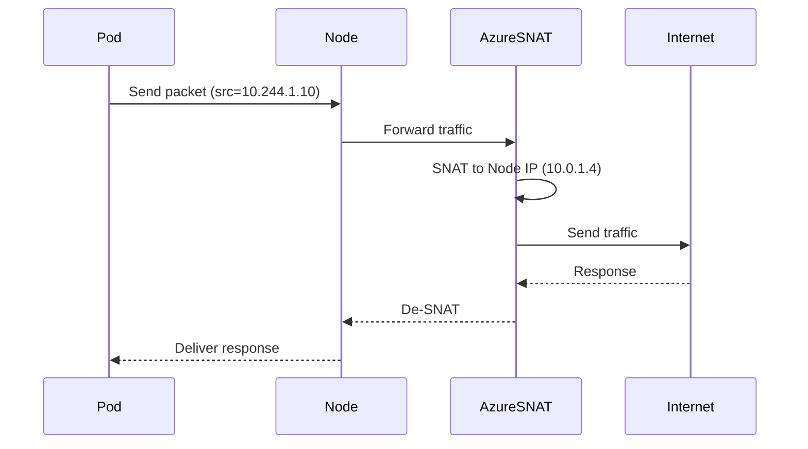

# 1️⃣ First: What is Azure CNI Overlay (in simple words)

**Azure CNI Overlay =**

- Pods get **private IPs from an overlay network (not from your VNet subnet)**
- Nodes still live in your **Azure VNet**
- Azure handles **NAT + routing** between:

  - Pods ↔ Nodes ↔ VNet ↔ Internet

👉 Think of it as:

> “Pods live in their own invisible network on top of Azure networking”

---

## 2️⃣ Why Azure created Overlay mode (the problem it solves)

### Traditional Azure CNI (non-overlay) problem

- Pods get **real VNet IPs**
- Every pod **consumes a subnet IP**
- Large clusters = **IP exhaustion nightmare**

### Overlay solution

- Pods use **internal overlay CIDR** (e.g. `10.244.0.0/16`)
- Subnet IPs are used **only by nodes**
- Azure handles translation behind the scenes

✅ Result: **Massive IP savings**

---

## 3️⃣ High-level architecture (mental picture)


### Components involved

| Component     | Role                   |
| ------------- | ---------------------- |
| **AKS Node**  | Has a real VNet IP     |
| **Pod**       | Gets an overlay IP     |
| **Azure CNI** | Sets up networking     |
| **SNAT**      | Translates pod traffic |
| **VNet**      | Only sees node IPs     |

---

## 4️⃣ IP addressing in Overlay mode

### Example setup

```text
VNet Subnet:     10.0.0.0/16
Node IPs:        10.0.1.4, 10.0.1.5
Pod CIDR:        10.244.0.0/16 (overlay)
```

### On a node

```text
Node IP: 10.0.1.4
Pods:
  pod-A → 10.244.1.10
  pod-B → 10.244.1.11
```

🔑 **Important**

- Pod IPs are **NOT routable in Azure VNet**
- Azure does **NAT** automatically

---

## 5️⃣ Now the key part: How pods access the outside world 🌍

Let’s walk through **pod → internet** traffic step by step.

---

## 6️⃣ Pod → Internet (Outbound traffic flow)

### Step-by-step flow



### What actually happens

1. Pod sends traffic using **overlay IP**
2. Node forwards packet
3. Azure performs **SNAT**

   - Source IP becomes **Node IP**

4. Internet sees traffic coming from **node**
5. Return traffic is mapped back to the pod

✅ **Pods can access the internet normally**

---

## 7️⃣ Where does SNAT happen?

Depends on your setup:

| Scenario            | SNAT Location      |
| ------------------- | ------------------ |
| Default AKS         | Azure-managed SNAT |
| With NAT Gateway    | NAT Gateway        |
| With Azure Firewall | Firewall           |
| With Load Balancer  | Azure LB           |

🔑 **Pod IP is never exposed externally**

---

## 8️⃣ Pod → Azure services (Storage, SQL, etc.)

### What Azure sees

- **Source IP = Node IP**
- Not the pod IP

### Implications

- Network rules must allow **node subnet**
- Service Endpoints & Private Endpoints work fine
- Identity should be done via:

  - Managed Identity
  - Workload Identity

---

## 9️⃣ Pod-to-Pod communication (overlay internal)

### Same node

- Direct overlay networking
- No NAT

### Different nodes

- Encapsulated traffic
- Azure CNI manages routing
- Still **overlay → overlay**

✅ Fully transparent to Kubernetes

---

## 🔟 Incoming traffic (brief note)

Overlay affects **outbound**, not ingress much:

| Traffic Type         | How it works      |
| -------------------- | ----------------- |
| Ingress Controller   | Uses Node IP      |
| LoadBalancer Service | Uses Azure LB     |
| External client      | Never sees pod IP |

---

## 1️⃣1️⃣ Key advantages of Azure CNI Overlay

✅ Massive IP savings
✅ Native Azure integration
✅ Supports Network Policies
✅ Scales well for large clusters

---

## 1️⃣2️⃣ Limitations (important!)

⚠ Pod IPs:

- Are **not visible in VNet**
- Cannot be used in Azure NSGs
- Cannot be directly routed

⚠ Troubleshooting:

- Requires understanding SNAT behavior

---

## 1️⃣3️⃣ When should YOU use Overlay mode?

### Use Azure CNI Overlay when:

✔ Large AKS clusters
✔ Limited VNet IP space
✔ Mostly outbound workloads
✔ Microservices + autoscaling

### Avoid when:

❌ You need pod IPs visible in VNet
❌ Heavy pod-to-onprem routing requirements

---

## 🧠 Final one-line summary (memorize this)

> **In Azure CNI Overlay, pods use an internal overlay IP range, and all outbound traffic is SNATed to the node’s VNet IP before leaving the cluster.**

If you want next, I can:

- Compare **Overlay vs Kubenet vs Azure CNI**
- Explain **NAT Gateway sizing & SNAT port exhaustion**
- Draw a **real production AKS networking design**

Just tell me 👌
