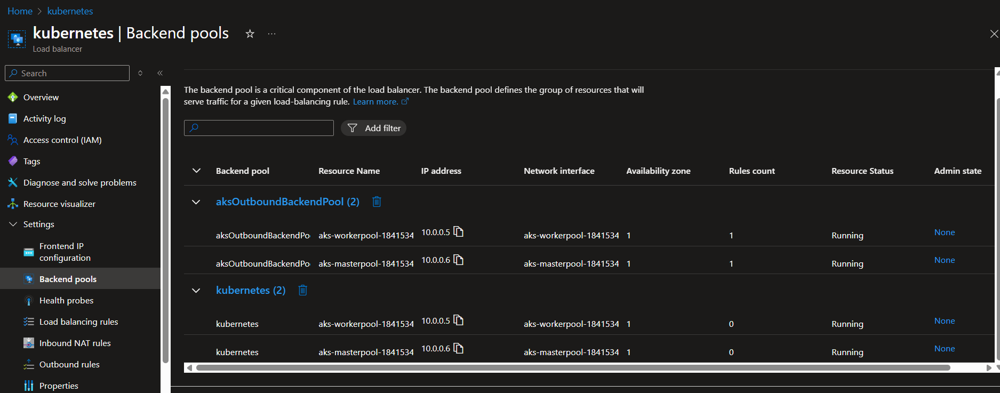
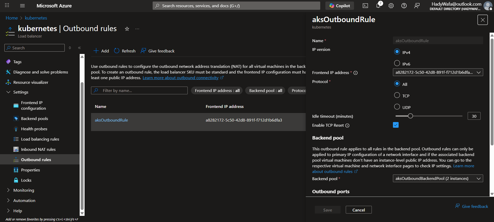

# AKS lb backend pools

## 🧠 First: what a Backend Pool REALLY is (simple definition)

> **A backend pool is just a logical group of NICs/IPs that a specific load-balancer rule sends traffic to.**

🔑 **Backend pools do NOT mean different machines**

- They are **groups for different purposes**
- **The same node can appear in multiple backend pools**

That’s exactly what you’re seeing.

---



---

## 👀 What you are seeing in your screenshot

You have **2 AKS nodes**:

- `10.0.0.5` → worker
- `10.0.0.6` → master/system

But you see **TWO backend pools**:

1. **`aksOutboundBackendPool`**
2. **`kubernetes`**

And **both pools contain the same two nodes**

👉 This is **100% normal**

---

## 🔹 Backend Pool #1: `aksOutboundBackendPool`



---

### What is it for?

👉 **OUTBOUND traffic (SNAT to internet)**

This pool is used when:

- Pods or nodes access:

  - Internet
  - External APIs
  - Docker registries
  - Azure services (public endpoints)

### Traffic flow

```text
Pod → Node → Load Balancer → Internet
```

The Load Balancer:

- Takes traffic from **this backend pool**
- SNATs it
- Sends it out via the LB public IP

### Key point

> This pool exists **even if you expose ZERO applications**

That’s why it always exists.

---

## 🔹 Backend Pool #2: `kubernetes`

### What is it for?

👉 **INBOUND traffic (services of type LoadBalancer)**

This pool is used when:

- You create a Kubernetes Service:

```yaml
type: LoadBalancer
```

Azure then:

- Adds an inbound rule
- Uses the **`kubernetes` backend pool**
- Sends traffic to nodes
- kube-proxy forwards traffic to pods

### Important observation from your screenshot

| Column      | Value |
| ----------- | ----- |
| Rules count | `0`   |

🔑 That means:

> **You currently have NO LoadBalancer services exposed**

So this pool exists, but is not actively used yet.

---

## ❓ “Why do both backend pools have the same nodes?”

Because:

✔ The **same nodes**:

- Send outbound traffic
- Receive inbound traffic

✔ Azure Load Balancer separates traffic by **purpose**, not by machine

Think of it like this:

```text
Same Nodes
 ├── Outbound traffic → aksOutboundBackendPool
 └── Inbound traffic  → kubernetes backend pool
```

---

## 🧩 Very important mental model (memorize this)

> **Backend pools are not clusters of machines — they are traffic targets for specific LB rules.**

Same VM
✔ can be in 1 pool
✔ can be in 5 pools
✔ can be in 10 pools

It depends on **how many traffic flows exist**.

---

## 🧪 Real-world analogy (easy)

Imagine a company building:

| Concept        | Azure LB Equivalent   |
| -------------- | --------------------- |
| Same employees | AKS nodes             |
| Exit door      | Outbound backend pool |
| Reception door | Inbound backend pool  |
| Security rules | LB rules              |

Same people, **different doors**, different rules.

---

## 🔍 Why you see “2 nodes per pool”

Because:

- Your cluster has **2 nodes**
- Both nodes must:

  - Send outbound traffic
  - Be able to receive inbound traffic

So Azure adds **both NICs to both pools**.

---

## ⚠️ Important beginner warning

❌ Do NOT:

- Delete backend pools
- Remove NICs manually
- Modify rules directly

AKS **reconciles** these resources and will break or recreate them.

---

## 🧠 One-line summary (this will click)

> **AKS creates multiple backend pools on the same Load Balancer because inbound and outbound traffic are handled separately, even though they use the same nodes.**

---

If you want next, I can:

- Explain **Outbound rules vs Load balancing rules**
- Show what happens **when you create a Service: LoadBalancer**
- Explain **how Ingress Controller fits into this**

Just tell me 👌
