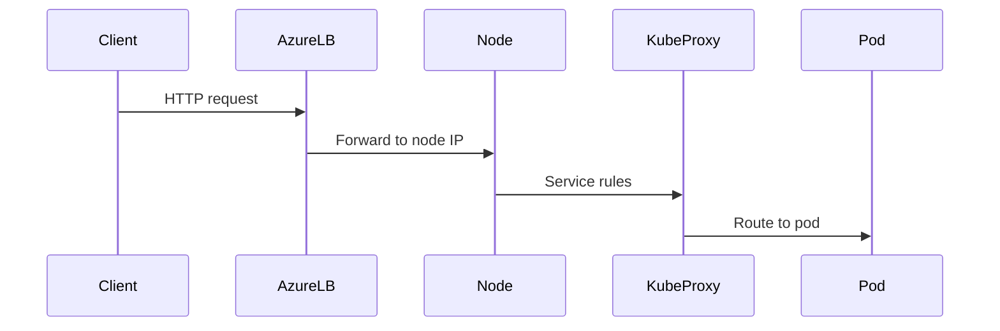

Excellent question 🔥
You just hit the **exact “aha” moment** where Azure Load Balancer + Kubernetes suddenly makes sense.

Short answer first, then deep explanation:

> **Inbound traffic does NOT work until Kubernetes explicitly asks Azure to create rules.**
> That’s why you currently see **only outbound rules**.

Now let’s unpack this **slowly and visually**, because this is a core AKS concept.

---

## 1️⃣ Why you see ONLY outbound rules right now

### Because you currently have:

* ❌ No `Service` of type `LoadBalancer`
* ❌ No Ingress Controller with `LoadBalancer`

So AKS created:
✔ **Outbound rule** → cluster needs internet access
❌ **Inbound rules** → nothing to expose yet

Azure Load Balancer is **declarative**:

> “No rule = no traffic”

---

## 2️⃣ Very important rule (memorize this)

> **Azure Load Balancer does NOTHING automatically for inbound traffic.**

It does **not**:

* Guess ports
* Scan Kubernetes services
* Forward traffic magically

Instead:

👉 **Kubernetes (via Azure Cloud Controller Manager)** explicitly tells Azure what to create.

---

## 3️⃣ Who creates inbound rules? (key player)

### 🎯 Azure Cloud Controller Manager (CCM)

This component:

* Runs inside AKS
* Watches Kubernetes Services
* Talks to Azure APIs
* Creates / updates / deletes:

  * Frontend IPs
  * Backend pools
  * Health probes
  * Load balancing rules

🔑 **Azure LB is dumb — Kubernetes is smart**

---

## 4️⃣ When inbound rules ARE created (the trigger)

### This YAML is the trigger 👇

```yaml
apiVersion: v1
kind: Service
metadata:
  name: my-api
spec:
  type: LoadBalancer
  ports:
  - port: 80
    targetPort: 8080
```

The moment you apply this:

```bash
kubectl apply -f service.yaml
```

AKS does the following automatically 👇

---

## 5️⃣ What AKS creates in Azure (step by step)

### Azure resources created automatically

| Azure LB Component  | Created? | Why               |
| ------------------- | -------- | ----------------- |
| Frontend IP         | ✅        | Public IP         |
| Backend pool        | ✅        | `kubernetes` pool |
| Health probe        | ✅        | Check node health |
| Load balancing rule | ✅        | Port mapping      |
| NAT rule            | ❌        | Not needed        |

---

## 6️⃣ Why **Inbound NAT rules are NOT used** in AKS

This is CRITICAL 👇

### Inbound NAT rules are for:

* **Port forwarding**
* **1:1 mapping**
* **RDP / SSH**
* **Single VM access**

Example:

```text
PublicIP:50001 → VM1:22
PublicIP:50002 → VM2:22
```

### Kubernetes does NOT work like that

Kubernetes needs:
✔ Load balancing
✔ Fan-out
✔ Health checks
✔ Many pods behind nodes

So AKS uses:

> **Load Balancing Rules**, not NAT rules

---

## 7️⃣ How inbound traffic REALLY flows in AKS

Let’s follow an inbound request step by step 👇



### Key detail

* Azure LB **only knows about nodes**
* It does NOT know pods
* kube-proxy handles pod-level routing

---

## 8️⃣ How does Azure LB know to use the `kubernetes` backend pool?

Because AKS tells it:

> “For Service X, create a rule that forwards traffic to backend pool = kubernetes”

This is configured **automatically** by AKS CCM.

You never do this manually.

---

## 9️⃣ Why inbound rules appear only AFTER service creation

Before Service:

```text
Public IP → ❌ nowhere
```

After Service:

```text
Public IP:80 → kubernetes backend pool
```

So the LB now knows:
✔ which port
✔ which backend pool
✔ which health probe

---

## 🔟 What about Ingress Controllers?

Ingress Controllers are **the same pattern**:

* Ingress Controller Service = `LoadBalancer`
* AKS creates inbound LB rules
* Ingress handles routing at L7

```text
Client → Azure LB → Node → Ingress → Pod
```

---

## 1️⃣1️⃣ Quick checklist to verify inbound works

Run:

```bash
kubectl get svc
```

If you see:

```text
EXTERNAL-IP   <pending>
```

→ LB rule not ready

If you see:

```text
EXTERNAL-IP   20.x.x.x
```

→ Azure LB inbound rule exists

---

## 🧠 Final mental model (this is the key)

> **Outbound rules exist by default because the cluster must access the internet.
> Inbound rules exist only when Kubernetes explicitly exposes a service.**

---

## 🧪 One-sentence killer answer (interview-ready)

> **AKS does not create inbound NAT or load-balancing rules by default; inbound rules are dynamically created only when a Kubernetes Service of type LoadBalancer or an Ingress Controller requests them.**

---

If you want next, I can:

* Show **exact Azure LB rules created by a Service**
* Explain **health probes in detail**
* Explain **NodePort vs LoadBalancer vs Ingress**

Just tell me 👌
