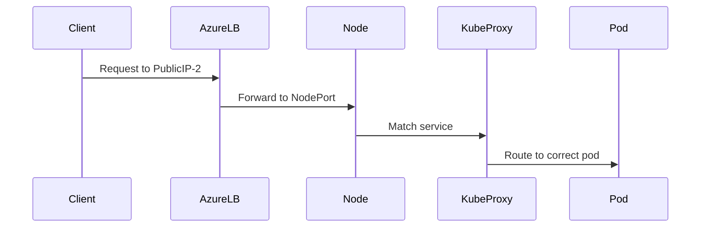

# Short answer (TL;DR)

> **If you create 3 Kubernetes Services of type `LoadBalancer`, AKS will NOT create 3 Azure Load Balancers by default.**
> It will:
>
> - Reuse the **same Azure Standard Load Balancer**
> - Create **3 frontend IP configurations**
> - Create **3 load-balancing rules**
> - All rules will point to the **same `kubernetes` backend pool**

Nothing happens **until you create those Services**.

---

# Now let’s explain it properly (slow & visual)

---

## 1️⃣ Your current state (important baseline)

Right now:

- AKS cluster created
- Azure Load Balancer exists
- Backend pools exist
- ✅ **ONLY outbound rules**
- ❌ **NO inbound rules**
- ❌ **NO frontend IPs for apps**

So inbound traffic = **nothing exposed**

---

## 2️⃣ You create the FIRST Service (LoadBalancer)

```yaml
apiVersion: v1
kind: Service
metadata:
  name: svc-1
spec:
  type: LoadBalancer
  ports:
    - port: 80
      targetPort: 8080
```

### What AKS does in Azure

AKS (via Cloud Controller Manager) creates:

| Azure LB Component  | Result                        |
| ------------------- | ----------------------------- |
| Frontend IP         | ✅ Public IP #1               |
| Load balancing rule | ✅ Rule #1 (80 → nodePort)    |
| Backend pool        | ✅ Uses existing `kubernetes` |
| Health probe        | ✅ Created                    |

---

## 3️⃣ You create the SECOND Service

```yaml
metadata:
  name: svc-2
```

### Azure behavior

| Component     | Result            |
| ------------- | ----------------- |
| Load Balancer | ❌ Not new        |
| Frontend IP   | ✅ Public IP #2   |
| LB rule       | ✅ Rule #2        |
| Backend pool  | Same `kubernetes` |

---

## 4️⃣ You create the THIRD Service

Same thing again 👇

| Component     | Result             |
| ------------- | ------------------ |
| Load Balancer | Still the same one |
| Frontend IP   | ✅ Public IP #3    |
| LB rule       | ✅ Rule #3         |
| Backend pool  | Same `kubernetes`  |

---

## 5️⃣ Final Azure Load Balancer state (important)

You end up with:

```
Azure Load Balancer
├── Frontend IPs
│   ├── PublicIP-1 (svc-1)
│   ├── PublicIP-2 (svc-2)
│   └── PublicIP-3 (svc-3)
│
├── Load Balancing Rules
│   ├── Rule-1 → svc-1
│   ├── Rule-2 → svc-2
│   └── Rule-3 → svc-3
│
└── Backend Pool
    └── kubernetes
        ├── Node-1
        └── Node-2
```

---

## 6️⃣ Important: Same backend pool, different Services — why?

Because:

- Azure LB only knows **nodes**
- Kubernetes decides:

  - Which pod gets traffic
  - Based on NodePort + kube-proxy

Azure LB job stops at:

> “Send traffic to a healthy node”

---

## 7️⃣ What happens at runtime (traffic flow)



🔑 **Azure does not know which service/pod**
Kubernetes handles that internally.

---

## 8️⃣ Do NAT rules get created?

❌ No
Still **no inbound NAT rules**

Why?

- Kubernetes requires **fan-out**
- NAT rules are **1:1**
- LB rules support **1:many**

---

## 9️⃣ Can AKS ever create multiple Load Balancers?

### Yes — but only if you ASK it to

Example:

```yaml
annotations:
  service.beta.kubernetes.io/azure-load-balancer-resource-group: custom-rg
```

Or:

- Internal vs External LB
- Multiple Standard LBs
- Advanced isolation scenarios

By default:

> **ONE Load Balancer per AKS cluster**

---

## 🔟 Cost & limits (important!)

| Item                    | Limit                   |
| ----------------------- | ----------------------- |
| Frontend IPs per LB     | 600                     |
| LB rules                | Hundreds                |
| Recommended LB services | Few (Ingress preferred) |

👉 Best practice:

> Use **Ingress Controller** instead of many LoadBalancer services

---

## 1️⃣1️⃣ Best-practice architecture (production)

Instead of:
❌ 10 Services → 10 Public IPs

Use:
✅ 1 Ingress Controller
✅ 1 Public IP
✅ Path / host routing

---

## 🧠 Final mental model (memorize this)

> **Each Service of type LoadBalancer adds a frontend IP and rule to the same Azure Load Balancer — it does not create a new load balancer.**

---

## 🧪 Interview-ready one-liner

> _Creating multiple Kubernetes LoadBalancer services results in multiple frontend IP configurations and rules on a single Azure Standard Load Balancer, all targeting the same node backend pool._

---

If you want next, I can:

- Show **exact Azure portal changes after each Service**
- Explain **internal vs external LoadBalancer services**
- Explain **Ingress vs LoadBalancer vs Application Gateway**

Just tell me 👌
