```mermaid
graph TD
    A([👤 Client])
    B[(🌍 DNS)]
    C@{shape: hex, label: "☁️ Azure Load Balancer\n(Public Frontend IP)"}
    D@{shape: hex, label: "🚪 Ingress Service\n(type=LoadBalancer)"}
    E@{shape: processes, label: "🧭 ingress-nginx Controller Pod"}

    S1{{"🧩 Backend Service A (ClusterIP)"}}
    S2{{"🧩 Backend Service B (ClusterIP)"}}
    P1@{shape: processes, label: "📦 App Pod A"}
    P2@{shape: processes, label: "📦 App Pod B"}

    A --> B --> C --> D --> E
    E -->|/api| S1 --> P1
    E -->|/web| S2 --> P2
```

# 🧠 **Ingress-NGINX on AKS — Correct Installation & Internals (Production-Grade)**

> On **Azure Kubernetes Service (AKS)**, an Ingress Controller is **not a managed Azure component**.
> It is a **Kubernetes workload (pods + service)** that integrates with **Azure Load Balancer**.
> The **most critical AKS-specific requirement** is **correct Azure Load Balancer health-probe configuration** — without it, **traffic is silently dropped** even if Kubernetes is healthy.

---

<div align="center" style="background-color:#2b3436ff; border-radius:10px; border:2px solid">



</div>

---

## 🔴 **The Problem Ingress Solves (Why It Exists)**

### 1️⃣ Phase 1 — NodePort (Primitive Access)

- App exposed via `Service: NodePort`
- Accessed using:

  ```ini
  http://<NodeIP>:31234
  ```

- ❌ Problems:

  - No DNS
  - No TLS
  - No routing
  - Operationally ugly

---

### 2️⃣ Phase 2 — LoadBalancer per Service

- Each service uses:

  ```yaml
  type: LoadBalancer
  ```

- Azure provisions:

  - Public IP
  - LB rule

- ❌ Problems:

  - One public IP **per service**
  - Expensive
  - No path-based routing

---

## 🟢 **Ingress + Ingress Controller (Correct Model)**

- **One** public entry point
- **Many** backend services
- Routing by:

  - Host
  - Path

- TLS termination
- Centralized traffic control

> **Ingress = rules** > **Ingress Controller = engine**

---

## ⚙️ **AKS-Specific Ingress Architecture**

<div align="center" style="background-color:#141a19ff;color:#a8a5a5ff; border-radius:10px; border:2px solid">

| Component           | AKS Reality                   |
| ------------------- | ----------------------------- |
| Azure Load Balancer | L4 only (TCP/UDP)             |
| Ingress Controller  | L7 (HTTP/HTTPS)               |
| Backend Pool        | AKS nodes (not pods)          |
| Health Probe        | MUST be explicitly configured |
| NAT Rules           | ❌ Never used                 |
| Pod IPs             | ❌ Never visible to Azure LB  |

</div>

---

## 🌐 **Full Request Flow (AKS-Accurate)**

```mermaid
sequenceDiagram
    participant User as 👤 User
    participant DNS as 🌍 DNS
    participant ALB as ☁️ Azure Load Balancer
    participant Node as 🖥️ AKS Node
    participant NodePort as 🚪 NodePort
    participant NGINX as 🧭 NGINX Ingress
    participant SVC as 🧩 ClusterIP Service
    participant Pod as 📦 Pod

    User->>DNS: Resolve domain
    DNS->>ALB: Public IP
    ALB->>Node: TCP 80 → NodePort
    Node->>NodePort: kube-proxy
    NodePort->>NGINX: Forward traffic
    NGINX->>SVC: Match host/path
    SVC->>Pod: Load-balance
    Pod-->>User: Response
```

<div align="center" style="background-color:#232b2dff; border-radius:10px; border:2px solid">



</div>

---

## 🧠 **CRITICAL AKS RULE (Memorize This)**

> **Azure Load Balancer probes NODE IPs — not pods — and nodes do NOT listen on port 80/443.**

If health probes fail:

- Azure LB marks nodes **unhealthy**
- **ALL inbound traffic is dropped**
- `curl` times out
- Kubernetes still looks “healthy”

This is **the #1 AKS Ingress pitfall**.

---

## ✅ **Correct Way to Install ingress-nginx on AKS**

### 0️⃣ Prerequisites

- AKS cluster running
- kubectl configured
- Helm installed

---

### 1️⃣ Add Helm Repository

```bash
helm repo add ingress-nginx https://kubernetes.github.io/ingress-nginx
helm repo update
```

---

### 2️⃣ Install Ingress Controller (AKS-Correct)

```bash
helm install ingress-nginx ingress-nginx/ingress-nginx \
  --namespace ingress-nginx \
  --create-namespace \
  --set controller.service.type=LoadBalancer
```

What AKS creates:

- **Service: LoadBalancer**
- Azure:

  - Reuses AKS Standard Load Balancer
  - Adds **new frontend IP**
  - Adds **LB rules (80/443)**
  - Adds **health probes (default = WRONG)**

---

## 🚨 **MANDATORY AKS FIX — Health Probe Annotation**

This step is **not optional**.

### Why?

- Azure LB probes `NodeIP:80`
- Nodes return **no HTTP 200**
- LB marks nodes **DOWN**

---

### ✅ Apply Correct Health Probe

```bash
kubectl annotate svc ingress-nginx-controller -n ingress-nginx \
  service.beta.kubernetes.io/azure-load-balancer-health-probe-request-path=/healthz
```

What happens:

- Azure LB probe → `/healthz`
- NGINX responds `200 OK`
- Nodes become **Healthy**
- Traffic flows

---

## 🔍 **Verify Correct State**

### Kubernetes

```bash
kubectl get svc -n ingress-nginx
```

Expected:

```ini
EXTERNAL-IP   <public-ip>
PORT(S)       80:31xxx,443:30xxx
```

---

### Azure Portal

- Load Balancer → Load balancing rules
- Health status:

  ```ini
  100% healthy
  ```

---

## 🧩 **Ingress Resource (Example)**

```yaml
apiVersion: networking.k8s.io/v1
kind: Ingress
metadata:
  name: hello-ingress
spec:
  ingressClassName: nginx
  rules:
    - host: hello.example.com
      http:
        paths:
          - path: /
            pathType: Prefix
            backend:
              service:
                name: hello-service
                port:
                  number: 80
```

---

## 🔑 **Why Azure NAT Rules Are NEVER Used**

| Feature              | Used in AKS Ingress? |
| -------------------- | -------------------- |
| Inbound NAT rules    | ❌ No                |
| Load balancing rules | ✅ Yes               |
| Health probes        | ✅ Mandatory         |
| NodePort             | ✅ Internal only     |

NAT rules are **1:1 VM access**, not fan-out traffic.

---

## 🧠 **Mental Model (Lock This In)**

> **Azure Load Balancer only knows nodes.
> Kubernetes only knows pods.
> Ingress bridges the two — but only if health probes are correct.**

---

## 🧠 **Mnemonic for AKS Ingress — “PHANTOM”**

| Letter | Meaning                         |
| ------ | ------------------------------- |
| **P**  | Public IP (Azure LB frontend)   |
| **H**  | Health probe (/healthz)         |
| **A**  | Azure Load Balancer             |
| **N**  | NodePort                        |
| **T**  | Traffic → NGINX                 |
| **O**  | Orchestration via Ingress rules |
| **M**  | Microservices behind ClusterIP  |

---

## 🎯 **Interview-Grade One-Liner**

> _On AKS, ingress-nginx must be exposed via a LoadBalancer service with a correctly configured Azure health probe; otherwise, Azure Load Balancer marks nodes unhealthy and silently drops all inbound traffic._
