```mermaid
sequenceDiagram
    participant ALB as ☁️ Azure LB
    participant Node as 🖥️ Node IP
    participant NP as 🚪 NodePort
    participant NGINX as 🧭 ingress-nginx
    participant Health as ❤️ /healthz

    ALB->>Node: GET /healthz
    Node->>NP: iptables DNAT
    NP->>NGINX: forward request
    NGINX->>Health: health check
    Health-->>NGINX: 200 OK
    NGINX-->>ALB: 200 OK
```

# 🧠 **AKS Ingress Health Probe Annotation — Internals (No Magic Edition)**

> The annotation
> `service.beta.kubernetes.io/azure-load-balancer-health-probe-request-path=/healthz`
> does **NOT** configure NGINX directly and does **NOT** add Azure logic.
> It is a **contract between Kubernetes and Azure Cloud Controller Manager** that changes how **Azure Load Balancer probes AKS nodes**, while `/healthz` itself is **pure ingress-nginx logic**.

---

<div align="center" style="background-color:#2b3436ff; border-radius:10px; border:2px solid">

```mermaid
graph TD
    A[📝 Kubernetes Service<br/>type=LoadBalancer]
    B[🧠 Azure Cloud Controller Manager]
    C[☁️ Azure Load Balancer]
    D[🖥️ AKS Node]
    E[🧭 ingress-nginx Pod]
    F[/healthz Endpoint]

    A -->|Service annotation| B
    B -->|ARM API call| C
    C -->|HTTP probe| D
    D -->|NodePort iptables| E
    E --> F
```

</div>

---

## 🔴 **The Problem (Before the Annotation)**

### What Azure Load Balancer does by default

When AKS sees:

```yaml
spec:
  type: LoadBalancer
  ports:
    - port: 80
```

Azure Cloud Controller Manager creates:

```text
Health Probe:
  Protocol: HTTP
  Port: 80
  Path: /
```

So Azure LB probes:

```http
GET http://<NodeIP>:80/
```

---

### Why this FAILS on AKS

| Component       | Reality              |
| --------------- | -------------------- |
| AKS Node        | ❌ Not a web server  |
| Port 80 on node | ❌ Nothing listening |
| Response        | ❌ No HTTP 200       |
| LB verdict      | ❌ Node = unhealthy  |

Result:

- Backend pool = **0% healthy**
- Azure LB **drops all inbound traffic**
- `curl` → **timeout**

This failure happens **before Kubernetes routing**.

---

## 🟢 **What `/healthz` Actually Is**

### 🔍 Ownership (important)

| Question                           | Answer |
| ---------------------------------- | ------ |
| Is `/healthz` Azure logic?         | ❌ No  |
| Is `/healthz` Kubernetes core?     | ❌ No  |
| Is `/healthz` ingress-nginx logic? | ✅ Yes |

---

### What ingress-nginx does internally

The ingress-nginx controller process:

- Starts **NGINX**
- Starts a **separate internal HTTP server**
- Exposes fixed endpoints:

  - `/healthz`
  - `/readyz`
  - `/metrics`

`/healthz` means:

> “Is the ingress controller process alive and able to proxy traffic?”

If yes → `HTTP 200`
If no → `HTTP 500`

That’s it.

No Azure awareness. No Kubernetes awareness.

---

## ⚙️ **What the Annotation REALLY Does**

### The annotation

```yaml
service.beta.kubernetes.io/azure-load-balancer-health-probe-request-path: /healthz
```

### ❗ Key insight

> This annotation is **read by Azure Cloud Controller Manager**, not by ingress-nginx.

---

## 🧠 **Azure Cloud Controller Manager (CCM) Logic**

Azure CCM runs a reconciliation loop:

```text
Desired state (K8s Service)
↓
Compare with Azure LB
↓
Apply delta
```

### Pseudocode (conceptual)

```go
if svc.Type == LoadBalancer {
    probePath := annotation["azure-load-balancer-health-probe-request-path"]
    if probePath != "" {
        configureAzureLBProbe(path=probePath)
    }
}
```

---

## 🔁 **What Changes After the Annotation**

### Before

```text
Probe → NodeIP:80 /
Result → ❌
```

### After

```text
Probe → NodeIP:80 /healthz
Result → ✅
```

---

<div align="center" style="background-color:#232b2dff; border-radius:10px; border:2px solid">



</div>

---

## 🟢 **Why the Port Stays 80 (Very Important)**

You might expect:

> “Shouldn’t Azure probe port 10254?”

Answer: **No**.

Because:

- Azure LB probes **frontend → backend mapping**
- Backend port is **NodePort**
- iptables handles the translation
- Azure doesn’t need to know internal ports

Azure only sees:

```ini
NodeIP:80 → healthy or not
```

---

## 🧠 **Why Azure Does NOT Auto-Detect This**

Because:

- Not all ingress controllers expose `/healthz`
- Some use TCP probes
- Some use custom paths
- Some don’t expose HTTP at all

So AKS uses:

> **Annotations as an explicit contract**

No guessing. No magic.

---

## 🧠 **Mental Model (Lock This In)**

> `/healthz` is an ingress-nginx self-test endpoint.
> The annotation tells Azure **where to look**, not **what to run**.
> Azure Load Balancer is blind — it only trusts HTTP 200.

---

## 🧠 **Mnemonic — “WATCH, DON’T SERVE”**

| Layer               | Responsibility        |
| ------------------- | --------------------- |
| ingress-nginx       | **Serves** `/healthz` |
| Kubernetes Service  | **Declares** intent   |
| Azure CCM           | **Translates** intent |
| Azure Load Balancer | **Watches** for 200   |

---

## 🎯 **Interview-Grade Explanation**

> _The `/healthz` endpoint is implemented by ingress-nginx to expose controller health; the Azure load balancer health probe annotation instructs the Azure Cloud Controller Manager to configure the load balancer to probe that endpoint, allowing node health to be evaluated correctly._

---

If you want next, I can:

- Compare `/healthz` vs `/readyz`
- Trace the **iptables DNAT rules**
- Explain **why NodePort is unavoidable**
- Compare **AKS vs EKS behavior**

Just say the word.
