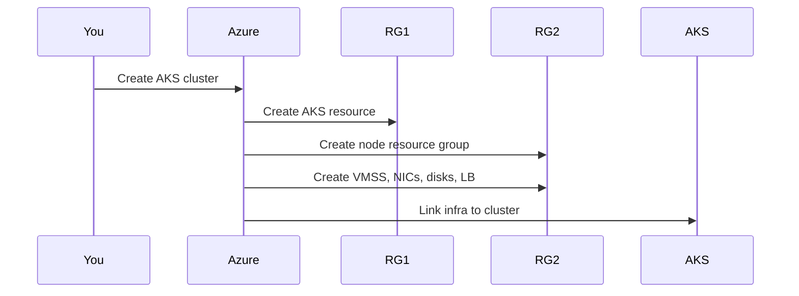

# 🧠 AKS Resource Groups — What Really Happens (No Confusion)

## 🔴 The Core Confusion

> “I created **one AKS cluster**, but Azure created **two resource groups**. Why?”

Answer:

> **Because AKS is a managed service that _creates infrastructure on your behalf_.**

Azure **must separate**:

- What **you own**
- What **AKS manages internally**

---

## 🧱 The Two Resource Groups (Very Important)

When you create an AKS cluster, **Azure always uses two resource groups**:

| Resource Group          | Purpose                      | Who manages it |
| ----------------------- | ---------------------------- | -------------- |
| **AKS Resource Group**  | The AKS control-plane object | **You**        |
| **Node Resource Group** | VMs, NICs, disks, LB, etc.   | **AKS**        |

---

## 1️⃣ AKS Resource Group (The One You Choose)

This is the RG you explicitly select or create in the portal.

### Contains:

- `Microsoft.ContainerService/managedClusters`
- (Optional) diagnostic settings
- (Optional) role assignments

### Example:

```ini
rg-aks-prod
```

### Think of it as:

> “The **definition** of the cluster”

You:

- Create it
- Delete it
- Assign RBAC to it

---

## 2️⃣ Node Resource Group (AKS-Created Automatically)

This is the one that **surprises people**.

### Example name:

```ini
MC_rg-aks-prod_aks-prod-eastus_eastus
```

Azure creates it **automatically**.

### Contains:

- VM Scale Sets (nodes)
- NICs
- Managed disks
- Load balancers
- Public IPs
- Route tables
- NSGs

### Think of it as:

> “The **physical infrastructure** of the cluster”

---

## 🧠 Why Azure MUST Separate Them

This is **intentional and critical**.

### Reasons:

### 1️⃣ Lifecycle safety

- You can:

  - Upgrade node pools
  - Scale nodes
  - Replace VMs

- AKS freely destroys/recreates infra
- Without breaking your cluster object

---

### 2️⃣ Permission isolation

- Developers can:

  - Use the cluster

- Without:

  - Touching NICs, disks, or LBs

---

### 3️⃣ Managed-service contract

AKS promises:

> “Don’t touch these resources — we manage them.”

If everything was in one RG:

- Accidental deletes
- Broken clusters
- Support nightmares

---

## 🔄 What Happens During Cluster Creation (Step-by-Step)



---

## 🔐 Who Should Manage What (Golden Rule)

### ✅ You SHOULD manage:

- AKS Resource Group
- RBAC on AKS
- Policies
- Networking (VNet)

### ❌ You should NOT touch:

- Node Resource Group
- VMSS settings
- NIC configs
- Load balancer rules

> Azure may **recreate or modify** these at any time.

---

## ⚠️ Common Mistakes (Avoid These)

### ❌ Deleting resources inside `MC_*` RG

→ Cluster breaks

### ❌ Adding custom resources to node RG

→ Deleted during upgrade

### ❌ Assigning policies directly to node RG

→ Unexpected failures

---

## 🧠 Advanced: Can You Control the Node RG?

### Yes — partially

You can:

- **Name it explicitly**
- **Lock it**
- **Apply read-only RBAC**

But:

- You still don’t “own” it

AKS still controls:

- Node lifecycle
- Scaling
- Replacements

---

## 🧪 Example: What Happens When You Scale Nodes?

```text
kubectl scale nodepool → AKS
AKS → modifies VMSS
Azure → changes node RG
```

You never touch the RG — **AKS does**.

---

## 🧠 Perfect Mental Model (Remember This)

> **AKS Resource Group = Control Plane contract** > **Node Resource Group = Implementation detail**

Or simpler:

> “One RG defines the cluster.
> The other RG runs the cluster.”

---

## 🏁 Final Summary (Short & Clear)

- AKS **always uses two resource groups**
- One is **yours**
- One is **AKS-managed**
- This is **by design**
- This is **non-negotiable**
- This is how Azure guarantees a managed Kubernetes experience

---

If you want next, I can:

- 🔥 Compare this with **EKS & GKE**
- 🧪 Show what happens during **upgrade / repair**
- 🔐 Explain **RBAC across both RGs**
- 🏗️ Design **enterprise RG strategy for AKS**
- ⚔️ Explain **why deleting the node RG breaks everything**

Just tell me where to go next 👊
