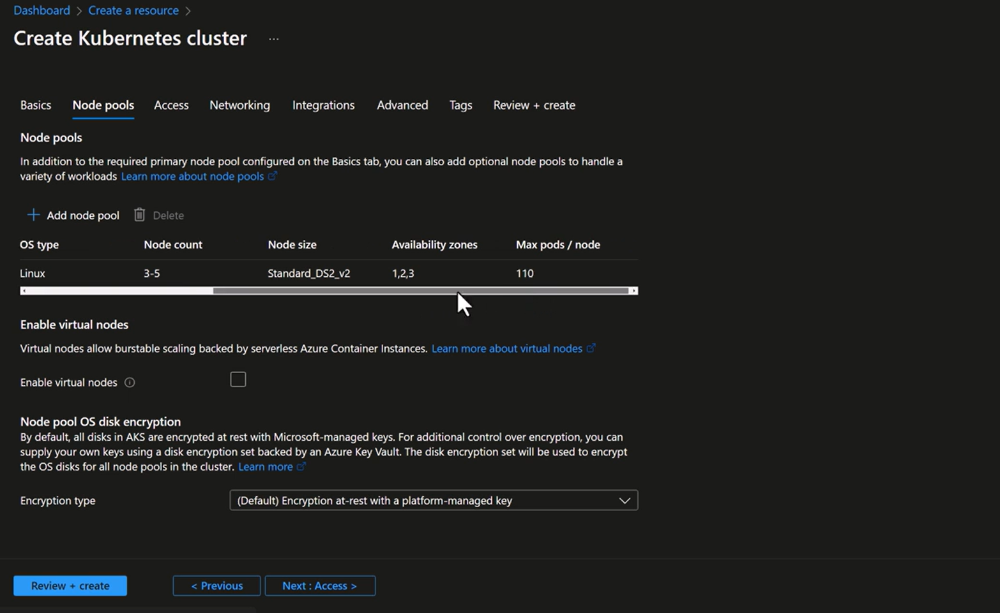

# (AKS), the **max pods per node**

In Azure Kubernetes Service (AKS), the **max pods per node** setting controls how many pods can be scheduled on each node. For **system node pools**, the default is **30 pods per node**, and they should remain small and stable to host cluster-critical services. For **user node pools**, the same default applies, but you can configure higher values depending on your network plugin (Azure CNI vs Kubenet). Planning subnet IPs is critical when increasing this limit.

---



## 📦 System Node Pool – Max Pods per Node

- **Purpose:** Hosts AKS system components like CoreDNS, kube-proxy, metrics-server.
- **Default Value:** **30 pods per node**.
- **Minimum Requirement:** Every AKS cluster must have at least one system node pool with **≥2 nodes**.
- **Configuration:**

  - At creation:

    ```bash
    az aks nodepool add --mode System --max-pods <number>
    ```

  - Update existing pool:

    ```bash
    az aks nodepool update --name <pool> --max-pods <number>
    ```

- **Best Practices:**
  - Keep system pools **small (1–3 nodes)** and stable.
  - Avoid running heavy workloads here; leave headroom for upgrades and add-ons.
  - Ensure subnet has enough IPs if using Azure CNI.

---

## 📦 User Node Pool – Max Pods per Node

- **Purpose:** Hosts application workloads.
- **Default Value:** **30 pods per node** (same as system pool).
- **Configurable Range:**
  - **Azure CNI:** Up to ~250 pods per node (limited by NIC IPs).
  - **Kubenet:** Up to ~110 pods per node (uses NAT, fewer IPs needed).
- **Configuration:**

  - At creation:

    ```bash
    az aks nodepool add --mode User --max-pods <number>
    ```

  - Update existing pool:

    ```bash
    az aks nodepool update --name <pool> --max-pods <number>
    ```

- **Best Practices:**
  - Plan subnet size = `(nodes × max-pods) + buffer`.
  - Use multiple user pools for workload isolation (e.g., dev vs prod).
  - Monitor IP consumption when scaling pods.

---

## ⚖️ Key Differences – System vs User Node Pools

| **Aspect**             | **System Node Pool**                            | **User Node Pool**                  |
| ---------------------- | ----------------------------------------------- | ----------------------------------- |
| **Default max pods**   | 30                                              | 30                                  |
| **Purpose**            | Cluster-critical services                       | Application workloads               |
| **Scaling**            | Keep small (1–3 nodes)                          | Flexible, can scale large           |
| **Configurable range** | Same as user pool, but not recommended to raise | Azure CNI: ~250, Kubenet: ~110      |
| **Best practice**      | Stability, headroom for upgrades                | Workload isolation, subnet planning |

---

## 🚨 Risks & Trade-offs

- **Subnet exhaustion:** With Azure CNI, each pod consumes a routable IP. If subnet is too small, pods fail to schedule.
- **System pool overload:** Running too many workloads in system pool risks cluster stability.
- **Changing max-pods:** Requires recreating or updating node pools; cannot be changed on existing nodes directly.

---

## 🎯 Takeaway

- **System node pool:** Default 30 pods/node, keep lean and stable.
- **User node pool:** Default 30 pods/node, configurable higher depending on network plugin.
- **Always plan subnet IPs** when increasing pod density.

Sources: [Microsoft Learn – System Node Pools](https://learn.microsoft.com/en-us/azure/aks/use-system-pools), [Microsoft Learn – IP Address Planning & Max Pods](https://learn.microsoft.com/en-us/azure/aks/concepts-network-ip-address-planning).

---
