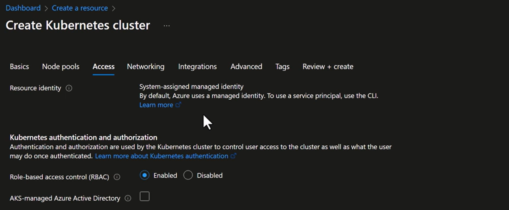

# Access

the **Access tab in AKS cluster creation** configures two distinct layers of identity and access control. Let’s break it down precisely and cleanly 👇

---

---

## 🔐 Part 1: **Resource Identity** (Azure-level access)

### ✅ What It Controls:

This defines **how Azure provisions and manages AKS resources** like the control plane, load balancers, managed disks, etc.

### 🔧 Options:

- **System-assigned Managed Identity (default):**

  - Azure automatically creates an identity tied to the AKS resource.
  - This identity is used to access other Azure resources (e.g., pulling secrets from Key Vault, writing logs to Log Analytics).
  - You don’t manage credentials — Azure rotates them securely.

- **Service Principal (legacy, CLI only):**
  - You manually create an identity in Entra ID and provide credentials.
  - Requires secret/cert rotation and more overhead.
  - Mostly deprecated in favor of managed identities.

### 🧠 Analogy:

Think of this as **“who AKS is” when talking to other Azure services**. It’s the cluster’s Azure-facing identity.

---

## 🔐 Part 2: **Kubernetes Authentication & Authorization** (Cluster-level access)

### ✅ What It Controls:

This governs **how users (humans or apps) authenticate to the Kubernetes API server** and what they’re allowed to do inside the cluster.

### 🔧 Key Features:

- **Authentication:**

  - **Azure AD integration (AKS-managed AAD):**
    - Users sign in via Azure AD.
    - You can assign RBAC roles based on their Entra ID identity.
  - **Kubeconfig with token-based access:**
    - Users get a kubeconfig file with a token linked to their Azure AD identity.

- **Authorization:**
  - **Role-Based Access Control (RBAC):**
    - You define roles (e.g., reader, admin) and bind them to users/groups.
    - Controls what actions users can perform (e.g., list pods, deploy apps).

### 🧠 Analogy:

This is **“who the user is” and “what they’re allowed to do” inside the cluster**.

---

## 🧩 Summary Table

| Layer                 | Purpose               | Identity Type                         | Example                                |
| --------------------- | --------------------- | ------------------------------------- | -------------------------------------- |
| **Resource Identity** | Azure resource access | Managed Identity or Service Principal | AKS pulling secrets from Key Vault     |
| **Kubernetes Access** | Cluster API access    | Azure AD user/group + RBAC            | Dev logging in via `kubectl` to deploy |

---

## 🧠 DevOps Tips

- Always prefer **system-assigned managed identity** for simplicity and security.
- Use **AKS-managed Azure AD** for clean user onboarding and RBAC control.
- Avoid mixing service principals and manual RBAC unless you have legacy constraints.
- For automation (CI/CD), use **Azure AD app registrations** with RBAC bindings or **workload identities**.
