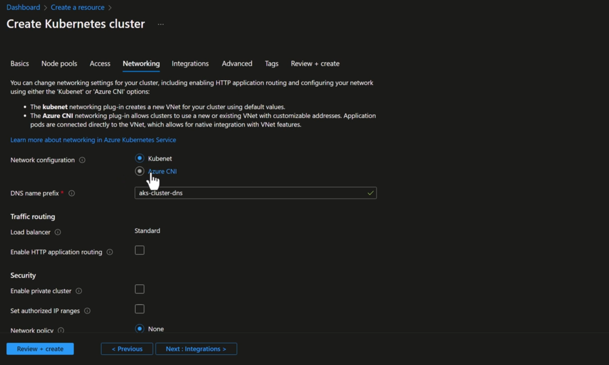
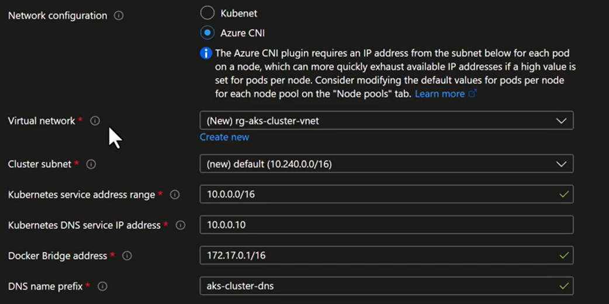
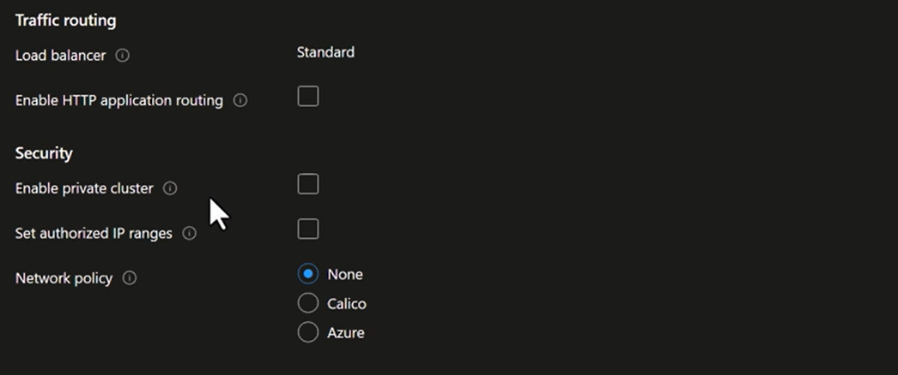
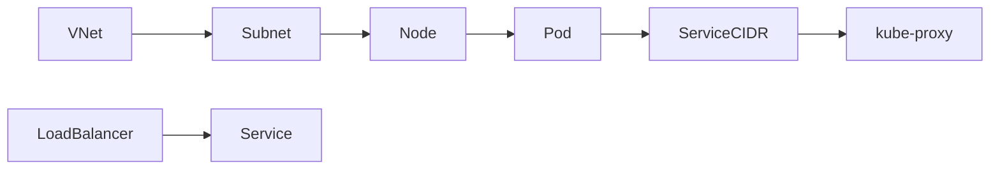

# 🌐 AKS Networking Tab — What Each Option _Really_ Means

> This tab answers **three big questions**:

1. How Pods get IPs
2. How Services get IPs
3. How traffic enters / leaves the cluster

Everything on this screen maps to **real Kubernetes concepts** you already know.

---






## 🧩 1️⃣ Network configuration

**Kubenet vs Azure CNI**

This is the **most important decision on the page**.

---

### 🔹 Kubenet

**What it means**

- Nodes get IPs from Azure VNet
- Pods get IPs from an **internal Pod CIDR**
- Pod traffic is **NATed** when leaving the node

**Kubernetes view**

- Similar to classic kubeadm + bridge networking
- Pods are **not first-class VNet citizens**

**Azure impact**

- Fewer VNet IPs used
- Limited integration with Azure networking
- Legacy / learning only

👉 Rarely used in real AKS production today

---

### 🔹 Azure CNI (what you selected)

**What it means**

- Nodes get IPs from Azure VNet
- **Pods also get routable IPs**
- Deep Azure networking integration

**Kubernetes view**

- Pods behave like VMs in the VNet
- No hidden NAT for east–west traffic

**Azure impact**

- Required for:

  - Private AKS
  - Network policies
  - Enterprise security
  - Most real-world setups

⚠️ Note you saw:

> “requires an IP address from the subnet for each pod”

That refers to **Azure CNI Classic behavior**
(New clusters should use **Azure CNI Overlay** to avoid exhaustion)

---

## 🌐 2️⃣ Virtual network

```
(New) rg-aks-cluster-vnet
```

**What this is**

- The Azure VNet where:

  - AKS nodes live
  - Pod traffic is routed
  - Load balancers attach

**Kubernetes mapping**

- This is **outside Kubernetes**
- Kubernetes doesn’t know what a VNet is
- But **AKS CNI plugs into it**

👉 You can:

- Create a new VNet
- Or reuse an existing enterprise VNet

---

## 🧱 3️⃣ Cluster subnet

```ini
default (10.240.0.0/16)
```

**What this subnet is used for**

- **AKS nodes always live here**
- Pods _may_ use it (depends on CNI mode)

### Mapping by mode

| Mode              | Nodes  | Pods              |
| ----------------- | ------ | ----------------- |
| Kubenet           | Subnet | ❌                |
| Azure CNI Classic | Subnet | ✅                |
| Azure CNI Overlay | Subnet | ❌ (overlay CIDR) |

👉 This subnet must be **large enough for node scaling**

---

## 🔁 4️⃣ Kubernetes service address range

```
10.0.0.0/16
```

This is **pure Kubernetes**, not Azure.

**What it is**

- CIDR for **Service ClusterIP**
- Used by:

  - ClusterIP services
  - kube-dns service
  - internal virtual IPs

**Important**

- These IPs:

  - Are NOT in the VNet
  - Are NOT routable
  - Exist only inside kube-proxy / iptables / IPVS

Think of this as:

> “The virtual load balancer IP space”

---

## 🌍 5️⃣ Kubernetes DNS service IP address

```
10.0.0.10
```

**What this is**

- One IP **inside the Service CIDR**
- Assigned to **CoreDNS Service**

**Kubernetes mapping**

```text
kube-dns / coredns Service → 10.0.0.10
```

Pods resolve DNS by sending traffic to this IP.

⚠️ Must:

- Be inside Service CIDR
- Not conflict with anything else

---

## 🐳 6️⃣ Docker bridge address

```
172.17.0.1/16
```

**What this is**

- Docker / container runtime bridge on the node

**Reality**

- Legacy
- Mostly irrelevant for CNI networking
- Still required for compatibility

You normally **never touch this**.

---

## 🌐 7️⃣ DNS name prefix

```
aks-cluster-dns
```

**What this controls**

- Public DNS name for:

  - API server
  - Load balancer (if public)

Example:

```
aks-cluster-dns.eastus.cloudapp.azure.com
```

Not related to CoreDNS.

---

# 🚦 Traffic routing section

---

## ⚖️ Load balancer: `Standard`

**What this means**

- AKS will use **Azure Standard Load Balancer**

**Why Standard is mandatory**

- Required for:

  - Production
  - Private clusters
  - Multiple node pools
  - Better security

**Kubernetes mapping**

```text
Service type LoadBalancer → Azure Standard LB
```

---

## 🌍 Enable HTTP application routing (Unchecked)

**What this is**

- A **managed Ingress + DNS** solution
- Creates:

  - NGINX Ingress
  - Azure DNS zone
  - Auto routing

**Why experts usually disable it**

- Limited control
- Not production-grade
- Replaced by:

  - NGINX Helm
  - AGIC
  - Service Mesh ingress

👉 You did the right thing leaving it off.

---

# 🔐 Security section

---

## 🔒 Enable private cluster (Unchecked)

**What happens if enabled**

- API server gets:

  - Private IP only
  - No public endpoint

- Access via:

  - VPN
  - ExpressRoute
  - Bastion / Jumpbox

**Enterprise default** ✔️

---

## 📍 Set authorized IP ranges (Unchecked)

**What it does**

- Restricts **API server access**
- Even if public, only specific IPs can call it

Think:

```text
kubectl access firewall
```

---

## 🛡️ Network policy

```
None | Calico | Azure
```

This controls **Pod-to-Pod traffic rules**.

---

### 🔹 None

- All Pods can talk to all Pods
- No isolation

---

### 🔹 Azure Network Policy

- Uses Azure dataplane
- Good performance
- Limited advanced rules

---

### 🔹 Calico (most popular)

- Kubernetes-native
- Rich policies
- Namespace + label-based control

**Kubernetes mapping**

```yaml
kind: NetworkPolicy
```

👉 If you care about zero-trust inside the cluster → **Calico**

---

# 🧠 Final Mental Model (Tie Everything Together)



---

# 🏁 Summary Table (Cheat Sheet)

| Option                | Controls            |
| --------------------- | ------------------- |
| Network configuration | Pod IP model        |
| VNet                  | Azure network scope |
| Subnet                | Node placement      |
| Service CIDR          | Virtual service IPs |
| DNS service IP        | CoreDNS             |
| Load balancer         | External traffic    |
| Private cluster       | API exposure        |
| Network policy        | Pod isolation       |

---

## ✅ Real-World Recommendation (2025)

- Azure CNI **Overlay**
- Large node subnet
- Separate Service CIDR
- Standard Load Balancer
- Calico Network Policy
- Private cluster for prod

---

If you want next, I can:

- 🔥 Map **each option to packets**
- 🧪 Design **perfect AKS VNet layout**
- ⚔️ Compare **AKS vs EKS networking screens**
- 🔐 Combine **RBAC + NetworkPolicy**
- 🌍 Explain **Ingress traffic step-by-step**

Just tell me what you want to zoom into next 👊
