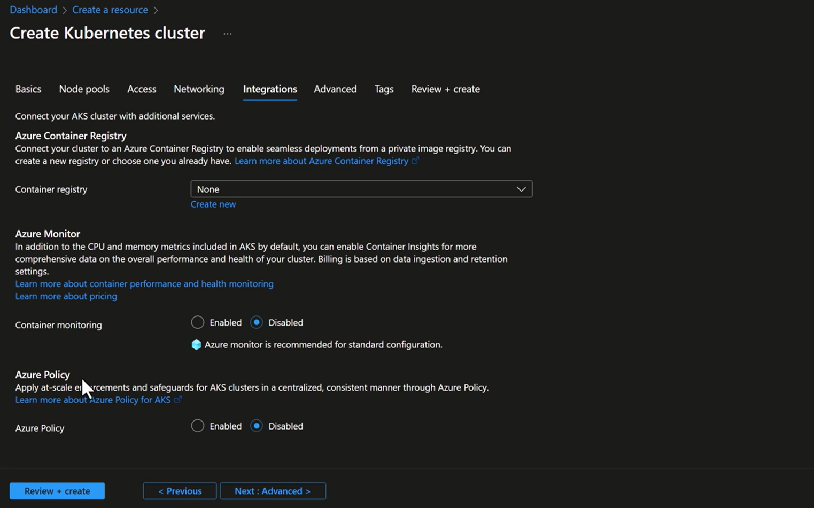
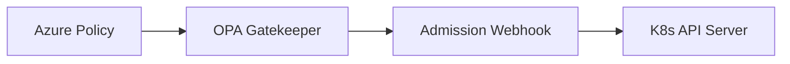
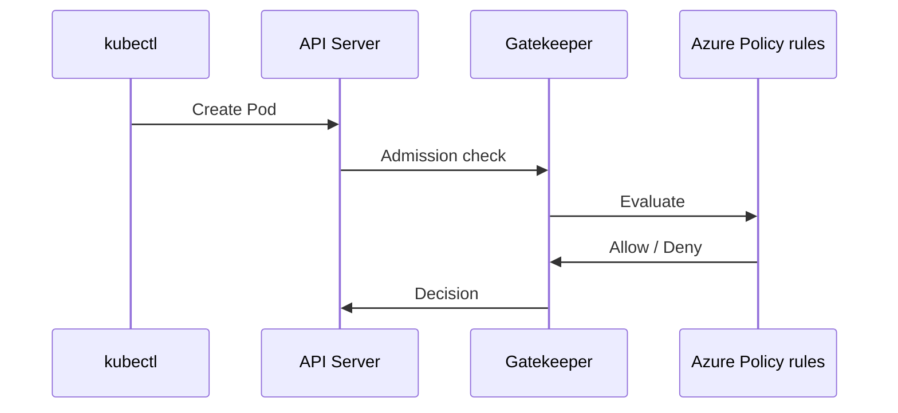

# 🔗 AKS “Integrations” Tab — What Each Option Really Does

This tab is **not Kubernetes core**.
It’s about **Azure-managed add-ons** that _integrate_ with the cluster.

---



---

## 🧱 1️⃣ Azure Container Registry (ACR)

### What happens if you enable it?

- AKS is granted **pull permissions** to ACR
- Uses:

  - Managed Identity
  - No imagePullSecrets needed

### Kubernetes view

```text
Node → ACR (authenticated by Azure)
```

No RBAC, no admission control, no policy here — just image access.

---

## 📊 2️⃣ Azure Monitor (Container Insights)

### What it does

- Deploys:

  - Azure Monitor agent (DaemonSet)
  - Log collection

- Sends:

  - Metrics
  - Logs
  - Container stdout/stderr

### Kubernetes view

- Just agents + exporters
- No enforcement
- No mutation

---

## 🛡️ 3️⃣ Azure Policy for AKS (🔥 This is your real question)

Let’s slow down and be **100% precise** here.

---

## 🔐 Azure Policy for AKS — What It REALLY Is

### ❓ Is it OPA?

### ❓ Is it Gatekeeper?

### ❓ Is it Azure RBAC?

### ❓ Is it something custom?

### ✅ Correct answer:

> **Azure Policy for AKS = OPA Gatekeeper (v3), fully managed by Azure**

---

## 🧠 Architecture (Very Important)

When you enable **Azure Policy for AKS**, Azure does ALL of this for you:



### What Azure installs automatically

- Gatekeeper controller
- Gatekeeper audit controller
- Admission webhooks
- Constraint templates (OPA Rego)

You **do not** install Gatekeeper yourself.

---

## 🧩 Where Each Responsibility Lives

| Layer        | Responsibility                 |
| ------------ | ------------------------------ |
| Azure Policy | Policy definition & assignment |
| Gatekeeper   | Enforcement engine             |
| OPA          | Policy language (Rego)         |
| Kubernetes   | Admission control              |

---

## 🔍 How Policies Are Defined (This is the KEY Difference)

### ❌ Native Gatekeeper (DIY)

You write:

- ConstraintTemplates (Rego)
- Constraints (YAML)

### ✅ Azure Policy for AKS

You **do NOT write Rego**

Instead:

- Azure ships **built-in policies**
- You assign them like any Azure Policy

Example:

> “Pods must not run as root”

```text
Azure Policy → mapped → Gatekeeper constraint → enforced
```

---

## 📌 Example Mapping (Very Important)

### Azure Policy (what YOU see)

```text
Kubernetes clusters should not allow privileged containers
```

### Behind the scenes (what Azure creates)

```yaml
kind: K8sPSPPrivilegedContainer
```

Which internally maps to:

```rego
input.review.object.spec.containers[_].securityContext.privileged == true
```

👉 You never see this unless you inspect Gatekeeper objects.

---

## ⚠️ What Azure Policy for AKS is NOT

| ❌ Not               | Why                |
| -------------------- | ------------------ |
| Azure RBAC           | Different layer    |
| NetworkPolicy        | Different purpose  |
| PodSecurityAdmission | Separate mechanism |
| Custom OPA platform  | Locked & curated   |

---

## 🆚 Azure Policy vs Native Gatekeeper (Important Comparison)

| Feature                     | Azure Policy for AKS | Native Gatekeeper |
| --------------------------- | -------------------- | ----------------- |
| Uses OPA                    | ✅ Yes               | ✅ Yes            |
| Uses Gatekeeper             | ✅ Yes               | ✅ Yes            |
| Write Rego                  | ❌ No                | ✅ Yes            |
| Azure-managed               | ✅ Yes               | ❌ No             |
| Works with Azure governance | ✅ Yes               | ❌ No             |
| Full flexibility            | ❌ Limited           | ✅ Full           |

---

## 🎯 When SHOULD you use Azure Policy for AKS?

✅ You want:

- Central governance
- Compliance (CIS, SOC, ISO)
- No Rego maintenance
- Same policy model as VMs, Storage, etc.

❌ You want:

- Complex custom logic
- Deep Rego expressions
- Kubernetes-only governance

Then → **install Gatekeeper yourself**

---

## 🧠 How Enforcement Actually Happens (Request Flow)



---

## 🔥 Key Takeaway (This Clears Everything)

> **Azure Policy for AKS is not a replacement for OPA** > **It is OPA Gatekeeper — wrapped, managed, and governed by Azure**

Think of it as:

> **“OPA-as-a-Service for AKS”**

---

## 🏁 Final Summary (Cheat Sheet)

- ✅ Azure Policy for AKS = **OPA Gatekeeper**
- ✅ Uses **admission webhooks**
- ❌ You don’t write Rego
- ✅ Policies assigned via Azure
- ❌ Not RBAC
- ❌ Not NetworkPolicy
- ❌ Not Pod Security Admission

---

If you want next, I can:

- 🔥 Compare **Azure Policy vs Pod Security Standards**
- 🧪 Show **real policies enforced at runtime**
- 🧠 Explain **why PSP died & what replaced it**
- ⚔️ Combine **RBAC + OPA + NetworkPolicy**
- 🏗️ Design **enterprise AKS governance model**

Just tell me where to go next 👊
