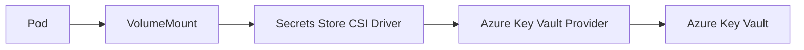
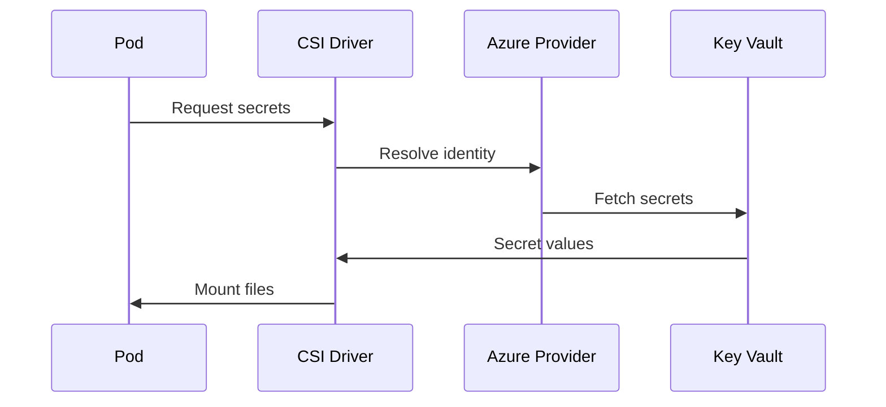

# 🔐 Secret Store CSI Driver (AKS) — Explained Properly

## 🧠 First: What Problem Does It Solve?

### Classic Kubernetes Secret problem

```text
Secret → stored in etcd → base64 → long-lived → needs rotation → risky
```

Issues:

- Secrets live **inside the cluster**
- Stored in **etcd**
- Often synced to Git / YAML
- Rotation is painful
- Auditing is weak

---

## 🎯 What Secret Store CSI Driver Does

> **Mount external secrets directly into Pods at runtime**

Instead of:

- Copying secrets _into_ Kubernetes

You:

- **Read secrets directly from external secret managers**

Examples:

- Azure Key Vault
- AWS Secrets Manager
- HashiCorp Vault

---

## 🧩 What “CSI Driver” Means Here

CSI = **Container Storage Interface**

Same concept as:

- CSI for disks
- CSI for filesystems

But here:

> **Secrets are treated like a read-only filesystem**

---

## 🧠 High-Level Architecture




---

## 🔗 AKS: What Happens When You Enable It

When you enable **Secret Store CSI Driver** in AKS:

Azure automatically installs:

- `secrets-store-csi-driver` (DaemonSet)
- Azure Key Vault provider
- Required CRDs

You do **NOT** install it manually.

---

## 🧩 Identity Used (Very Important)

AKS uses **Azure Managed Identity**:

- System-assigned or user-assigned
- No passwords
- No secrets in YAML

Flow:

```text
Pod → Node MI → Azure AD → Key Vault
```

---

## 🗂️ How Secrets Are Consumed (Two Modes)

### 1️⃣ Mount as Files (Default & Best)

Secrets appear as **files inside the container**.

#### Example

```text
/mnt/secrets-store/
  ├── db-password
  └── api-key
```

#### Pod Spec Example

```yaml
volumeMounts:
  - name: secrets-store
    mountPath: "/mnt/secrets-store"
    readOnly: true
```

✔️ No Kubernetes Secret
✔️ No etcd storage
✔️ Runtime-only

---

### 2️⃣ Sync to Kubernetes Secret (Optional)

⚠️ **Optional, not default**

You can **mirror** external secrets into native `Secret` objects.

```yaml
secretObjects:
  - secretName: app-secrets
    type: Opaque
    data:
      - objectName: db-password
        key: DB_PASSWORD
```

Why this exists:

- Legacy apps
- Env var usage

❌ But secrets now live in etcd again

---

## 🧱 SecretProviderClass (Core Object)

This is the **bridge object**.

```yaml
apiVersion: secrets-store.csi.x-k8s.io/v1
kind: SecretProviderClass
metadata:
  name: azure-keyvault-secrets
spec:
  provider: azure
  parameters:
    keyvaultName: my-kv
    objects: |
      array:
        - objectName: db-password
          objectType: secret
```

Think of it as:

> “Instruction manual for the CSI driver”

---

## 🔁 Runtime Flow (Step-by-Step)



No secret is stored permanently in the cluster.

---

## 🔄 Secret Rotation (Huge Win)

If enabled:

- Key Vault secret rotates
- CSI driver updates files
- Pod reads new value

⚠️ App must reread file (no restart auto-magic)

---

## 🆚 CSI Driver vs Kubernetes Secrets

| Feature                 | K8s Secret | CSI Driver |
| ----------------------- | ---------- | ---------- |
| Stored in etcd          | ✅ Yes     | ❌ No      |
| External secret manager | ❌ No      | ✅ Yes     |
| Auto rotation           | ❌ No      | ✅ Yes     |
| Auditing                | ❌ Weak    | ✅ Strong  |
| Git-safe                | ❌ Risky   | ✅ Safe    |
| Cloud-native            | ❌ No      | ✅ Yes     |

---

## 🧠 AKS Expert Mental Model

> **RBAC controls WHO can talk to the API** > **CSI Driver controls HOW secrets enter the Pod** > **Azure Key Vault controls WHERE secrets live**

---

## 🚨 Common Misunderstandings (Cleared)

- ❌ “It replaces Kubernetes Secrets”
- ✅ No — it _avoids_ them (unless synced)

- ❌ “Secrets are env vars”
- ✅ No — they are **files** by default

- ❌ “Azure Policy controls secrets”
- ✅ No — different layer

- ❌ “Needs service accounts”
- ✅ No — uses **Managed Identity**

---

## 🏁 When You SHOULD Use It

- ✅ Production workloads
- ✅ Regulated environments
- ✅ Zero-trust setups
- ✅ No secrets in Git
- ✅ Centralized secret governance
- ❌ Small demos
- ❌ Legacy apps that only support env vars (unless syncing)

---

## 🧠 Final One-Liner (Remember This)

> **Secret Store CSI Driver lets Pods read secrets directly from Key Vault at runtime, without ever storing them inside Kubernetes.**

---

If you want next, I can:

- 🔥 Compare **CSI vs External Secrets Operator**
- 🧪 Show **full AKS + Key Vault example**
- 🔐 Explain **identity flow with Managed Identity**
- ⚔️ Combine **CSI + RBAC + Azure Policy**
- 🏗️ Design **enterprise secret strategy for AKS**

Just say the word 👊
