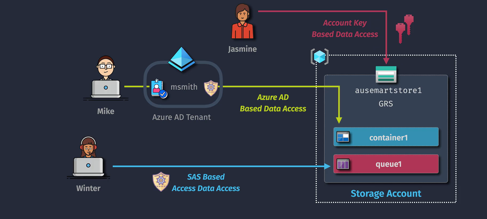
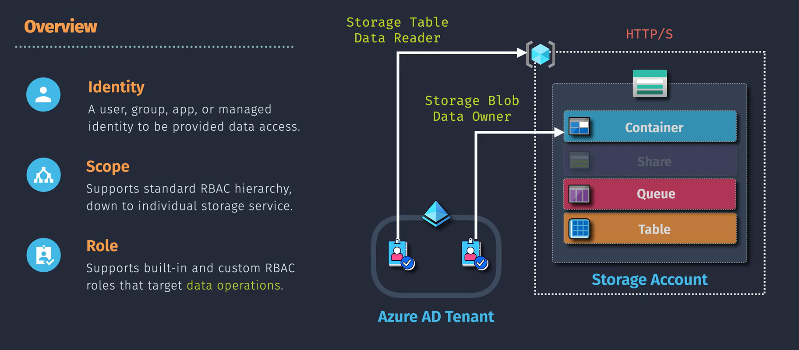
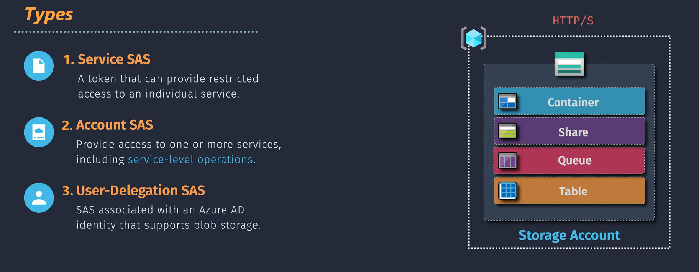
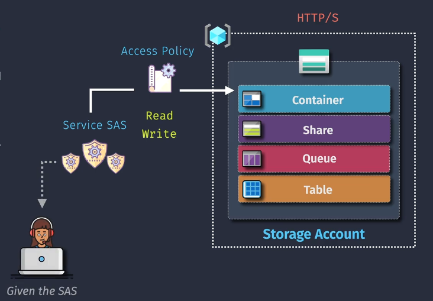
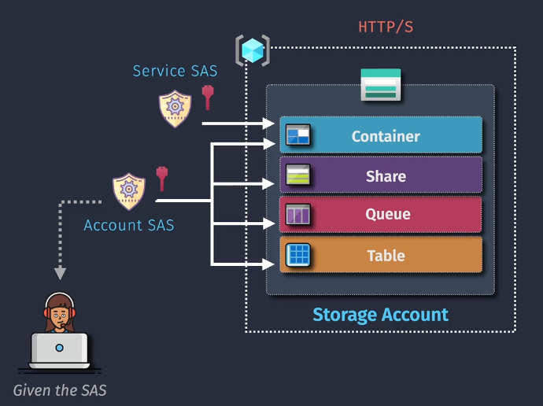
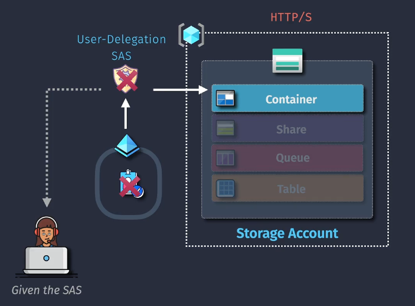
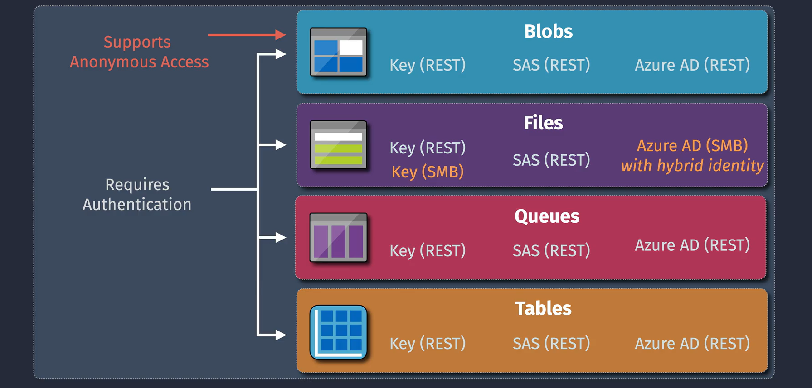
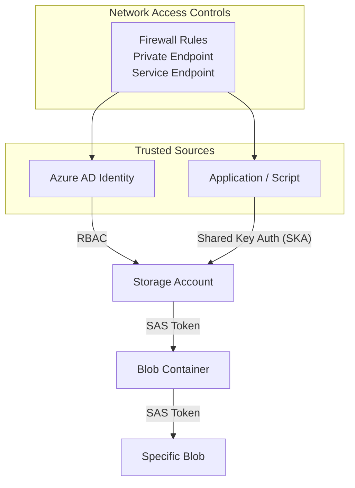

# 🔐 **Storage Access Control** in Azure Storage

In Azure, controlling who can touch your precious data is **serious business**, but that doesn’t mean it has to be boring. Think of it like running a high-security vault: **you decide who gets the keys, how long they can use them, and whether they can peek inside or actually move stuff around.**

---

> 📌 In Azure Storage, access control is handled using three main methods: **Access Keys**, **Role-Based Access Control (RBAC)**, and **Shared Access Signatures (SAS)**, plus, the protocols through which data is accessed also play a role in security.

---

---

## 1️⃣ **Access Keys** – _The Master Keys to the Kingdom_

> When you create a storage account, Azure _automatically_ generates **two** powerful access keys:
>
> - **Primary Key** – Full access to _everything_ in the account.
> - **Secondary Key** – Same powers, but exists so you can rotate them without downtime.

---

---

### 🔄 **Key Rotation Example:**

If your app uses the primary key, you can:

1. Update it to use the secondary key.
2. Regenerate the primary key.
3. Switch back to the primary key when ready.

### **💡 Use case:**

Admin tasks or apps that need **full control** over all storage services.

### ⚠️ **Security Tip:**

Access keys are **nuclear launch codes** — guard them with your life.

---

## 2️⃣ **Azure RBAC** – _Granular, Role-Based Permissions_

> **Azure Role-Based Access Control** lets you assign _specific roles_ to _specific people or apps_ — at _specific scopes_.

---

---

### **🌀 Common Blob roles:**

- **Storage Blob Data Owner** – All blob data rights.
- **Storage Blob Data Contributor** – Read/write, no ownership rights.
- **Storage Blob Data Reader** – Read-only.

### **🔎 Scopes:**

- **Subscription level** – Broadest, affects _everything_.
- **Resource group level** – Only resources in that group.
- **Resource level** – One specific storage account.

### **💡 Use case:**

Give a developer Blob write access without letting them delete the account.

---

## 3️⃣ **Shared Access Signatures (SAS)** – _VIP Guest Passes_

> A **SAS token** is like handing someone a **time-limited backstage pass**, they can only go where you allow, for as long as you allow.

---

### **🌀 Types of SAS:**

- **Service SAS** – For one service (Blob, File, Queue, Table).
    

    
    

- **Account SAS** – Multiple services in one account.
    

    
    

- **User Delegation SAS** – Uses Azure AD credentials for more secure delegation. (**only got blob storage**)
    

    
    

### **📰 Parameters you control:**

- Which services
- What operations (Read, Write, Delete…)
- Start & expiry time

### **💡 Use case:**

Give a client 24-hour upload rights to a Blob container without sharing account keys.

---

## 📒 **Note**

> 📌 **All Azure Storage Account services require authentication**, **except Blob Containers**, which can optionally allow **anonymous (public) access** to blobs — if explicitly configured.

---

---

## 🐦‍🔥 **Network Access Controls**

> 🚨 Security isn’t just about _who_ can get in — it’s also about _where they’re coming from_.

- **🌐 Storage Firewalls & VNet Rules** – Restrict access to specific IPs or virtual networks.
- **🪝 Service Endpoints** – Route VNet traffic to storage over Azure’s backbone network.
- **🔒 Private Endpoints** – Access storage over a private IP within your Azure Virtual Network.

---

## 🧩 **Combining Access Controls**

In real-world scenarios, you **layer** multiple access mechanisms to secure both identity and data paths.

---

## 🌐 **Storage Access Protocols**

Azure Storage supports **three main protocols** for accessing data. Each suits different use cases and environments:

---

---

### 1️⃣ **REST API** – For Apps & Scripts

📦 **What it is**:  
A web-based protocol used by applications to talk to Azure Storage over HTTP/HTTPS.

🛠️ **Used with**:

- Blob Storage
- Queue Storage
- Table Storage

💡 **Example**:  
A web app uploads user profile pictures to Blob Storage using REST API calls.

🔐 **Authentication**:

- Azure AD (RBAC)
- SAS Tokens
- Shared Key Auth

---

### 2️⃣ **NFS (Network File System)** – For Linux-Based File Access

📦 **What it is**:  
A protocol that lets Linux/UNIX systems mount Azure Blob or File shares like local drives.

🛠️ **Used with**:

- Blob Storage (NFS 3.0)
- Azure Files

💡 **Example**:  
A data science team mounts a Blob container via NFS to run analytics on large datasets from their Linux VMs.

🔐 **Authentication**:

- Storage account-level permissions
- Network restrictions (VNet, firewall)

---

### 3️⃣ **SMB (Server Message Block)** – For Windows & Cross-Platform File Sharing

📦 **What it is**:  
A protocol that allows shared access to files across Windows, macOS, and Linux systems.

🛠️ **Used with**:

- Azure Files

💡 **Example**:  
A company maps Azure File Shares to employees’ Windows machines for shared document access.

🔐 **Authentication**:

- Azure AD DS (Domain Services)
- NTLM / Kerberos
- RBAC (for identity-based access)

---

### 🧠 Quick Summary Table

| Protocol | Used With          | Best For                         | Auth Methods                     |
| -------- | ------------------ | -------------------------------- | -------------------------------- |
| REST API | Blob, Queue, Table | Apps, scripts, integrations      | Azure AD, SAS, Shared Key        |
| NFS      | Blob, Files        | Linux-based file access          | Network + Storage-level controls |
| SMB      | Azure Files        | Windows/macOS/Linux file sharing | Azure AD DS, NTLM, Kerberos      |

---

## 🛡 **Best Practices** for Storage Access Control

1. **Prefer RBAC over Access Keys** – Granular and safer.
2. **Limit SAS lifetimes** – Expire them ASAP.
3. **Rotate Access Keys regularly** – Reduce risk of compromise.
4. **Use Azure Key Vault** – Store secrets securely.
5. **Monitor access** – Azure Monitor + Activity Logs = visibility.
6. **Apply network restrictions** – NSGs, firewalls, private endpoints.
7. **Force HTTPS** – Always encrypt in transit.
8. **Least privilege principle** – Never give more rights than necessary.

---

## 📊 **Summary Table**

| Feature         | Azure RBAC                | SAS Tokens                     | Access Keys              |
| --------------- | ------------------------- | ------------------------------ | ------------------------ |
| **Purpose**     | Assign roles via Azure AD | Grant temporary, scoped access | Full unrestricted access |
| **Granularity** | Fine-grained              | Limited but flexible           | None                     |
| **Security**    | High                      | Medium                         | Low                      |
| **Best Use**    | Ongoing role management   | Temporary external access      | Admin automation         |
