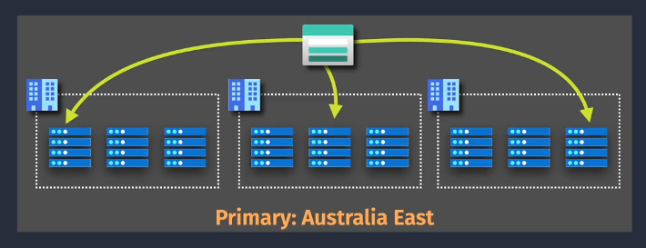
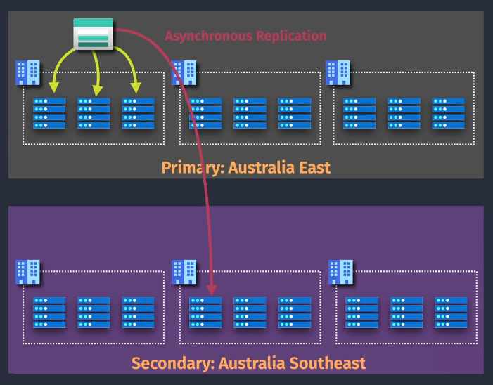
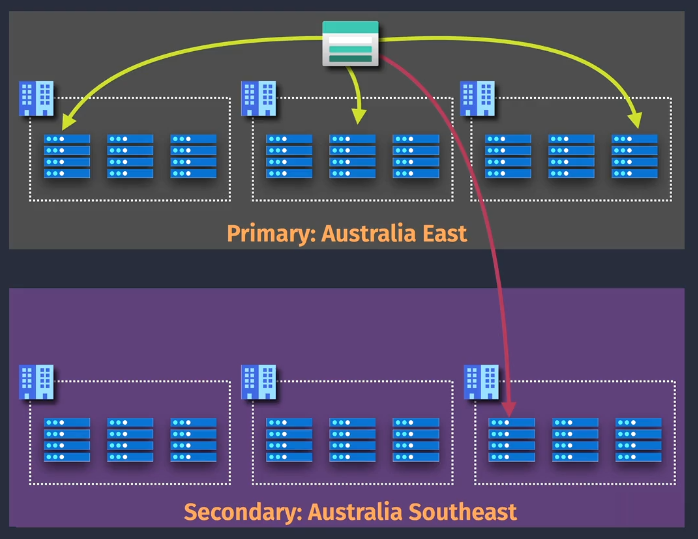
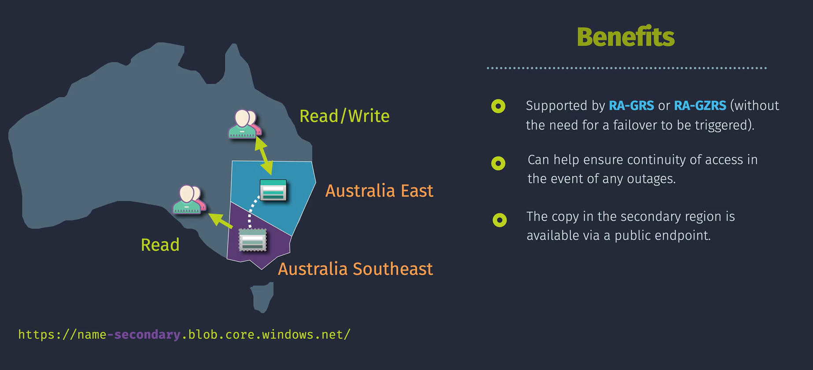
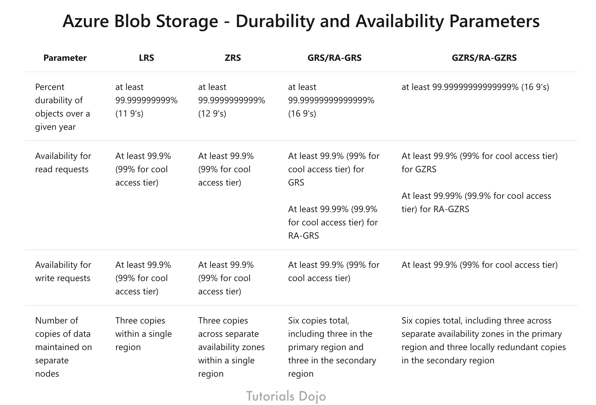

# 🛡️ **Azure Storage Redundancy**

> **📖 Definition:**  
> Azure Storage Redundancy is Azure’s way of **keeping multiple copies of your data** so that even if a hard drive catches fire, a data center goes dark, or an entire region goes down — your files are still safe, sound, and accessible.

It’s all about **availability** (your data is online when you need it) and **durability** (your data won’t vanish unexpectedly).

---

## 🌍 **Redundancy Types**

### 1️⃣ **LRS – Locally Redundant Storage**

  

- **How it works:** Keeps **3 copies** of your data in **one data center**.
- **Protection scope:** Survives **local hardware failures** (like disk crashes).
- **Limit:** If that data center goes down completely, your data goes offline too.
- **Example:** Think of it as saving your file on **3 different drives in the same PC**.

---

### 2️⃣ **ZRS – Zone-Redundant Storage**

  

- **How it works:** Replicates data across **3 availability zones** in the same Azure region.
- **Protection scope:** Survives **entire data center failures** in the same region.
- **Example:** Like saving copies in **3 separate buildings in the same city**.

---

### 3️⃣ **GRS – Geo-Redundant Storage**

  

- **How it works:** LRS in your **primary region** + **asynchronous replication** to a **secondary region** hundreds of kilometers away.
- **Protection scope:** Survives a **regional disaster**.
- **Catch:** Data replication isn’t instant (slight lag).
- **Example:** Copies in your **city** and in a **backup city** far away.

---

### 4️⃣ **GZRS – Geo-Zone-Redundant Storage**

  

- **How it works:** Combines **ZRS** in the primary region + replication to a **secondary region**.
- **Protection scope:** Zone-level AND region-level protection.
- **Example:** Like having **3 copies across districts in City A** + **another 3 in City B**.

---

## 📖 **Bonus: Read Access Versions**

---

### 5️⃣ **RA-GRS – Read-Access Geo-Redundant Storage**

- Same as GRS **+** read access to secondary region.
- **Use case:** Disaster strikes? Still serve users by reading from backup region.

---

### 6️⃣ **RA-GZRS – Read-Access Geo-Zone-Redundant Storage**

- Same as GZRS **+** read access to secondary region.
- **Highest availability tier**.

---

## 🪜 **How to Set Redundancy**

1. **In Azure Portal → Create / Configure Storage Account**
2. Under **Replication**, pick your redundancy option.
3. Click **Create** or **Save**.

> ⚠️ Some changes (like LRS → ZRS) may need **Azure support**.

---

## 💡 **Failover Considerations** (For GRS, RA-GRS, GZRS, RA-GZRS)

1. **Manual Process**  
   Failover is **initiated manually** by you — Azure will not automatically switch regions for storage accounts.

2. **Data Loss Risk**  
   Replication is **asynchronous**. If the primary fails, any data not yet replicated to the secondary will be lost.

3. **Post-Failover State**  
   After failover, the new primary becomes **LRS**.
   If you need geo-redundancy again, you must **re-enable** it.

4. **DNS Update**  
   Azure updates the storage endpoint DNS to point to the new primary automatically.

---

## 💡 **General Redundancy Considerations**

- **Availability Limits**  
  Not all redundancy types are available for all storage account tiers (e.g., Premium has restrictions).

- **Not a Backup**  
  Replication is for **disaster recovery**, not historical backups — corrupted or deleted data is replicated too.

- **Changing Types**  
  You can switch between many redundancy types, but **some require Azure Support** and cannot be done instantly.

---

## **🏁 Quick Summary**

| Type        | Copies | Scope                      | Async? | Read Secondary? | Best For                        |
| ----------- | ------ | -------------------------- | ------ | --------------- | ------------------------------- |
| **LRS**     | 3      | One DC                     | ❌     | ❌              | Local hardware failure          |
| **ZRS**     | 3      | 3 Zones (1 region)         | ❌     | ❌              | Zone/DC failures                |
| **GRS**     | 6      | Primary + Secondary region | ✅     | ❌              | Regional outages                |
| **GZRS**    | 6      | Zones + Secondary region   | ✅     | ❌              | Zone + regional outages         |
| **RA-GRS**  | 6      | Primary + Secondary region | ✅     | ✅              | Disaster recovery + read access |
| **RA-GZRS** | 6      | Zones + Secondary region   | ✅     | ✅              | Highest availability            |

  

