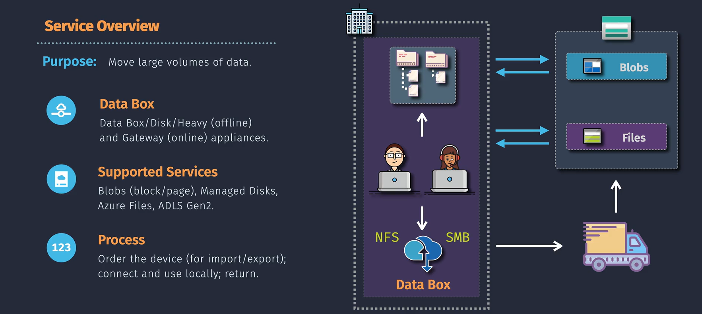
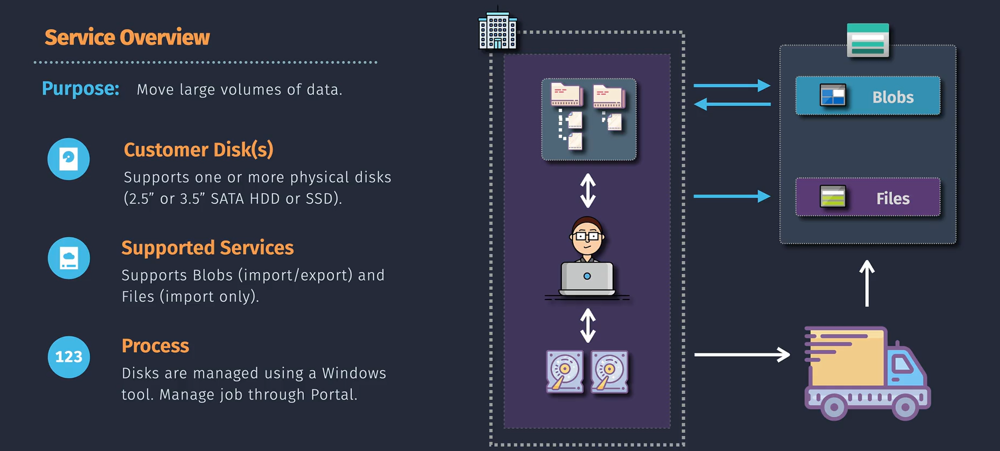
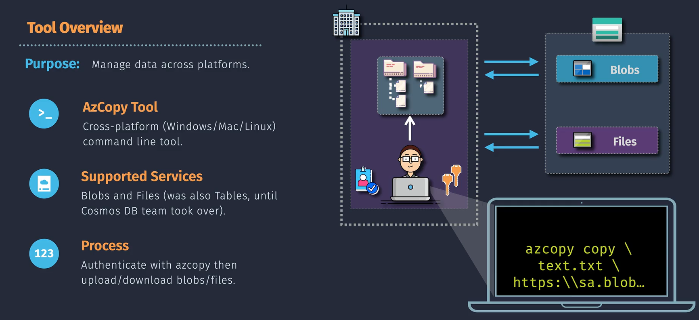

# 🚚 **Azure Storage Data Transfer Tools**

Transferring large amounts of data into Azure Storage requires different approaches depending on:

- **Volume of data**
- **Transfer speed required**
- **Network bandwidth availability**
- **Security and compliance requirements**

Azure provides several **data transfer services and tools**, ranging from offline shipping devices to high-speed command-line utilities.

---

> 📖 T.O.C:
>
> 1. Azure Data Box Family
> 2. Azure Import/Export Service (Custom Disk)
> 3. AzCopy

---

## 🚚 **1.Azure Data Box Family**

> The **Azure Data Box** family provides **Microsoft-managed, ruggedized appliances** that you can order, load with data, and ship back to Azure for bulk ingestion.

<div style="text-align:center;">

</div>

---

### 📦 Variants

- **Data Box** (100 TB capacity) → Rugged appliance with 100 TB usable storage.
- **Data Box Disk** (up to 40 TB) → SSD disks for smaller datasets.
- **Data Box Heavy** (1 PB) → For extremely large migrations.
- **Data Box Gateway** (virtual appliance) → Continuous data transfer over network.

### 🛠️ How It Works

1. Order Data Box appliance from the Azure portal.
2. Copy data onto the device using SMB/NFS/REST.
3. Ship device back to Azure datacenter.
4. Microsoft uploads the data securely into your storage account.

### ⚡ Use Cases

- **Massive migrations** (tens of TBs to PBs).
- Moving data for **datacenter shutdowns** or **cloud adoption projects**.
- **Compliance-driven secure transfers** (offline, encrypted).

### ✅ Benefits

- **High capacity** and **ruggedized hardware** (secure transport).
- **Managed by Microsoft** (you don’t buy hardware).
- **Encrypted** end-to-end with AES-256.

### ⚠️ Considerations

- Involves **shipping** (not real-time).
- Cost depends on device size and shipping location.

---

## 🛵 **2.Azure Import/Export Service (Custom Disk)**

> The **Azure Import/Export Service** allows you to transfer data into or out of Azure Storage by **physically shipping encrypted disks** to an Azure datacenter.
>
> - **Import job** → Copy large datasets from disks into Azure Blob Storage or Azure Files.
> - **Export job** → Copy data from Azure to disks, which are then shipped back to you.

<div style="text-align:center; margin: 0 auto;">

</div>

---

### 🛠️ How It Works

1. Prepare your disks (BitLocker-encrypted).
2. Use the **Azure Import/Export tool** to copy data onto disks (for import).
3. Ship the disks to the nearest Azure datacenter.
4. Azure team uploads data into your storage account (import) or downloads data onto your disks (export).
5. Disks are shipped back securely.

### ⚡ Use Cases

- Large-scale **initial data migration** when internet bandwidth is limited.
- **Data export** for compliance, audits, or offboarding.

### ✅ Benefits

- Secure (BitLocker encryption).
- No dependency on network speed.
- Cost-effective for petabyte-scale migrations.

### ⚠️ Considerations

- Involves **physical logistics** (shipping time).
- Best for **one-time or infrequent transfers**, not ongoing sync.

---

## 🧑🏻‍💻 **3.AzCopy**

> **AzCopy** is a **command-line utility** designed for **fast and reliable data transfer** between local storage and Azure Storage over the network.

<div align="center">

</div>

---

### 🛠️ Key Features

- Supports **Blob Storage, File Shares, and Tables**.
- **Parallel, multithreaded transfers** for speed.
- Supports **SAS tokens, Azure AD authentication, and Managed Identities**.
- **Cross-account and cross-region copy**.
- Resume failed transfers automatically.

### ⚡ Use Cases

- Upload/download files and directories to **Blob containers or File shares**.
- **Automated migration scripts**.
- Ongoing **data synchronization jobs**.
- **CI/CD pipelines** needing storage uploads.

### ✅ Benefits

- **High performance** → optimized for Azure Storage.
- **Free & lightweight** → no infrastructure required.
- Works across **Windows, Linux, macOS**.

### ⚠️ Considerations

- **Depends on internet bandwidth** (network-bound).
- Best for **ongoing or medium-scale transfers**, not petabyte offline migration.

---

### 🔹 1. Install & Login

#### Install AzCopy

- Windows: [Download MSI](https://aka.ms/downloadazcopy-v10-windows)
- Linux/macOS:

```bash
wget https://aka.ms/downloadazcopy-v10-linux -O azcopy.tar.gz
tar -xvf azcopy.tar.gz
sudo ./install.sh
```

#### Login with Azure AD

```bash
azcopy login --tenant-id <Tenant-ID>
```

or with **SAS token** (no login needed, just append `?<SAS>` to URLs).

---

### 🔹 2. Upload Files to Azure Blob Storage

#### Upload a Single File

```bash
azcopy copy "/local/path/file1.txt" "https://<storageaccount>.blob.core.windows.net/<container>?<SAS>"
```

#### Upload Entire Folder

```bash
azcopy copy "/local/path/folder" "https://<storageaccount>.blob.core.windows.net/<container>?<SAS>" --recursive=true
```

---

### 🔹 3. Download Files from Azure Blob Storage

#### Download a Single File

```bash
azcopy copy "https://<storageaccount>.blob.core.windows.net/<container>/file1.txt?<SAS>" "/local/path/file1.txt"
```

#### Download Entire Container

```bash
azcopy copy "https://<storageaccount>.blob.core.windows.net/<container>?<SAS>" "/local/download/folder" --recursive=true
```

---

### 🔹 4. Copy Between Storage Accounts

```bash
azcopy copy "https://<sourceaccount>.blob.core.windows.net/<container>?<SAS>" "https://<destaccount>.blob.core.windows.net/<container>?<SAS>" --recursive=true
```

---

### 🔹 5. Sync Local Folder with Blob Storage

Keeps local and cloud data **in sync** (new/updated files copied).

```bash
azcopy sync "/local/path/folder" "https://<storageaccount>.blob.core.windows.net/<container>?<SAS>" --recursive=true
```

Or reverse (Azure → local):

```bash
azcopy sync "https://<storageaccount>.blob.core.windows.net/<container>?<SAS>" "/local/path/folder" --recursive=true
```

---

### 🔹 6. Upload/Download to Azure File Share

#### Upload File

```bash
azcopy copy "/local/path/file.txt" "https://<storageaccount>.file.core.windows.net/<share>/<directory>?<SAS>"
```

#### Download File

```bash
azcopy copy "https://<storageaccount>.file.core.windows.net/<share>/<directory>/file.txt?<SAS>" "/local/path/file.txt"
```

---

### 🔹 7. Advanced Options

- **Limit concurrency (useful if bandwidth is low):**

```bash
azcopy copy "/local/path" "https://<storageaccount>.blob.core.windows.net/<container>?<SAS>" --recursive=true --cap-mbps=50
```

- **Resume failed jobs:**

```bash
azcopy jobs resume <job-id>
```

- **Check current jobs:**

```bash
azcopy jobs list
```

---

## 📊 **Comparison**

| Tool                            | Mode                   | Capacity                                  | Speed              | Best For                         |
| ------------------------------- | ---------------------- | ----------------------------------------- | ------------------ | -------------------------------- |
| **Import/Export (Custom Disk)** | Offline (your disks)   | Up to \~10 TB per job (depends on #disks) | Shipping-based     | Small → Medium offline jobs      |
| **Data Box Family**             | Offline (MS devices)   | 40 TB → 1 PB+                             | Shipping-based     | Large offline migrations         |
| **AzCopy**                      | Online (over internet) | Unlimited                                 | Depends on network | Day-to-day transfers, automation |

---

## ✅ **Best Practices**

- Use **AzCopy** when:

  - Data is in **GBs to few TBs**, and **network bandwidth is good**.
  - You need **recurring sync or automation**.

- Use **Import/Export or Data Box** when:

  - Migrating **tens/hundreds of TBs to PBs**.
  - Network is **slow, expensive, or unreliable**.
  - Need **one-time bulk ingestion**.

- For **hybrid/on-premises + Azure sync** → combine with **Azure File Sync** or **Data Box Gateway**.

---

## ⚡ **Quick Recap:**

- **Import/Export Service** → Ship your own disks.
- **Azure Data Box** → Microsoft ships rugged devices for bulk ingestion/export.
- **AzCopy** → Free CLI for fast online transfers & automation.
