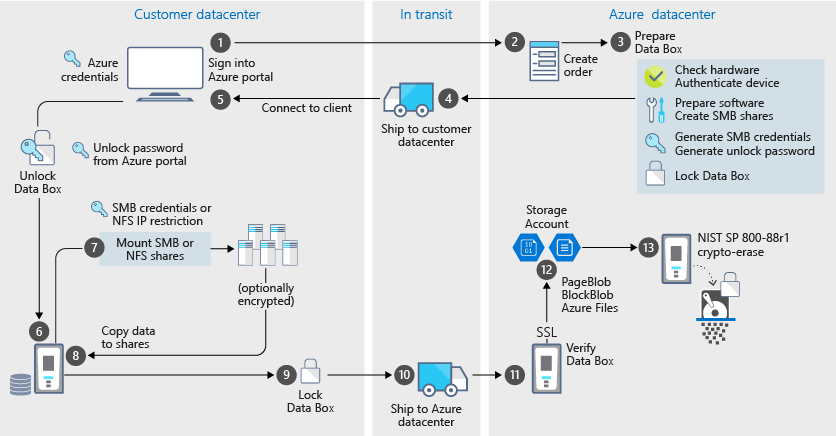

# 🚚 **Azure Data Box**

**Azure Data Box is a physical device that helps you securely transfer large volumes of data (40 TB to 500+ TB) to or from Azure when network upload is too slow or impractical.**

---

## 📦 What Is Azure Data Box?

Azure Data Box is a **hardware appliance** shipped to your location by Microsoft. You copy your data onto it locally, then ship it back to Microsoft, where the data is uploaded to your Azure storage account.

It’s designed for:

- **Offline data transfer**
- **Secure, high-volume migration**
- **One-time or periodic bulk ingestion**

---

  

---

## 🧠 How It Works

1. **Order the device** via Azure Portal.
2. **Receive the Data Box** (rugged, tamper-resistant).
3. **Connect it locally** via standard interfaces (SMB/NFS).
4. **Copy your data** using familiar tools (Robocopy, rsync, etc.).
5. **Ship it back** to Microsoft.
6. **Azure uploads the data** to your specified storage account.

The entire process is **tracked end-to-end** in the Azure Portal.

---

## 📊 Models and Capacity

| Model              | Capacity             | Use Case                         |
| ------------------ | -------------------- | -------------------------------- |
| **Data Box Disk**  | Up to 40 TB          | Small transfers, branch offices  |
| **Data Box**       | Up to 80 TB          | Medium-scale migration           |
| **Data Box Heavy** | Up to 1 PB (retired) | Large-scale datacenter migration |

_Note: Data Box Heavy is retired in most regions as newer models replace it_.

---

## 🔐 Security Features

- **AES 256-bit encryption**
- **Tamper detection**
- **Secure erase after upload**
- **Data never leaves your region unless specified**

---

## 🧪 Use Cases

- **Lift-and-shift migration**: Move VMs, databases, media libraries.
- **Initial bulk transfer**: Seed large datasets before syncing via network.
- **Disaster recovery**: Restore large backups quickly.
- **Compliance**: Avoid bandwidth bottlenecks or meet data residency rules.

---

## ⚠️ When to Use It

Use Azure Data Box when:

- You need to move **40+ TB** of data.
- Your **network is too slow or costly** for upload.
- You want **secure, offline transfer** with full control.
