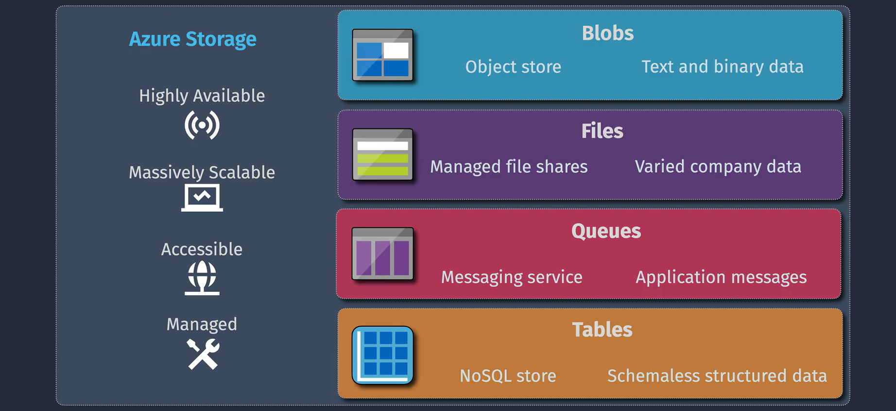
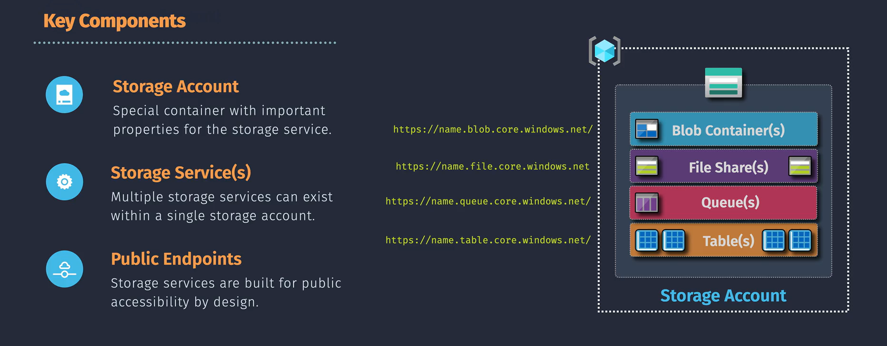
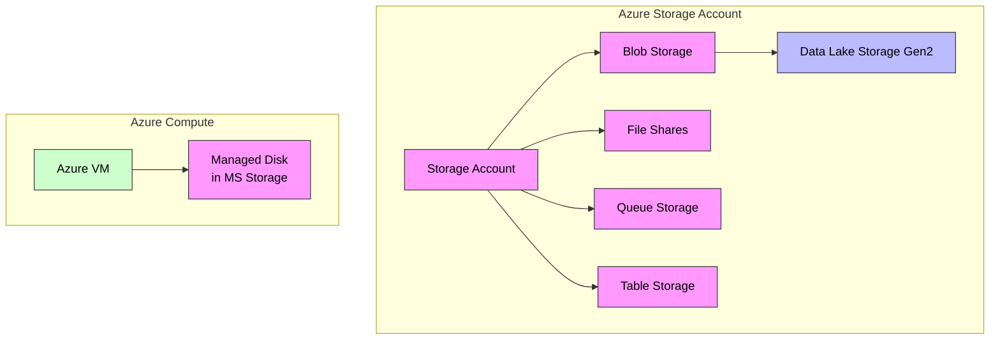

# 📦 **Azure Storage Account**

An **Azure Storage Account** is the **foundational container** for all Azure storage services. It provides a **unique namespace** in Azure, a **secure endpoint** for data access, and centralized control over performance, redundancy, and networking.

Think of it like a **cloud warehouse** with **different departments** (Blob, File, Queue, Table), each designed for a different kind of “merchandise” (data).

---

<div align="center">
  
</div>

---

> 📖 T.O.C:
>
> 1. Storage Services Types
> 2. Storage Performance Tiers
> 3. Storage Account Types
> 4. Redundancy Options
> 5. Networking
> 6. Security
> 7. Billing

---

## ✂️ **Storage Services Types**

Here’s what’s inside every storage account when you open it in the Azure Portal:

### 1️⃣ **Blob Storage** 🫙 – Object Storage for the Cloud Era

Blob = _Binary Large OBject_.

- **What it stores:** Images, videos, logs, backups, documents — basically _anything unstructured_.
- **Tiers:**

  - **Hot** – For frequently accessed data (e.g., user profile pictures)
  - **Cool** – For infrequently accessed data (e.g., monthly reports)
  - **Archive** – Cheapest tier for long-term storage (e.g., compliance data)

- **Example:** Hosting a static website or storing millions of IoT telemetry files.

---

### 2️⃣ **File Shares** 📁 – Network Drives in the Cloud

- **What it stores:** Files accessible over SMB or NFS protocols.
- **Why it’s great:** Lift-and-shift legacy apps without changing their code — they’ll think the cloud file share is a normal file server.
- **Example:** Company documents accessed by multiple Azure VMs across departments.

---

### 3️⃣ **Queue Storage** 📬 – Messaging Without the Headache

- **What it stores:** Small messages (up to 64 KB each) for async processing.
- **Why it’s great:** Decouple application components. If one service goes down, the messages wait patiently.
- **Example:** An e-commerce site queues "order shipped" notifications for later processing by a background worker.

---

### 4️⃣ **Table Storage** 📊 – Schemaless, Fast, NoSQL Store

- **What it stores:** Structured, non-relational data in key-value pairs.
- **Why it’s great:** Fast lookups for large datasets without a complex database.
- **Example:** Storing millions of IoT sensor readings, or user profile settings.

---

> 📌 **Note:** `Disks` and `Data Lake Storage Gen2` are **specialized use cases** of blob storage, but managed differently.

---

### 💡 **Azure Disks and Data Lake Storage Gen2**

Some Azure services use **Storage Accounts under the hood** without you seeing them:

#### 💽 **1. Azure Managed Disks**

> Stored as a Page Blob in Microsoft’s managed storage account (not in your account)

- Managed Disks **use Storage Accounts under the hood**, but those accounts are **managed by Azure** and hidden from you.
- You can’t browse them in your own storage account blade.
- Example: When you create a VM, its OS/data disks live in Microsoft-managed storage accounts in the same region.

#### 🌊 **2. Azure Data Lake Storage Gen2**

> Blob storage with hierarchical namespace enabled = ADLS Gen2

- ADLS Gen2 is **a capability on top of Blob Storage** (hierarchical namespace + analytics optimizations).
- It’s enabled **within a blob container** rather than being a separate service icon in the portal.
- That’s why you don’t see “Data Lake” as a fifth tile — it’s part of Blob.

---

### 🆔 **Unique Name & Namespace**

<div align="center">
  
</div>

Your storage account name forms its URL:

```ini
https://<account-name>.blob.core.windows.net/
```

- Blob → `https://<account>.blob.core.windows.net`
- File → `https://<account>.file.core.windows.net`
- Queue → `https://<account>.queue.core.windows.net`
- Table → `https://<account>.table.core.windows.net`
- Data Lake → `https://<account>.dfs.core.windows.net`

> 📌 Name must be **3–24 lowercase letters/numbers**, globally unique.

---

## 🧩 **Storage Account Types**

| Type                                              | Best For                                                      |
| ------------------------------------------------- | ------------------------------------------------------------- |
| **General-purpose v2 (GPv2)** ✅ _Default choice_ | Supports all storage types, multiple tiers, modern features.  |
| **Premium Block Blob**                            | SSD-backed, High-throughput apps needing fast blob access     |
| **Premium Page Blob**                             | SSD-backed disks for low-latency VM workloads like DB storage |
| **Premium File Shares**                           | SSD-backed, Enterprise SMB/NFS shares with high IOPS          |

---

## 🚀 **Storage Performance Tiers**

- **Premium (SSD / FileStorage)** → low latency, high IOPS (AVD/FSLogix, databases, CAD).
- **Standard (HDD)**:

  - **Transaction Optimized** (balanced)
  - **Hot** (read/write often)
  - **Cool** (cheap + infrequent access)

---

## 🔂 **Redundancy Options**

| Option      | Copies | Scope                  | Use Case        |
| ----------- | ------ | ---------------------- | --------------- |
| **LRS**     | 3      | Single Az (datacenter) | Cost-sensitive  |
| **ZRS**     | 3      | Multiple AZs           | Zone resiliency |
| **GRS**     | 6      | Paired regions         | DR-ready        |
| **GZRS**    | 6      | ZRS + geo-rep          | Max durability  |
| **RA-GRS**  | 6      | GRS + read access      | Read replicas   |
| **RA-GZRS** | 6      | GZRS + read access     | Top-level HA/DR |

---

## 🥵 **Access Tiers for (Blob) only**

| Tier        | Latency                   | Cost/GB | Best For                 |
| ----------- | ------------------------- | ------- | ------------------------ |
| **Hot**     | Low                       | Higher  | Frequently accessed data |
| **Cool**    | Medium                    | Lower   | Infrequently accessed    |
| **Archive** | High (rehydration needed) | Lowest  | Long-term retention      |

---

## 🌐 **Networking**

- **Public endpoints** – Accessible over internet (with optional firewall rules)
- **Private endpoints** – Private IP access via Azure Private Link
- **Service endpoints** – Secure access over Azure backbone

---

## 👮🏻‍♀️ **Security**

- **Access Control**

  - Azure AD RBAC
  - Shared Access Signatures (SAS)
  - Storage Account Keys

- **Encryption**

  - At-rest (Microsoft-managed or Customer-managed keys in Key Vault)
  - In-transit (HTTPS enforced)

---

## 💸 **Billing Factors**

- **Capacity** (GB/month)
- **Tier** (Hot, Cool, Archive)
- **Redundancy** (LRS, ZRS, GRS, GZRS, etc.)
- **Transactions** (read/write/delete)
- **Data Transfer Out** of Azure

---

## 📊 **Flowchart – How It All Connects**



---

## 💡 **Real-World Example**

**Scenario:** An online learning platform

- **Videos & PDFs:** Blob Storage (Hot tier for popular courses, Cool tier for old content)
- **Teacher Shared Material:** File Share accessed by multiple VMs
- **Assignment Processing Queue:** Queue Storage for grading jobs
- **Student Progress Tracking:** Table Storage for quick lookups
- **VM Disk Storage:** Managed Disks stored as page blobs (invisible to user)
