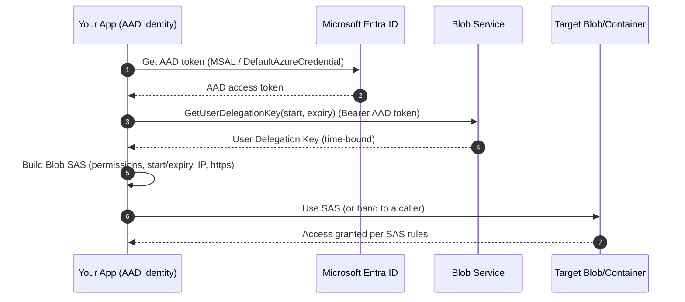
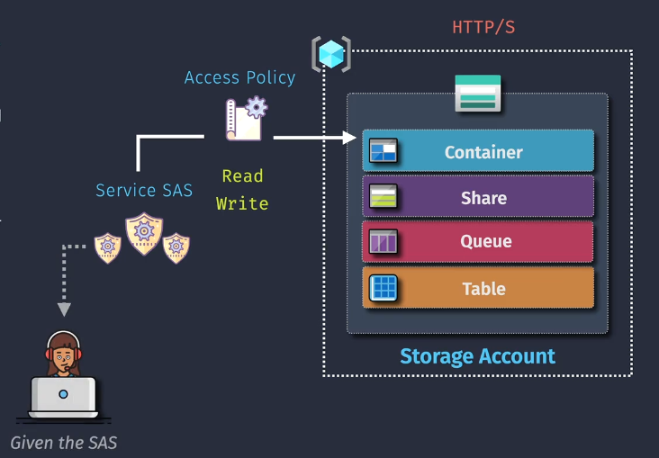
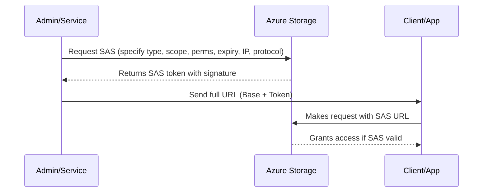
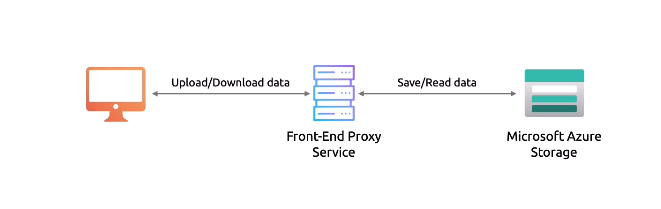
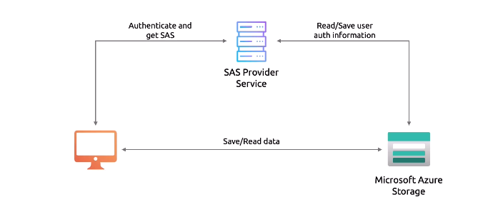

# 🔐 Azure Shared Access Signature (SAS) — Your Temporary Digital Pass

**SAS** security feature that allows you to grant limited access to your resources without exposing your storage account keys. SAS tokens help you define specific permissions, constrain the allowed time window, and restrict access by IP range, making them ideal for secure data sharing in Azure.

---

## 🎯 **The Purpose of SAS**

SAS defines:

1. **🎯 What you can access** — Scope of the resource (container, blob, file share, queue, or table).
2. **🛠 What you can do** — Read, Write, Delete, etc.
3. **⏳ For how long** — Start and expiry date/time.
4. **🌍 From where** — Restrict by IP and protocol (HTTPS recommended).

**Why it matters:**
This means you can give someone just enough access for just enough time — without giving them the master keys.

---

## 🧩 **Types of SAS & Their Scope**

| 🚦 SAS Type                | 📦 Scope                                                                                     | 🔑 Signing Method                      | 💡 Best For                                                  |
| -------------------------- | -------------------------------------------------------------------------------------------- | -------------------------------------- | ------------------------------------------------------------ |
| **1️⃣ Service SAS**         | One **service** only (Blob, File, Queue, or Table) and its resources (container, blob, etc.) | Account Key **or** User Delegation Key | Fine-grained, single-service access                          |
| **2️⃣ Account SAS**         | Multiple **services** in the same storage account                                            | Account Key                            | Cross-service automation                                     |
| **3️⃣ User Delegation SAS** | Blob service only, scoped to **Azure AD identity**                                           | User Delegation Key from Azure AD      | Identity-based, least-privilege, **no account key exposure** |

📌 **How they relate:**

- **Service SAS** → Precise access, one service.
- **Account SAS** → Multiple services, one signature.
- **User Delegation SAS** → Service SAS powered by Azure AD identity.

---

📌 **Why UD SAS is often preferred:**

- **No account keys** in your app or pipeline → huge blast-radius reduction.
- Honors **Azure AD RBAC** (who is allowed to request a UD key), **Conditional Access**, MFA, risk policies.
- **Short-lived by design** (you control lifetime). If a user/app loses access, they **cannot mint new** UD tokens.
- Fits **zero-trust** and least-privilege patterns (one-time, narrow permission, short TTL).

> Note: an already-issued SAS (any type) works until it **expires**. You can’t “yank” a specific SAS early (`except` Service/Account SAS issued via `stored access policies`).  
> So: **keep expiry short**.

---

## 🏗 **SAS Building Blocks**

Every SAS token (no matter the type) contains these components:

1. **📍 Resource scope** — Which container, blob, share, queue, or table.
2. **🔒 Permissions** — R (Read), W (Write), D (Delete), L (List), A (Add), U (Update), C (Create), P (Process).
3. **⏳ Validity window** — Start + expiry time.
4. **🔐 Protocol** — HTTPS only (recommended) or HTTPS+HTTP.
5. **🌐 IP restrictions** — Optional range limits.
6. **🖊 Signature** — Cryptographic proof it’s valid.

---

## ✍ **Signing Methods**

1. **🔑 Account Key** — Directly signs the SAS with a **storage account key** (simple, but leaks are dangerous).
2. **👤 User Delegation Key** — Issued by Azure AD for **Blob only**. Tied to identity and permissions.

---

### 💡 Prereqs & roles (UD SAS)

To create UD SAS, the caller must be able to request a **User Delegation Key**. Give one of:

- **Storage Blob Data Owner** (broad)
- **Storage Blob Data Contributor** (broad)
- **Storage Blob Delegator** (narrow; purpose-built for generating UD keys)

You can assign these at **account**, **container**, or **RG/subscription** scope (least privilege!).

---

## 🎁 How UD SAS actually works



- Your app never uses an account key.
- The **User Delegation Key** is time-scoped; you use it to sign the SAS.

---

## 🔍 **SAS Token Anatomy** – Dissecting the Beast

When you generate a SAS, you actually get **two parts**:

```ini
https://<account>.blob.core.windows.net/<resource-path>?<SAS-token>
```

- **Base URL** → Points to the actual Azure resource (container/blob/etc.).
- **Query String (SAS Token)** → The “magic pass” with all the rules encoded.

---

## 🧩 **SAS Query Parameters**

Here’s what you might see in a **Service SAS** for Blob:

```ini
?sv=2023-11-03&ss=b&srt=o&sp=rwdl&st=2025-08-13T07:00Z&se=2025-08-13T09:00Z&sip=192.168.1.0-192.168.1.255&spr=https&sig=<signature>
```

| Param             | Meaning                           | Example Value                                           | Applies To          |
| ----------------- | --------------------------------- | ------------------------------------------------------- | ------------------- |
| **sv**            | Storage Service Version           | `2023-11-03`                                            | All SAS types       |
| **sp**            | Permissions                       | `r` (Read), `w` (Write), `d` (Delete), `l` (List), etc. | All SAS types       |
| **ss**            | Service(s) allowed                | `b` (Blob), `f` (File), `q` (Queue), `t` (Table)        | Account SAS         |
| **srt**           | Resource Types                    | `o` (Object), `c` (Container), `s` (Service)            | Account SAS         |
| **sr**            | Resource                          | `b` (Blob), `c` (Container)                             | Service SAS         |
| **st**            | Start Time                        | `2025-08-13T07:00Z`                                     | All SAS types       |
| **se**            | Expiry Time                       | `2025-08-13T09:00Z`                                     | All SAS types       |
| **sip**           | Allowed IP Range                  | `192.168.1.0-192.168.1.255`                             | Optional            |
| **spr**           | Protocol                          | `https` or `https,http`                                 | Optional            |
| **skoid**         | Object ID (Azure AD user)         | GUID                                                    | User Delegation SAS |
| **sktid**         | Tenant ID (Azure AD tenant)       | GUID                                                    | User Delegation SAS |
| **skt** / **ske** | Start & Expiry for delegation key | ISO timestamp                                           | User Delegation SAS |
| **sig**           | Signature                         | Long Base64 hash                                        | All SAS types       |

---

## 🏗 **Relationship Between SAS Type & Parameters**

| SAS Type            | Unique Params                  | Why?                                               |
| ------------------- | ------------------------------ | -------------------------------------------------- |
| **Service SAS**     | `sr` only                      | You’re targeting a single resource.                |
| **Account SAS**     | `ss`, `srt`                    | Grants multiple services/resource types in one go. |
| **User Delegation** | `skoid`, `sktid`, `skt`, `ske` | Ties token to Azure AD-issued delegation key.      |

---

## 📜 **Stored Access Policies**

Instead of defining expiry and permissions in each SAS manually:

- Create a **policy** once at the container/share/table/queue level.
- Reference the **policy name** in SAS tokens.
- Update/revoke the policy → **all linked SAS become updated instantly**.

---

<div align="center">

</div>

---

> 💡 **Pro Tip:** Great for revoking multiple SAS tokens at once without hunting them down.

---

## 📜 **Stored Access Policy in URL**

When you use a **Stored Access Policy**, instead of `st` and `se` in the SAS, you may see:

```ini
?si=PolicyName
```

Where `si` = **Signed Identifier** (name of the policy).
The expiry and permissions are **looked up** in Azure instead of being embedded in the SAS.

---

## 🔄 **How SAS Gets Generated** (End-to-End)



---

## ✍🏻 **Example** – Breaking Down a SAS

**URL**:

```ini
https://myaccount.blob.core.windows.net/mycontainer/myfile.txt?sv=2023-11-03&sr=b&sp=rw&st=2025-08-13T07:00Z&se=2025-08-13T09:00Z&spr=https&sig=abcdef123456...
```

- `sv=2023-11-03` → API version.
- `sr=b` → Resource = Blob.
- `sp=rw` → Read + Write permissions.
- `st` / `se` → 2-hour validity window.
- `spr=https` → HTTPS only.
- `sig=...` → Signed with account key or user delegation key.

---

## 🎯 When to Use Shared Access Signatures (SAS)

SAS is your way to give **temporary, limited access** to Azure Storage **without exposing account keys**.
Two main design patterns exist depending on your needs:

### 1️⃣ **Frontend Proxy Service**

- **How it works**:
  Clients talk to **your service first** → the proxy uploads/downloads data from Storage.

- **Pros**:

  - ✅ Can enforce **business rules** (e.g., file type checks, quotas).
  - ✅ Centralized logging & validation.

- **Cons**:

  - ❌ Becomes a **bottleneck** under heavy load.
  - ❌ Expensive to scale (all traffic goes through the proxy).

- **Best for**:
  🛒 Medium-volume apps where **strict validations** are more important than raw performance.

<div align="center">
  
</div>

---

### 2️⃣ **Lightweight Auth Service + SAS Tokens**

- **How it works**:
  A small service authenticates users → issues a **SAS token** → client talks **directly** to Storage with it.

- **Pros**:

  - ✅ **High scalability** (no proxy bottleneck).
  - ✅ **Efficient** (server doesn’t handle file streams).
  - ✅ Perfect for large/unpredictable data (e.g., video uploads).

- **Cons**:

  - ❌ Less control over **inline business validations** (since clients bypass proxy).

- **Best for**:
  📹 Apps with **large file transfers** or **high upload rates** where performance & scalability matter.

<div align="center">
  
</div>
## 📚 **Example Scenarios**

1. **🎥 Temporary Media Upload Portal**

   - **Type:** Service SAS (Blob)
   - **Permission:** Write only
   - **Expiry:** 1 hour
   - **Use:** Client uploads directly, server never sees your keys.

2. **📦 Multi-Service Data Pipeline**

   - **Type:** Account SAS
   - **Permission:** Read + List
   - **Expiry:** 24 hours
   - **Use:** ETL job fetches from Blob & Queue in one go.

3. **🔐 Employee Access to Private Files**

   - **Type:** User Delegation SAS
   - **Permission:** Read
   - **Expiry:** Until end of shift
   - **Use:** Scoped to employee’s Azure AD identity.

---
