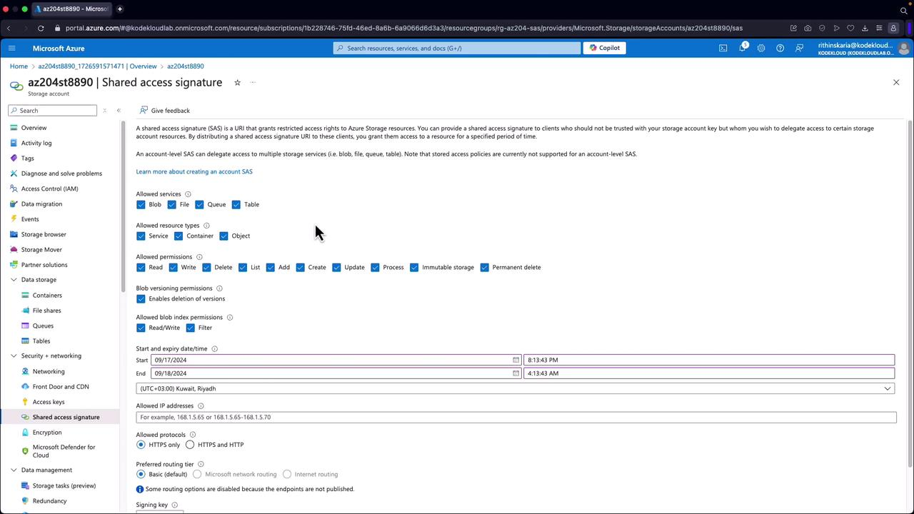

# 🛠 Step-by-step examples (each SAS type)

## 🎨 Generating SAS Tokens via the Azure Portal

You can generate SAS tokens using the Azure portal before implementing them with SDKs:

1. Open your storage account and navigate to a container (e.g., "airportcodes") that holds a file (such as airports.json).
1. Scroll down to the "Shared Access Signatures" section.
1. Configure the SAS by choosing the services, resource types, permissions, start/end times, IP restrictions, and the protocol (ensure HTTPS is enforced).
1. Click to generate the SAS token.

---

<div align="center">
  
</div>

---

> ⚠️ Warning: If you rotate the signing key, any previously generated SAS tokens will be revoked.

After generating the SAS token, append it to your resource URL. Without a valid SAS token, trying to access a private container might return an error similar to:

```xml
<Error>
    <Code>ResourceNotFound</Code>
    <Message>The specified resource does not exist. RequestId:231217b3-301e-0065-1f25-09a821000000 Time:2024-09-17T17:15:49.4907161Z</Message>
</Error>
```

---

## 🧑🏻‍💻 Generating SAS Tokens Using the .NET SDK

Below are examples demonstrating how to generate SAS tokens programmatically using the .NET SDK.

### 1️⃣ **Account SAS** (cross-service, signed by **account key**)

#### CLI

```bash
# Account SAS for Blob+Queue for 12 hours, service+container+object resource types
az storage account generate-sas \
  --account-name mystg \
  --account-key <ACCOUNT_KEY> \
  --services bq \
  --resource-types sco \
  --permissions rwlacup \
  --expiry 2025-09-18T06:00Z \
  --https-only
```

Use it by appending the SAS to target service URLs (e.g., container list, queue ops).

#### .NET

```csharp
using Azure.Storage;
using Azure.Storage.Sas;

// 1) Shared key credential
var cred = new StorageSharedKeyCredential("mystg", "<ACCOUNT_KEY>");

// 2) Build account SAS
var builder = new AccountSasBuilder
{
    Services = AccountSasServices.Blobs | AccountSasServices.Queues,
    ResourceTypes = AccountSasResourceTypes.Service | AccountSasResourceTypes.Container | AccountSasResourceTypes.Object,
    StartsOn = DateTimeOffset.UtcNow.AddMinutes(-5),
    ExpiresOn = DateTimeOffset.UtcNow.AddHours(12),
    Protocol = SasProtocol.Https
};
builder.SetPermissions(AccountSasPermissions.Read | AccountSasPermissions.Write | AccountSasPermissions.List);

var sas = builder.ToSasQueryParameters(cred).ToString();

var listContainersUrl = $"https://mystg.blob.core.windows.net/?comp=list&{sas}";
Console.WriteLine(listContainersUrl);
```

**Pros:** one token for multiple services (Blob/File/Queue/Table).
**Cons:** still relies on **account key**; broad permissions if you’re not careful.

---

### 2️⃣ **Service SAS** (one service, signed by **account key**)

#### CLI

```bash
# Read-only SAS for a specific blob
az storage blob generate-sas \
  --account-name mystg \
  --account-key <ACCOUNT_KEY> \
  --container-name mycontainer \
  --name myfile.txt \
  --permissions r \
  --expiry 2025-09-17T20:00Z \
  --https-only
```

#### .NET

```csharp
using Azure.Storage;
using Azure.Storage.Blobs;
using Azure.Storage.Sas;

// 1) Shared key credential
var cred = new StorageSharedKeyCredential("mystg", "<ACCOUNT_KEY>");

// 2) Build SAS for a blob
var sasBuilder = new BlobSasBuilder
{
    BlobContainerName = "mycontainer",
    BlobName = "myfile.txt",
    Resource = "b",
    StartsOn = DateTimeOffset.UtcNow.AddMinutes(-5),
    ExpiresOn = DateTimeOffset.UtcNow.AddHours(1),
    Protocol = SasProtocol.Https
};
sasBuilder.SetPermissions(BlobSasPermissions.Read | BlobSasPermissions.Write);

// 3) Sign with account key
var sas = sasBuilder.ToSasQueryParameters(cred);

// 4) Full URL
var url = $"https://mystg.blob.core.windows.net/mycontainer/myfile.txt?{sas}";
Console.WriteLine(url);
```

**Pros:** precise per-resource, supports **stored access policies** (so you can revoke/update multiple SAS at once).
**Cons:** you must protect the **account key** (big blast radius if leaked).

---

### 3️⃣ **User Delegation SAS** (Blob only)

#### CLI (as your signed-in AAD user/app)

```bash
# Login with an AAD identity that has Blob Data *Delegator/Contributor/Owner*
az login

# Generate UD SAS for a blob (read-only for 1 hour)
az storage blob generate-sas \
  --account-name mystg \
  --container-name mycontainer \
  --name myfile.txt \
  --permissions r \
  --expiry 2025-09-17T20:00Z \
  --as-user \
  --auth-mode login \
  --https-only
```

This prints the **SAS query string**; append it to the blob URL.

#### .NET (Azure.Storage.Blobs + Azure.Identity)

```csharp
using Azure.Identity;
using Azure.Storage;
using Azure.Storage.Blobs;
using Azure.Storage.Sas;

// 1) Auth with AAD (Managed Identity locally: az login; in Azure: MI)
var service = new BlobServiceClient(
    new Uri("https://mystg.blob.core.windows.net"),
    new DefaultAzureCredential());

// 2) Ask Blob service for a time-bound user delegation key
var startsOn = DateTimeOffset.UtcNow.AddMinutes(-5);
var expiresOn = DateTimeOffset.UtcNow.AddHours(1);
var userDelegationKey = await service.GetUserDelegationKeyAsync(startsOn, expiresOn);

// 3) Build the SAS
var containerName = "mycontainer";
var blobName = "myfile.txt";
var sasBuilder = new BlobSasBuilder
{
    BlobContainerName = containerName,
    BlobName = blobName,
    Resource = "b", // blob
    StartsOn = startsOn,
    ExpiresOn = expiresOn,
    Protocol = SasProtocol.Https
};
sasBuilder.SetPermissions(BlobSasPermissions.Read);

// 4) Sign SAS with the user delegation key
var sas = sasBuilder.ToSasQueryParameters(userDelegationKey, service.AccountName);

// 5) Compose full URL
var blobUrl = new Uri($"https://mystg.blob.core.windows.net/{containerName}/{blobName}");
var sasUrl = new UriBuilder(blobUrl) { Query = sas.ToString() }.Uri;
Console.WriteLine(sasUrl);
```

**Pros:** no keys, respects AAD.
**Cons:** Blob-only, and you can’t tie to a stored access policy.

---

## 🧠 When to choose which (quick rules)

- **Prefer UD SAS** when:

  - Your organization enforces **AAD-first** (MFA, CA, sign-in risk).
  - You want to **avoid storing account keys**.
  - You only need **Blob service** access.

- **Use Service SAS** when:

  - You need **stored access policies** (bulk revoke/update of many SAS).
  - You’re okay managing **account keys** securely (Key Vault, rotation).
  - Single-service precision is enough.

- **Use Account SAS** when:

  - You need **multi-service** automation with one token (ETL across Blob + Queue).
  - You can **secure** the account key and want fewer tokens to manage.

---

## ✅ Best practices (all SAS)

- **Keep TTL short** (minutes to a few hours; rarely days).
- **HTTPS-only** (`spr=https`).
- **Least privilege** (`sp` minimal perms).
- **Optional IP ranges** (`sip`) when feasible.
- **Generate SAS on the **server**, not in a browser**.
- For Service/Account SAS, prefer **Stored Access Policies** to allow bulk revocation.
- Monitor usage with **Storage logs** / Defender for Cloud alerts.

---

## 🧪 Quick “hello upload” scenarios

### 1) Client uploads directly (no server handling file)

- Backend (API) mints **write-only UD SAS** for a blob path that expires in **15 minutes**.
- Frontend uploads with `PUT <sasUrl>` or via SDK.
- Backend never touches account keys or the file stream → scalable & secure.

### 2) Data pipeline reading from Blob + pushing to Queue

- Use **Account SAS** limited to `r` on Blob, `a`/`p` on Queue, 2–4 hours.
- Pipeline uses one SAS for both services.

### 3) External vendor needs read for 24h on a folder

- Use **Service SAS** at **container** scope with `rl` permissions, with a **stored access policy** named `VendorRead24h`.
- If needed, revoke by **deleting/updating** the policy.
