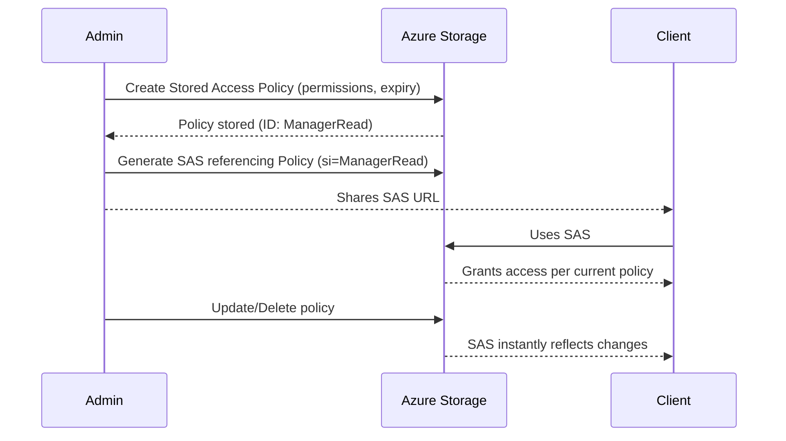
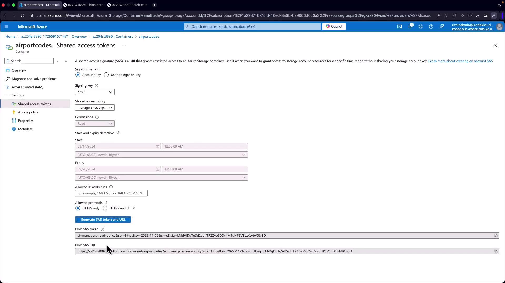

# 🏷️ Stored Access Policies (SAP)

A **Stored Access Policy** is like a **named rule** attached to a container (or queue/table/file share) that defines:

- **Permissions** (R, W, D, L, etc.)
- **Start and Expiry times**
- **Optional IP restrictions and protocols**

👉 Instead of baking permissions and expiry into each SAS token individually, you let the SAS **reference the policy by its ID** (`si`).

If you change or delete the policy, **all SAS tokens that reference it instantly reflect the update**.

---

## 🎯 Why Stored Access Policies Matter

1. **Centralized management**

   - Update expiry/permissions in **one place** → affects all SAS tokens linked to it.

2. **Rapid revocation**

   - Delete the policy → instantly kill **all SAS tokens** that use it.

3. **Reduced admin overhead**

   - No need to re-issue tokens when extending or revoking.

4. **Audit-friendly**

   - Easier to review and govern SAS usage across teams.

⚡ Without SAP: each SAS token is static → you’d have to hunt them down one by one.  
⚡ With SAP: one change in the policy cascades to all tokens.

---

## 🔎 SAS Token Anatomy with SAP

Normally SAS has `st` + `se` (start/expiry) and `sp` (permissions).
With SAP, SAS has:

```ini
?si=PolicyName&sig=<signature>
```

Where:

- `si` = Signed Identifier = your policy ID
- Expiry & permissions are **looked up in the policy**, not embedded

---

## 🏗️ How It Works

<div align="center">



</div>

---

## 1️⃣ How to Create In **Azure Portal**

1. Go to your **Storage Account** → **Containers**.
2. Pick a container → **Access Policy** (under **Settings**).
3. Add a new policy:

   - **Name/ID** → `ManagerRead`
   - **Start & Expiry** → e.g., today 9:00 → today 17:00
   - **Permissions** → Read + List

4. Save.
5. Now go to **Shared Access Signature** tab.

   - Instead of specifying permissions/expiry, select your policy (`ManagerRead`).
   - Generate SAS URL.

6. Share SAS → if you later change or delete `ManagerRead`, all SAS with `si=ManagerRead` update immediately.

---

<div align="center">
  
</div>

---

## 2️⃣ How to Create With **.NET SDK**

```csharp
using Azure.Storage.Blobs;
using Azure.Storage.Sas;
using Azure.Storage.Blobs.Models;

// Connect to the container
var container = new BlobContainerClient(
    new Uri("https://mystg.blob.core.windows.net/mycontainer"),
    new Azure.Storage.StorageSharedKeyCredential("mystg", "<account_key>"));

// Define Stored Access Policy
BlobSignedIdentifier policy = new BlobSignedIdentifier
{
    Id = "ManagerRead", // Policy ID
    AccessPolicy = new BlobAccessPolicy
    {
        StartsOn = DateTimeOffset.UtcNow,
        ExpiresOn = DateTimeOffset.UtcNow.AddHours(8),
        Permissions = "rl" // Read + List
    }
};

// Set the policy on the container
await container.SetAccessPolicyAsync(permissions: new[] { policy });

// Generate SAS referencing the stored access policy
var sasBuilder = new BlobSasBuilder
{
    BlobContainerName = container.Name,
    Identifier = "ManagerRead" // <- references stored access policy
};
var sas = sasBuilder.ToSasQueryParameters(
    new Azure.Storage.StorageSharedKeyCredential("mystg", "<account_key>"));

// SAS URL (applies policy’s perms + expiry)
var sasUrl = $"{container.Uri}?{sas}";
Console.WriteLine(sasUrl);
```

---

## 3️⃣ How to Create With **Azure CLI**

```bash
# Create Stored Access Policy (1 hour, RW perms)
az storage container policy create \
  --name ManagerRW \
  --container-name mycontainer \
  --account-name mystg \
  --account-key <account_key> \
  --start 2025-09-17T08:00Z \
  --expiry 2025-09-17T09:00Z \
  --permissions rw
```

Then, generate SAS linked to the policy:

```bash
az storage container generate-sas \
  --name mycontainer \
  --account-name mystg \
  --account-key <account_key> \
  --policy-name ManagerRW
```

---

## 📚 Example Use Case

### Scenario: Vendor access for 1 day

- Policy: `VendorRead` → Read/List, expires tomorrow.
- Generate SAS with `si=VendorRead`.
- Share SAS with vendor.
- If vendor contract ends early → **delete `VendorRead`** → SAS instantly invalid.
- If vendor contract extends → **update expiry in `VendorRead`** → SAS automatically extended.

---

## ✅ Summary

- **Stored Access Policy (SAP)** = Named rule applied at container/share/queue/table level.
- SAS tokens can reference SAP via `si`.
- **Benefits**: centralized control, expiry updates without re-issuing SAS, instant revocation.
- **Created via**: Portal, .NET SDK, CLI, PowerShell.
- Best practice: **always tie SAS to SAP** if you need revocation/extension control.
