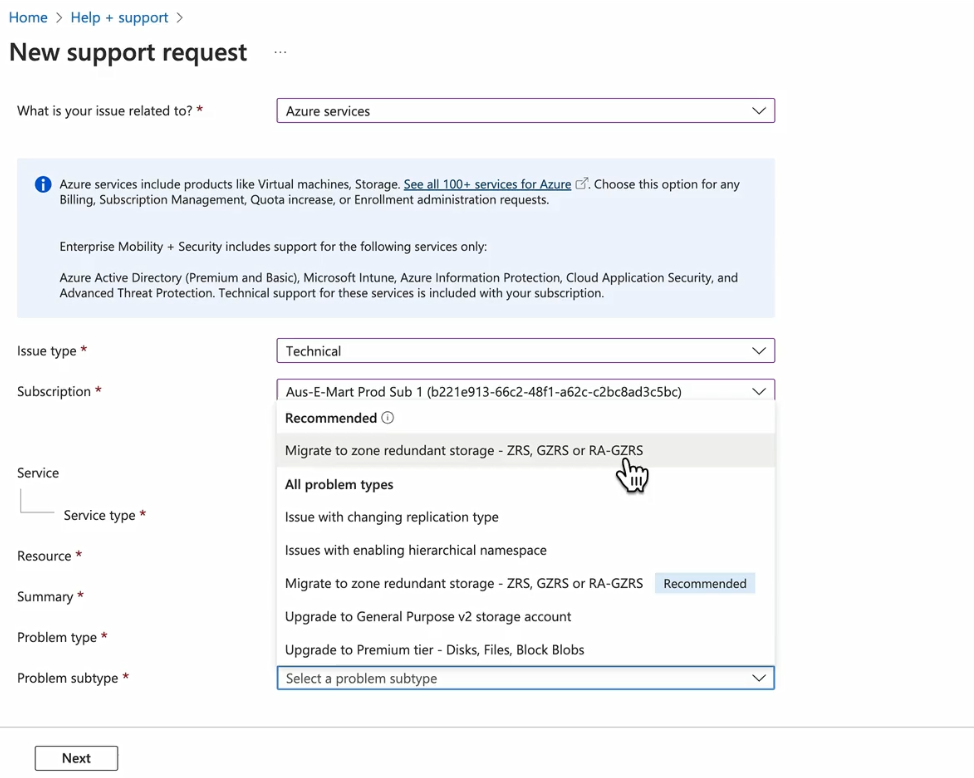

# 🏗️ **Azure Storage Replication Migration**

Azure gives you **3 main ways** to change redundancy:

1. **Add/Remove Geo-replication or Read Access** (LRS ↔ GRS, GRS ↔ RA-GRS, ZRS ↔ GZRS, GZRS ↔ RA-GZRS).
2. **Add/Remove Zone-redundancy (Conversion)** → This is a _conversion process_ that Azure can perform for you, either **customer-initiated** or **support-initiated**.
3. **Manual Migration** → Always an option, and sometimes **the only option** when conversion isn’t supported (like Azure Files NFSv4.1).

---

## 🔄 **Supported Migration Paths**

| From \ To        | **LRS**                            | **GRS/RA-GRS**                             | **ZRS**                                  | **GZRS/RA-GZRS**                      |
| ---------------- | ---------------------------------- | ------------------------------------------ | ---------------------------------------- | ------------------------------------- |
| **LRS**          | -                                  | ✅ Portal/CLI                              | ⚠️ Conversion (depends on type/features) | Two-step → GRS first, then conversion |
| **GRS/RA-GRS**   | ✅ Portal/CLI                      | -                                          | Two-step → GRS → LRS → Conversion        | ⚠️ Conversion                         |
| **ZRS**          | ⚠️ Conversion                      | Two-step → ZRS → GZRS/RA-GZRS → Conversion | -                                        | ✅ Portal/CLI                         |
| **GZRS/RA-GZRS** | Two-step → GZRS → ZRS → Conversion | ⚠️ Conversion                              | ✅ Portal/CLI                            | -                                     |

---

## ⚙️ **Migration Methods**

1. **Easy self-service (Portal/CLI/PowerShell)**
2. **Support ticket required (Support-initiated conversion)**
3. **Manual migration (AzCopy/Robocopy/rsync)**

---

### 🟢 1. **Easy (Self-service Conversion in Portal/CLI)**

You can just go to **Storage Account → Redundancy → Change → Save**.

- No downtime, Azure does it in-place.
- Applies when:

  - **LRS → GRS or RA-GRS**
  - **GRS ↔ RA-GRS**
  - **ZRS → GZRS or RA-GZRS**
  - **GZRS ↔ RA-GZRS**

👉 These are **geo-replication or RA toggles**, always self-service.

---

### 🟡 2. **Conversion (Zone Redundancy Changes)**

This is when you want to add or remove **ZRS/GZRS**.
Two flavors:

- **Customer-initiated conversion (preferred)**

  - Supported in most public regions.
  - You initiate in Portal/CLI and Azure schedules it.
  - ⚠️ Starts within 72 hours, no SLA for completion.

- **Support-initiated conversion**

  - If your region **does not support customer-initiated conversion** (e.g., Mexico Central, some sovereign clouds).
  - You must **open a support ticket** (Azure Support → Storage Account → “Migrate to ZRS/GZRS/RA-GZRS”).
  - Microsoft runs the conversion for you.

  

👉 So: **ZRS conversions = Portal if region supports, else Support ticket**.

---

### 🔴 3. **Manual Migration (Always a New Account + Copy Data)**

You must do this when conversion is **not possible**.
Cases:

- Moving to a **different region** (East US → West Europe).
- **Unsupported features**:

  - Storage accounts with **Azure Files NFSv4.1 shares**.
  - Blob accounts with **Archive tier blobs**.
  - **Premium block blob** accounts.
  - After a **failover event**, you cannot convert that account back to ZRS/GZRS.

- If you need a **guaranteed migration window** (since conversions have no SLA).

👉 Tools: **AzCopy, Robocopy, rsync, DistCp**.

---

## ⚠️ **Key Limitations**

1. **Region Support**

   - ZRS, GZRS, RA-GZRS not available in all regions.
   - Example: **Mexico Central** doesn’t support customer-initiated conversions to ZRS.

2. **Feature Conflicts**

   - Boot Diagnostics not supported with ZRS.
   - Archive tier blobs block conversion to geo-/zone-redundant.
   - Failover → no conversion allowed (e.g., LRS after failover cannot be converted back to ZRS/GZRS).

3. **Protocol Support**

   - If **Azure Files NFSv4.1** or **NFSv3 on Blobs** is enabled → cannot do conversion to ZRS/GZRS. Must use **manual migration**.

4. **Account Type**

   - **GPv2 accounts** = fully supported.
   - **GPv1** = must upgrade to GPv2 first.
   - **Premium accounts** = partial support (some require manual migration).

---

## 🧠 Memorization Hack

| Migration Type                      | Who Does It | When                                                                                               | Notes                   |
| ----------------------------------- | ----------- | -------------------------------------------------------------------------------------------------- | ----------------------- |
| **Self-service (Portal/CLI)**       | You         | LRS ↔ GRS/RA-GRS, ZRS ↔ GZRS/RA-GZRS                                                               | Easy, no downtime       |
| **Conversion (Customer-initiated)** | You         | Adding/removing ZRS/GZRS                                                                           | No downtime, but no SLA |
| **Conversion (Support-initiated)**  | MS Support  | If your region doesn’t support customer-initiated conversion                                       | Slower, requires ticket |
| **Manual Migration**                | You (tools) | Unsupported features (Files NFS, Archive tier, Premium block blob), region move, guaranteed window | Downtime possible       |

---

## 🧠 Exam/Interview Memorization Tips

- **Geo-replication (GRS/RA-GRS)** = **always Portal/CLI** (easy).
- **Zone-redundancy (ZRS/GZRS)** = **needs Conversion** (customer-initiated or support ticket).
- **Unsupported scenarios (Files NFS, Archive tier, Region move)** = **Manual Migration**.
- **Conversion = in-place, no downtime, but no SLA**.
- **Manual Migration = downtime risk, but full control**.

---

## 📊 Real Example Scenarios

- **Case 1:**  
  You have **LRS Blob storage**, want **RA-GRS**.  
  👉 Use **Portal/CLI**, live, no downtime.

- **Case 2:**  
  You have **GRS GPv2**, want **ZRS**.  
  👉 Must switch to **LRS first**, then **convert to ZRS**.

- **Case 3:**  
  You have **Azure Files NFSv4.1 LRS**, want **ZRS**.  
  👉 ❌ Conversion not supported.  
  👉 Must do **manual migration** with AzCopy/rsync.

- **Case 4:**  
  You have **ZRS Blob storage**, want **GZRS**.  
  👉 Use **Portal → convert**.

---

## 📚 Official Docs

- 🔗 [Change how a storage account is replicated (2025)](https://learn.microsoft.com/en-us/azure/storage/common/redundancy-migration)
- 🔗 [Azure Storage redundancy](https://learn.microsoft.com/en-us/azure/storage/common/storage-redundancy)
- 🔗 [Move a storage account to another region](https://learn.microsoft.com/en-us/azure/storage/common/storage-account-move)

---

## ✅ **Summary**

- **Portal/CLI** → for geo-replication & RA toggles.
- **Conversion (customer/support)** → for zone redundancy (ZRS/GZRS).
- **Manual Migration** → when conversion not supported (NFS, archive tier, region change).
- **Always check limitations by account type, region, and features enabled.**
