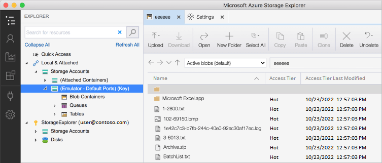
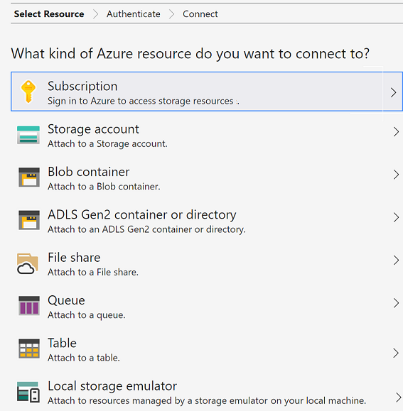

# ☁️ Azure Storage Explorer (ASE)

Azure Storage Explorer (ASE) is a **free, cross-platform desktop application** that helps you **view, manage, and organize Azure Storage** data without relying only on the Azure Portal or CLI.

💡 Think of ASE as your **desktop File Explorer for Azure Storage**—with superpowers like SAS tokens, multiple subscriptions, and emulator support.

---

---

## 🧩 **Core Idea**

- **Platform support**: _Windows_, _macOS_, _Linux_.
- **Resource support**: _Blobs_, _Files_, _Queues_, _Tables_, _Data Lake_.
- **Connectivity**: _Azure subscriptions_, _shared storage_, _external/national clouds_, and _local emulators_.
- **Security**: Uses **Azure AD (Entra ID)**, **SAS tokens**, or **account keys** for authentication.

---

## 🔑 **Permissions & Authentication**

ASE needs two levels of permissions:

1. **Management Plane (Control Layer)**

   - Uses **Azure Resource Manager (ARM)** to list storage accounts and containers.

2. **Data Plane (Access Layer)**

   - Needed to actually **read/write blobs, queues, files, etc.**

✅ Typically handled via **Microsoft Entra ID (Azure AD)**.  
⚠️ You can still use **Access Keys** or **SAS Tokens**, but AD/RBAC is the **best practice**.

---

## 📂 **Connection Scenarios**

ASE supports multiple ways to connect, depending on your needs:

| Scenario                          | What it means                                                   | Example Use                         |
| --------------------------------- | --------------------------------------------------------------- | ----------------------------------- |
| **Azure Subscription**            | Sign in with Azure AD to see all storage accounts you own.      | Normal day-to-day work.             |
| **Local Emulator**                | Connect to Azurite (or old Storage Emulator) for dev/test.      | Developer testing offline.          |
| **External Storage (Name + Key)** | Connect to storage from another subscription or national cloud. | Cross-org or China Gov cloud.       |
| **Attach with SAS (Account)**     | Connect with an account-level SAS token.                        | Shared access to an entire account. |
| **Attach with SAS (Service)**     | Connect with a service-level SAS (Blob, Queue, Table only).     | Scoped access for partners.         |

👉 **Pro Tip**:

- Use **Service SAS** when you only want to expose one service (e.g., Blob container).
- Use **Account SAS** if you need broader access but still temporary.

---

---

## 🔗 **Attaching External Storage**

To connect to storage in **another subscription or national cloud**:

1. Collect the **Account Name** and **Account Key** (found in Azure Portal → _Access Keys_ → usually `key1` or `key2`).
2. In ASE → **Add Account** → Choose _Use Storage Account Name and Key_.
3. For **national clouds** (China, Gov, etc.), set the **Storage endpoint domain** manually.

---

## 🔐 **Access Keys**

- Each storage account comes with **two keys** (`key1`, `key2`).
- Keys = **full account access**.
- Azure provides 2 so you can **rotate without downtime**.

**Best Practices:**

- Store in **Azure Key Vault** or secure vaults.
- Rotate regularly.
- Update apps when regenerating.
- Use **SAS tokens** instead of exposing keys.

⚠️ Keys are powerful: sharing them = giving away the whole house 🏠.

---

## 🌍 **How ASE Fits in** (Architecture)

```mermaid
flowchart TD
    User[👩‍💻 User] --> ASE[💻 Azure Storage Explorer]
    ASE -->|Azure AD / SAS / Keys| Auth[🔐 Authentication Layer]
    Auth --> Sub[🗂️ Subscriptions & Accounts]
    Sub --> Blob[🗃️ Blobs]
    Sub --> Files[📁 File Shares]
    Sub --> Queues[📬 Queues]
    Sub --> Tables[📊 Tables]
    Sub --> Local[🖥️ Local Emulator]
```

---

## 🛠️ **Common Use Cases**

- Upload/download blobs with drag-and-drop.
- Inspect and edit **queue messages** while debugging apps.
- Explore **Azure File shares** like a local network drive.
- Manage **Data Lake Gen2** file hierarchies.
- Generate **SAS tokens** without touching the portal.
- Connect to **multiple subscriptions** in one tool.

---

## ⚡ **ASE vs. Azure Portal**

| Feature                      | Azure Portal 🌐      | ASE 💻                  |
| ---------------------------- | -------------------- | ----------------------- |
| Works offline                | ❌                   | ✅ (for local emulator) |
| Handles large file uploads   | ❌ (browser limited) | ✅                      |
| Multi-subscription view      | Limited              | ✅                      |
| Service-level SAS attach     | ❌                   | ✅                      |
| Developer-friendly debugging | ❌                   | ✅                      |

---

## ✅ **Quick Recap**

- ASE = **desktop app for managing Azure Storage** (multi-account, cross-cloud, local dev).
- Supports **Azure AD, SAS tokens, account keys**.
- Handles **Blobs, Files, Queues, Tables, Data Lake**.
- Great for **developers, admins, and data engineers**.
- Best practices: prefer **Azure AD → SAS tokens → Keys (last resort)**.

> 💡 If you’re doing **day-to-day Azure Storage work**, ASE is your **Swiss Army Knife 🔪**.
