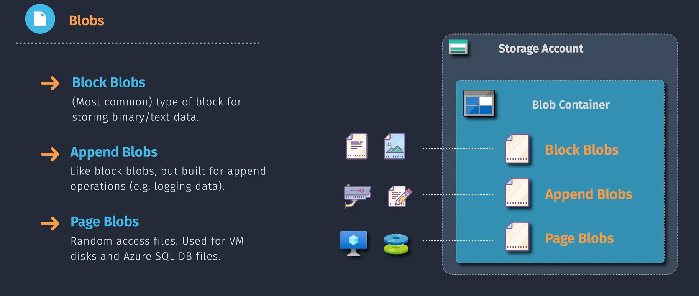
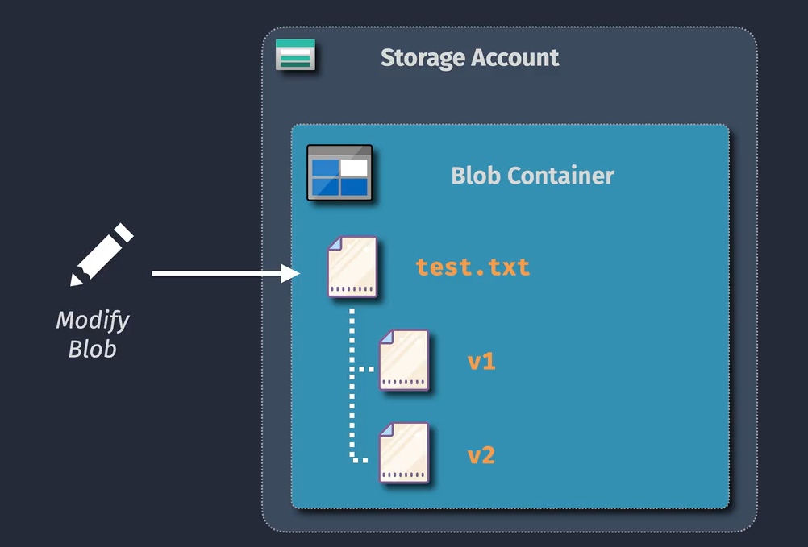
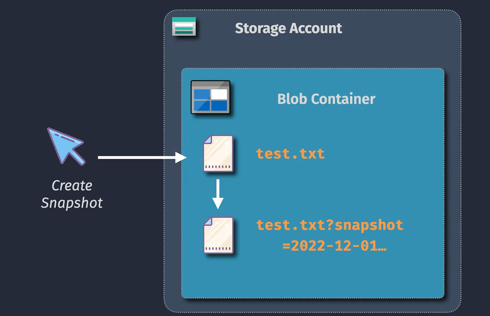
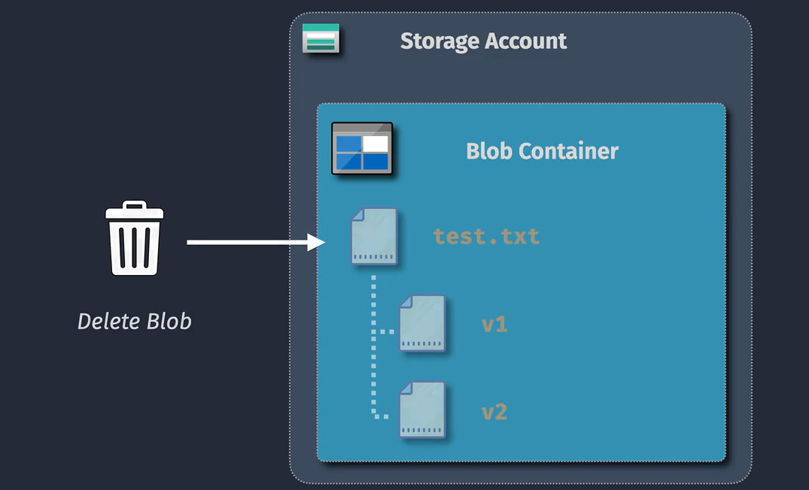
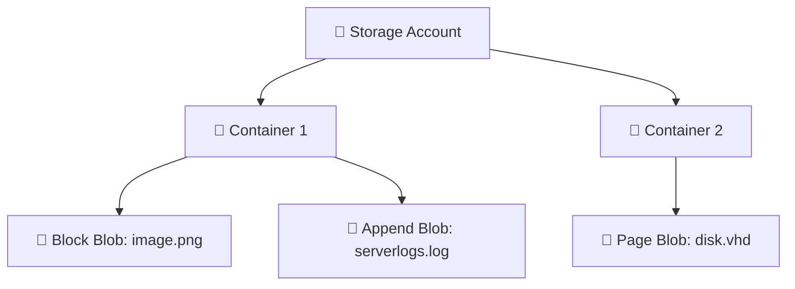

# 🏦 Azure Blob Storage – Your Cloud Vault for Unstructured Data

> 📖 **Official Definition:**  
> Azure Blob Storage is Microsoft’s **object storage service** for the cloud. It’s built for storing **massive amounts of unstructured data** like text, binary files, media, and backups.

---

## 🧩 **Blob Key Components**

### 📜 **Storage Account**

Your **root namespace** in Azure.

- Acts as your **vault** that stores all Azure storage types (blobs, files, queues, tables).
- Globally unique name (e.g., `mystorage.blob.core.windows.net`).
- Controls overall **security, location, and redundancy**.

---

### 📦 **Blob Container**

Your **folders** inside the storage account.

- Group blobs logically.
- Can have **public or private** access.
- Helps organize data like “images/”, “logs/”, “videos/”.

---

### 📄 **Blobs**

The **actual objects/files** stored.

- Can be images, documents, logs, backups, or videos.
- Stored in one of three main types (Block, Append, Page).

---

## 🧱 **Blob Types**

### 🎬 **1. Block Blob**

- Stores large amounts of **text/binary** data.
- Broken into **blocks** → uploaded in parallel for speed.
- Perfect for:

  - Media streaming
  - Backups
  - General file storage

---

### 📝 **2. Append Blob**

- **Append-only** writes — you can only add data to the end.
- Ideal for:

  - Application logs
  - Real-time event collection
  - Telemetry

---

### 💽 **3. Page Blob**

- Designed for **frequent read/write**.
- Used in **512-byte pages**.
- Best for:

  - Azure VM disks (VHDs)
  - Databases with high I/O needs

---

## 🧩 **Blob Sub-Types**

### 📜 **1. Blob Versioning**

- Keeps old versions every time a blob changes.
- Allows **rollbacks** after accidental overwrites.

---

### 📸 **2. Blob Snapshots**

- Read-only point-in-time copies.
- Great for:
  - Pre-update backups
  - Testing environments

---

### 🗑️ **3. Soft Delete**

- Retains deleted blobs for a **retention period**.
- Allows recovery from accidental deletions.

---

## 📊 **4. Why Choose Azure Blob Storage?**

- **Scalability**: Handles **petabytes** easily.
- **Security**: Encryption at rest & in transit, RBAC, threat protection.
- **Cost Control**: Tiers — **Hot**, **Cool**, **Archive**.
- **Integration**: Plays nicely with Azure Synapse, Databricks, Event Grid.
- **Reliability**: Multiple **redundancy options** **(LRS, ZRS, GRS, GZRS)**.

---

## ⚙️ **5. Getting Started**

1. **Create a Storage Account:**  
   Begin by setting up a storage account in the Azure portal, providing a unique name and selecting your preferred region.
2. **Set Up Blob Containers:**  
   Organize your data by creating blob containers within your storage account, categorizing your blobs for easy management.
3. **Choose Your Blob Type:**  
   Select the appropriate blob type (Block, Append, Page) based on your specific use case and data requirements.
4. **Upload Your Data:**  
   Start uploading your unstructured data to Azure Blob Storage, leveraging its powerful features to manage and protect your information.
5. **Leverage Advanced Features:**  
   Explore blob versioning, snapshots, and soft delete to enhance your data management and recovery strategies.

---

## 🎯 **6. Typical Use Cases**

- **🌐 Static Website Hosting**
- **🔄 Backup & Disaster Recovery**
- **🌊 Data Lake for Analytics**
- **📡 Log Storage for Apps & IoT**

---

## ⚙️ **7. How It All Fits Together (Flow Diagram)**

---

## 📒 **7. Pro Tip**

If you upload `puppy.mp4` to **Geo-Redundant Storage (GRS)**, Azure will keep **6 copies** of it across two regions. Because losing puppy videos is simply unacceptable.
