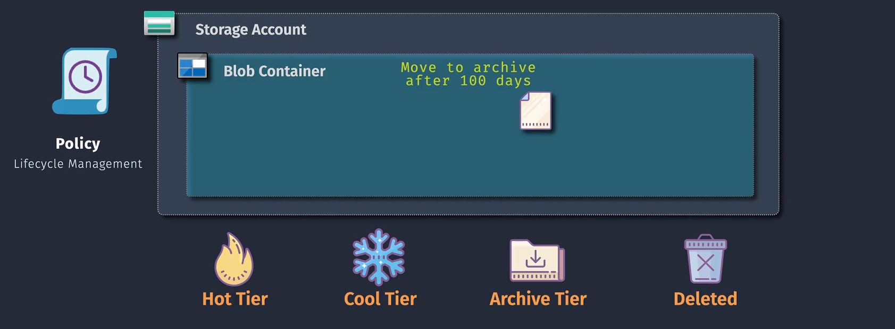
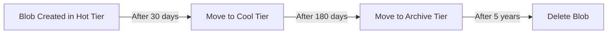
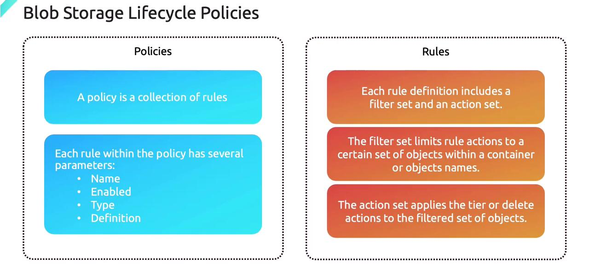
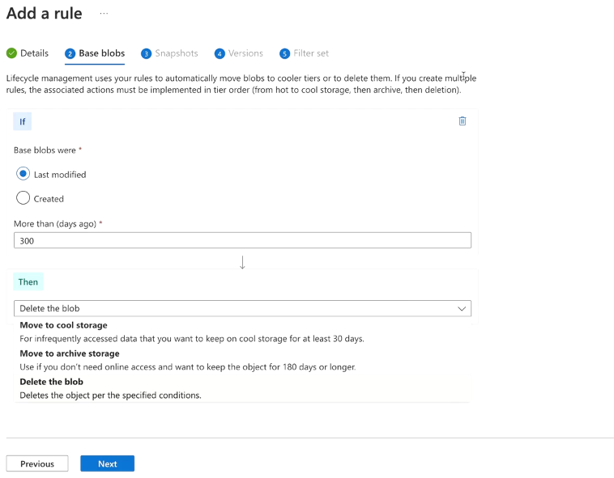
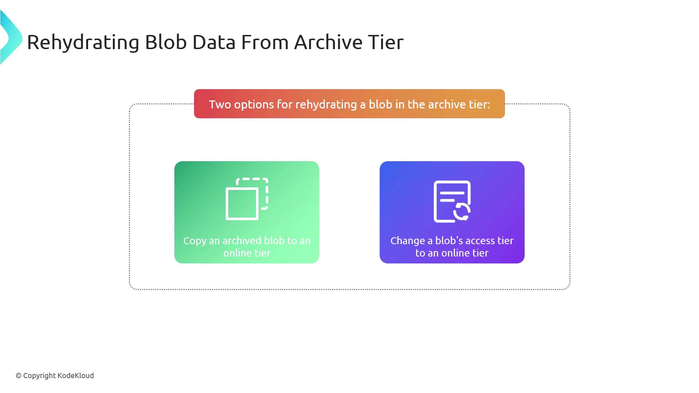

# ♻️ **Azure Blob Storage Lifecycle Management**

📌 **Official Definition**  
**Blob Storage Lifecycle Management** in Azure lets you **automatically move** your blobs between **Access Tiers** (Hot, Cool, Archive) or **delete** them, based on rules you define. This helps **optimize costs** and keep your storage tidy — without constant manual babysitting.

---

<div align="center">
  
</div>

---

## ⁉️ **Why Use Lifecycle Management?**

- **Save money**: Don’t pay Hot-tier prices for old, rarely accessed data.
- **Reduce manual work**: No need to remember when to move or delete files.
- **Stay compliant**: Automatically delete sensitive data after a set retention period.
- **Keep storage organized**: No more blob “junk drawers.”

---

## 🛠️ **How It Works**

You define **rules** based on:

- 📅 **Blob age** (since creation, modification, or last access)
- 📌 **Blob name patterns** (prefix or full match)
- 🏷️ **Blob index tags** (metadata labels)
- 📂 **Container name**

When conditions match, Azure performs an **action**:

- **Move to Cool** tier
- **Move to Archive** tier
- **Delete blob**
- **Delete blob snapshots/versions**

---



> 🚨 Keep in mind that these policies execute once a day at the storage account level

---

## 📋 **Policy Structure**

> A **lifecycle management policy** is a collection of rules, where each rule is defined by several key parameters:

<div align="center">
  
</div>

1. **Name** – Something meaningful (e.g., "MoveOldReportsToArchive").
2. **Enabled** – A boolean value that indicates whether the rule is active, allowing you to enable or disable rules for testing or maintenance.
3. **Type** - Specifies that the rule is a "Lifecycle" rule, dictating the type of action to be performed (for example, transitioning data between tiers or deleting it).
4. **Definition** - Details the conditions, filters, and actions applied to the data. This includes specifying which data the rule targets and what lifecycle action(s) to execute.

   - **Action** – Move tier or delete.
   - **Filter** – Conditions (prefix, tags, blob type, container).

Consider the following JSON snippet that illustrates two basic lifecycle rules:

```json
{
  "rules": [
    {
      "name": "rule1",
      "enabled": true,
      "type": "Lifecycle",
      "definition": {
        // Detailed definition for rule1
      }
    },
    {
      "name": "rule2",
      "enabled": true,
      "type": "Lifecycle",
      "definition": {
        // Detailed definition for rule2
      }
    }
  ]
}
```

> In this example, each rule is clearly labeled and contains the necessary details in its `definition` block.

```json
// real example
{
  "rules": [
    {
      "enabled": true,
      "name": "delete-files",
      "type": "Lifecycle",
      "definition": {
        "actions": {
          // Blob subtype can be [Base blob/Snapshot/Versions]
          "baseBlob": {
            "tierToCool": {
              "daysAfterModificationGreaterThan": 30
            },
            "delete": {
              "daysAfterModificationGreaterThan": 120
            }
          }
        },
        "filters": {
          // BlobTypes can be [block blobs/append blobs]
          "blobTypes": ["blockBlob"]
        }
      }
    }
  ]
}
```

---

## ✍🏻 **Hands-on**

You can set up Blob Storage Lifecycle Management using the **Azure Portal** or **Azure CLI**. Below are the steps for each method.

### 📊 **Using Azure Portal**

1. **Navigate to Storage Account:**

   - Log in to the [Azure Portal](https://portal.azure.com/).
   - Click on **"Storage Accounts"** and select your storage account.

2. **Access Lifecycle Management:**

   - In the storage account's menu, scroll down to **"Blob service"**.
   - Click on **"Lifecycle management"**.

3. **Add a Rule:**

   - Click **"Add rule"**.
   - **Name:** Enter a name for the rule (e.g., `MoveToCool`).
   - **Scope:** Choose the scope of the rule (e.g., entire storage account or specific containers).
   - **Filter Set:** Define filters based on blob name patterns or blob types (optional).
   - **Add Transition:**
     - Select the **"Transition blob to cool tier"** or **"Transition blob to archive tier"**.
     - Specify the number of days after creation or last modification when the transition should occur.
   - **Add Deletion (Optional):**
     - Choose to delete blobs after a certain period.
   - **Review and Add:**

     - Review the rule settings.
     - Click **"Add rule"** to save and apply the rule.

     <div align="left">
     
     </div>

---

### 🧑🏻‍💻 **Using Azure CLI**

1. **Install Azure CLI:**

   - Ensure you have the [Azure CLI](https://docs.microsoft.com/cli/azure/install-azure-cli) installed.

2. **Log In to Azure:**

   ```bash
   az login
   ```

3. **Create a Lifecycle Management Rule:**

   - **Example:** Move blobs to Cool tier after 30 days and delete after 365 days.

     ```bash
     az storage account management-policy create \
         --account-name <StorageAccount> \
         --resource-group <ResourceGroup> \
         --policy '{
         "rules": [
             {
             "name": "MoveToCoolAndDelete",
             "enabled": true,
             "type": "Lifecycle",
             "definition": {
                 "filters": {
                 "blobTypes": ["blockBlob"],
                 "prefixMatch": ["container-name/"]
                 },
                 "actions": {
                 "baseBlob": {
                     "tierToCool": {
                     "daysAfterModificationGreaterThan": 30
                     },
                     "delete": {
                     "daysAfterModificationGreaterThan": 365
                     }
                 }
                 }
             }
             }
         ]
         }'
     ```

   - **Replace `<StorageAccount>` and `<ResourceGroup>`** with your storage account name and resource group.

---

## 🧠 **Use Cases**

| Scenario                                         | Rule                                                                          |
| ------------------------------------------------ | ----------------------------------------------------------------------------- |
| 🌐 Website logs older than 90 days go to Cool    | Prefix: `logs/`, Condition: 90 days since last modified, Action: Move to Cool |
| 🗄️ Compliance docs older than 5 years to Archive | Tag: `type=compliance`, Condition: 5 years, Action: Move to Archive           |
| 🧹 Cleanup old temp files                        | Prefix: `temp/`, Condition: 30 days since creation, Action: Delete            |

---

## 📦 Rehydrating Data From Archive Tier

Rehydrating data from the archive tier means transferring offline, cost-effective data back to an online tier for immediate access. Azure offers two primary methods to rehydrate a blob from the archive:

<div align="center">
  
</div>

### 1️⃣ Option 1: Copying the Archived Blob to an Online Tier

In this method, the archived blob is copied into an online tier (either hot or cool) while the original archived blob remains unchanged. This approach is ideal when you require quick access to a duplicate of the data while preserving the original for future use. Microsoft recommends using this copy operation for most rehydration scenarios.

### 2️⃣ Option 2: Changing the Blob's Access Tier

Alternatively, you can change the blob's access tier directly to move it into an online tier, such as hot or cool, by using the `setBlobTier` API. With this method, the blob is entirely moved out of the archive tier. Keep in mind that rehydration through this approach may take additional time depending on the selected priority.

### ⏳ Rehydration Priority Options

When rehydrating data, you can choose between different priority settings that affect the duration of the operation:

1. **Standard Priority:**

   - This default setting typically completes the rehydration process in several hours—usually between **6 and 15 hours**.
   - It is best suited when there is no immediate urgency to access the data.

2. **High Priority:**
   - For scenarios requiring rapid access, setting a high priority can accelerate the process, usually completing within **1 to 5 hours** depending on the blob's size.
   - Note that opting for high priority may incur additional costs.

## 📒 **Pro Tips**

- **Use Blob Index Tags** to create rules by business logic instead of file paths.
- **Don’t overdo tier changes** — switching too often can add transaction costs.
- Combine with **Blob Versioning** and **Soft Delete** to avoid accidental permanent loss.
- Lifecycle rules run **once per day**, so changes aren’t instant.

---

## 📌 **Benefits in Practice**

- **Cost efficiency**: Keep only active data in Hot tier.
- **Hands-off operation**: Once set, Azure enforces rules automatically.
- **Consistency**: Every blob is treated according to the same policy.
- **Long-term retention**: Perfect for audit, legal, and compliance data.
