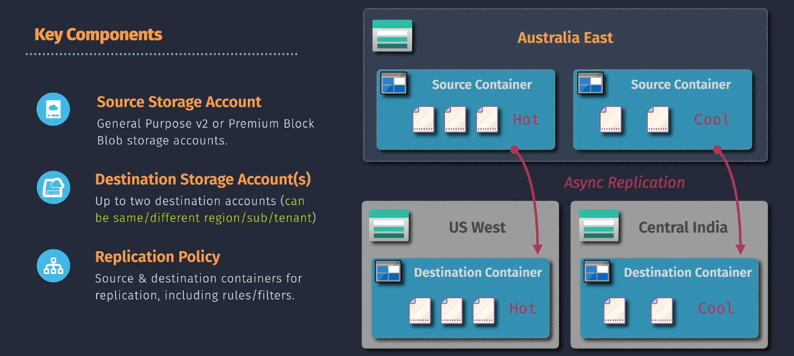
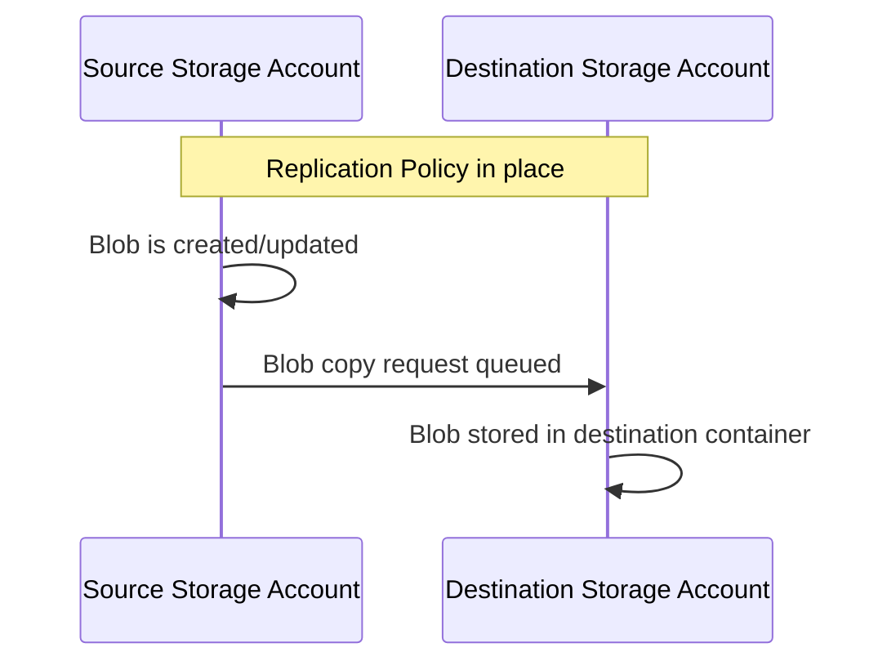

# 🔄 **Azure Block Blob Object Replication**

> 📖 **Official Definition**  
> **Azure Block Blob Object Replication** automatically **copies block blob data** from one **storage account** to another, **asynchronously**, based on **user-defined rules**.
> It helps with **data distribution, compliance, backup, and performance optimization** — without you manually downloading and re-uploading blobs.

---

<div align="center">
  
</div>

---

## 🧩 **Key Points**

- **Only for Block Blobs** — not for Append or Page blobs.
- **Asynchronous** — replication happens in the background; there’s a small delay.
- **Based on Rules** — you decide which blobs (prefix, container, tags) get replicated.
- **Cross-account/tenant or cross-region** — replication can be within the same region or to a different Azure region.
- **Version-aware** — supports blob versioning to ensure consistency.
- **No retroactive replication** — only new or updated blobs after the policy is enabled are copied.

---

## ⚙️ **How It Works** – Step-by-Step

1. **Enable Versioning** in both source and destination accounts.
2. **Create Replication Policy**:

   - Define source and destination containers.
   - Set rules (e.g., prefix match).

3. **Blob Created or Updated** in source account.
4. **Azure Automatically Copies** blob to the destination.
5. Destination blob keeps the **same version ID** for integrity.

---

<div align="center">



</div>

---

## ✍🏻 **Hands-on**

You can set up Block Blob Object Replication using the **Azure Portal** or **Azure CLI**. Below are the steps for each method.

### 📊 **Using Azure Portal**

1. **Navigate to Source Storage Account:**

   - Log in to the [Azure Portal](https://portal.azure.com/).
   - Click on **"Storage Accounts"** and select your **source storage account**.

2. **Access Replication Settings:**

   - In the storage account's menu, scroll down to **"Data management"**.
   - Click on **"Object replication"**.

3. **Add a Replication Rule:**

   - Click on **"Add replication rule"**.
   - **Rule Name:** Enter a name for the replication rule (e.g., `ReplicateToUSWest`).
   - **Source Container:** Select the container from the source account you want to replicate.
   - **Destination Storage Account:** Choose your **destination storage account** from the dropdown.
   - **Destination Container:** Select or create a container in the destination account.
   - **Additional Options:**
     - **Filter:** Optionally, set filters based on blob name prefixes.
     - **Replication Conditions:** Define conditions like blob type (ensure it's set to block blobs).
   - **Review and Create:**
     - Review the settings and click **"Create"** to apply the replication rule.

4. **Verify Replication:**
   - Once the rule is created, new block blobs added to the source container will automatically replicate to the destination container based on the defined rules.

### 🧑🏻‍💻 **Using Azure CLI**

1. **Install Azure CLI:**

   - Ensure you have the [Azure CLI](https://docs.microsoft.com/cli/azure/install-azure-cli) installed on your machine.

2. **Log In to Azure:**

   ```bash
   az login
   ```

3. **Create a Replication Policy:**

   - Define a JSON file (`replication-policy.json`) with the replication rules.

   ```json
   {
     "rules": [
       {
         "ruleName": "ReplicateToUSWest",
         "sourceContainer": "source-container",
         "destinationAccount": "destinationaccountname",
         "destinationContainer": "destination-container",
         "filter": {
           "blobTypes": ["blockBlob"],
           "prefixMatch": ["prefix/"]
         }
       }
     ]
   }
   ```

4. **Apply the Replication Policy:**

   ```bash
   az storage account object-replication-policy create \
     --account-name <SourceStorageAccount> \
     --resource-group <ResourceGroup> \
     --policy @replication-policy.json
   ```

   **Example:**

   ```bash
   az storage account object-replication-policy create \
     --account-name mysourceaccount \
     --resource-group myresourcegroup \
     --policy @replication-policy.json
   ```

5. **Verify Replication:**
   - Check the status of replication to ensure it's active and functioning as expected.

---

## 🧠 **Example Scenarios**

| Scenario                       | Why Object Replication Helps                                             |
| ------------------------------ | ------------------------------------------------------------------------ |
| 🌍 Global Content Distribution | Replicate media files to a region closer to customers for lower latency. |
| 🛡️ Compliance Backups          | Maintain a copy of data in another region for disaster recovery.         |
| ⚡ Load Optimization           | Spread read-heavy workloads across multiple storage accounts.            |
| 🔒 WORM/Immutable Storage      | Copy data to a storage account with immutability policies enabled.       |

---

## 🛑 **Limitations & Gotchas**

- **Not retroactive** — old blobs won’t be replicated automatically.
- **Source and Destination Must Be Different Accounts** — no same-account replication.
- **Versioning Required** — both sides must have blob versioning enabled.
- **No overwrite protection** — destination changes are independent.

---

## 💡 **Tips for Best Use**

- **Use with Lifecycle Management** — move data from Hot to Cool tier after replication to save cost.
- **Tag your blobs** — rules can filter replication by blob index tags for more precise control.
- **Test small** — start with a small container to validate replication speed and accuracy.
- **Plan costs** — replication traffic is billed, so know your egress and storage fees.

---

## 🎯 **Why It’s Awesome**

- **Hands-off replication** — you define it once, Azure does the heavy lifting.
- **Disaster recovery friendly** — ensures you always have a fresh copy elsewhere.
- **Improves performance** — serve customers from the nearest region.
- **Scalable** — works just as well for 10 blobs or 10 million.
