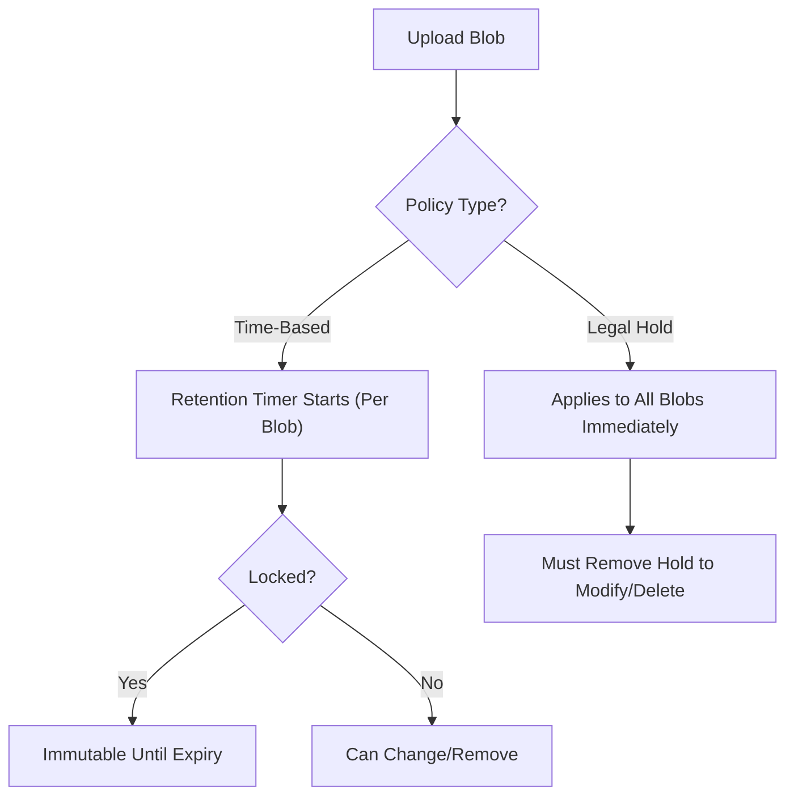
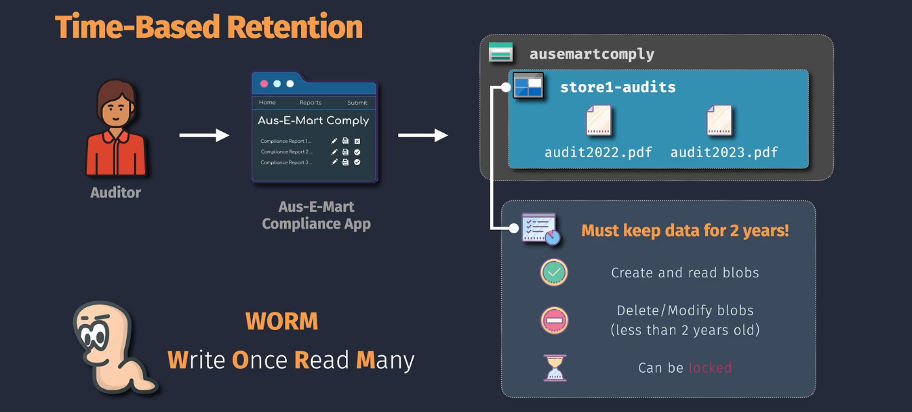
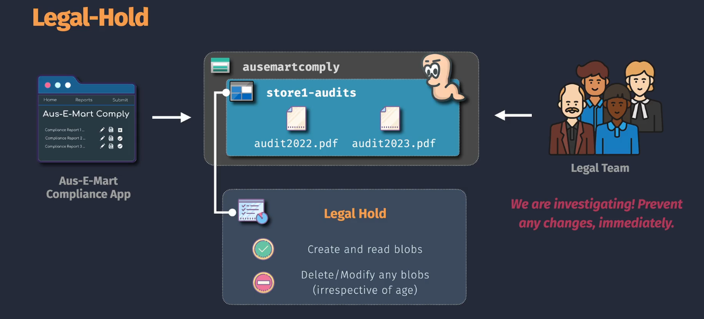

# 🛡️ **Immutable Blob Storage** – Your "Write Once, Read Forever" Vault

> 📖 **Official Definition**  
> **Immutable Blob Storage** in Azure allows you to **store data in a WORM (Write Once, Read Many)** state. Once written, data **cannot be modified or deleted** until the retention period expires.
> This is critical for compliance scenarios where data integrity is paramount, such as financial, legal, and healthcare records.

---

## 🧩 **Key Concepts**

1. **WORM Model** – Once data is written, you can only read it until the lock expires or is removed.
2. **Container-level Policy** – Immutability is applied **per container**, not per account.
3. **Two Policy Types**

   - **Time-based retention policy** (per-blob retention period)
   - **Legal hold policy** (manual release required)

4. **Version-level immutability** – Works per version of the blob.

---

## 🗂️ **Modes of Immutability**

Azure gives you two flavors of immutability:

### 1️⃣ **Time-Based Retention Policy**

**Definition (official)**
Specifies a retention period in days during which blob versions or snapshots are **immutable**.

**How it works**:

- **Retention time is per object**, starting **from the moment that object is created**.
- **No fixed deadline for the container** – each blob has its own timer.
- Before the timer ends → blob **cannot be deleted or modified**.
- After timer ends → blob becomes mutable again (unless a new policy is applied).

**Example**:

- You set **retention = 365 days**.
- Blob A uploaded today → locked until **+1 year**.
- Blob B uploaded next month → locked until **+1 year from next month**.
- An old blob uploaded 2 years ago? → Already past 1-year retention, so **can be deleted immediately**.

---

### 2️⃣ **Legal Hold**

**Definition (official)**
Applies a "legal hold" tag to blobs, making them immutable **indefinitely** until the hold is explicitly removed.

**How it works**:

- **Applied to all objects in the container** regardless of age.
- No expiration date → remains in WORM state until manually cleared.
- Can have multiple **tags** to track reasons (e.g., “Investigation2025”, “Audit2026”).

**Example**:

- You apply legal hold on `containerX`.
- Blob A (5 years old) and Blob B (just uploaded) → **both locked immediately**.
- Only way to delete → remove the legal hold.

---

## 🔒 **Locking the Policy**

**Time-based retention** policies start in **Unlocked** mode → can be increased, decreased, or removed.

Once you **Lock** the policy:

- Cannot be removed or reduced (can only **increase** the retention).
- Even account admins cannot bypass the restriction.
- **Very dangerous** to lock without testing — if you lock 10 years, that’s 10 years of WORM, no exceptions.

**Example**:

- You create policy: 180 days, unlocked → realize compliance says 7 years → change to 7 years.
- You lock the policy → now it’s permanent for all future blobs in that container until expiry.

---

## 🔄 **Version-Level Immutability**

Normally, immutability applies to **latest blob state** (base blob).
With version-level immutability:

- Each blob version gets its own retention timer or legal hold.
- You can delete newer versions without affecting older immutable versions.
- Great for protecting _specific_ data snapshots without locking the entire blob forever.

**Example**:

- Blob `Report.docx` has versions v1, v2, v3.
- Apply 2-year retention on v2 only → v1 and v3 remain editable/deletable.

---

## 🏁 **Quick Comparison Table**

| Feature              | Time-Based Retention | Legal Hold       | Version-Level Immutability |
| -------------------- | -------------------- | ---------------- | -------------------------- |
| Scope                | Per blob             | Whole container  | Per blob version           |
| Expiration           | Yes                  | No               | Per version timer          |
| Admin bypass         | ❌ When locked       | ❌ Until removed | ❌ When locked             |
| Applies to old blobs | No                   | Yes              | Depends on version chosen  |

---

## 🔍 **Policy Decision Logic**

<div align="center">



</div>

---

## ✍🏻 **Immutable Blob Storage - Hands-On**

You can set up Immutable Blob Storage using the **Azure Portal**, **Azure CLI**, or **Azure PowerShell**. Below are the steps for each method, categorized by the type of immutability you wish to implement.

### 1️⃣ **Time-Based Retention**

<div align="center">
  
</div>

---

#### 📊 **Using Azure Portal**

1. **Navigate to Storage Account:**

   - Go to the [Azure Portal](https://portal.azure.com/).
   - Click on **"Storage Accounts"** and select your storage account.

2. **Access Blob Containers:**

   - In the storage account's menu, scroll down to **"Data storage"**.
   - Click on **"Containers"** and select the desired container or create a new one.

3. **Enable Time-Based Retention:**

   - In the container's menu, click on **"Immutable blob storage"**.
   - Click **"Add policy"**.
   - **Policy Name:** Enter a name for the policy (e.g., `ComplianceRetention`).
   - **Immutability Policy Type:** Select **"Time-based retention"**.
   - **Set Retention Period:** Enter the number of days the data should remain immutable (e.g., 30 days).
   - **Review and Apply:** Click **"Save"** to apply the policy.

4. **Verify Policy:**
   - Ensure that the policy is listed under **"Immutable blob storage"** for the container.

#### 🧑🏻‍💻 **Using Azure CLI**

```bash
# Log in to Azure
az login

# Create a container with a time-based retention policy of 30 days
az storage container create \
  --name mycontainer \
  --account-name mystorageaccount \
  --immutability-policy "enabled=true;immutabilityPeriod=30"
```

### 2️⃣ **Legal Hold**

<div align="center">
  
</div>

#### 📊 **Using Azure Portal**

1. **Navigate to Storage Account:**

   - Go to the [Azure Portal](https://portal.azure.com/).
   - Click on **"Storage Accounts"** and select your storage account.

2. **Access Blob Containers:**

   - In the storage account's menu, scroll down to **"Data storage"**.
   - Click on **"Containers"** and select the desired container or create a new one.

3. **Apply Legal Hold:**

   - In the container's menu, click on **"Immutable blob storage"**.
   - Click **"Add policy"**.
   - **Policy Name:** Enter a name for the policy (e.g., `LegalHoldPolicy`).
   - **Immutability Policy Type:** Select **"Legal hold"**.
   - **Legal Hold Name:** Enter a name for the legal hold (e.g., `InvestigationHold`).
   - **Review and Apply:** Click **"Save"** to apply the policy.

4. **Verify Policy:**
   - Ensure that the legal hold is listed under **"Immutable blob storage"** for the container.

#### 🧑🏻‍💻 **Using Azure CLI**

```bash
# Log in to Azure
az login

# Apply a legal hold named "InvestigationHold" to a container
az storage container legal-hold add \
  --account-name mystorageaccount \
  --container-name mycontainer \
  --legal-hold "InvestigationHold"
```

---

## 📌 **Real-Life Use Cases**

1. **Financial Records** – Time-based (7 years) for compliance with audit rules.
2. **Legal Evidence** – Legal hold during investigation.
3. **Scientific Data** – Version-level retention for experiment datasets.

---

## 💡 **Best Practices**

- **Test with unlocked policies first** – Avoid costly “oops” moments.
- Use **version-level immutability** if you need selective protection.
- For **mixed compliance needs**:

  - Legal hold for broad legal requirement.
  - Time-based for ongoing business data retention.
