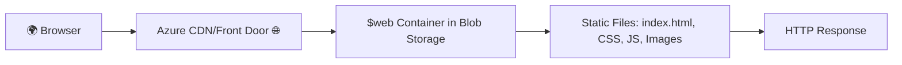
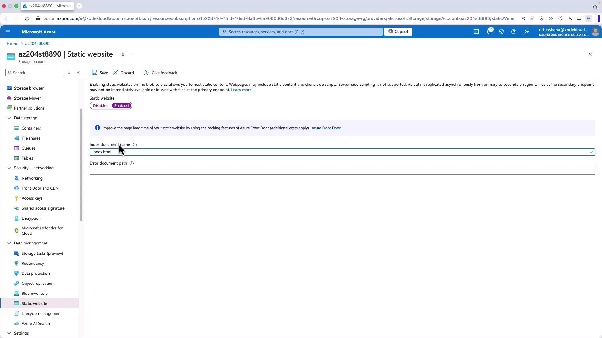
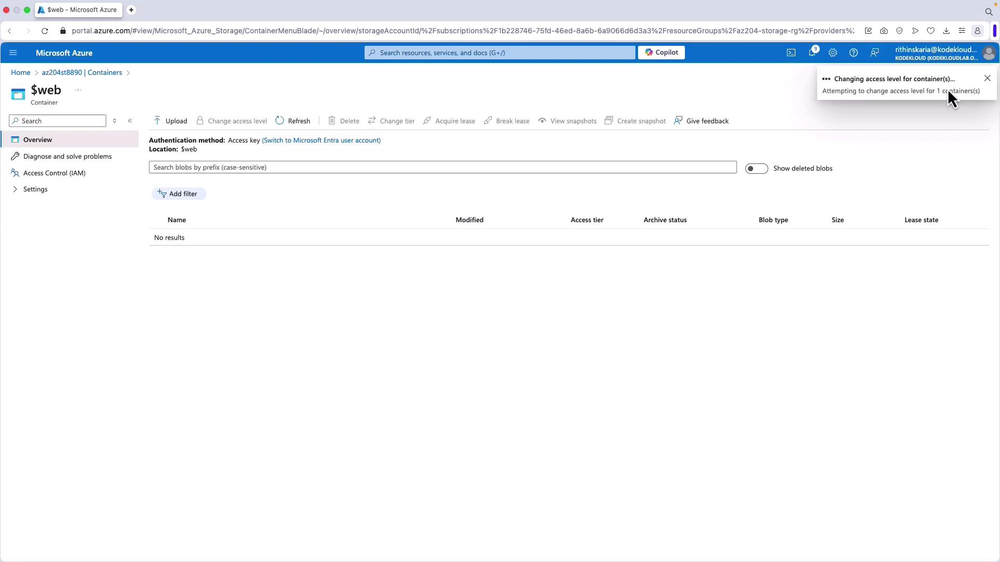
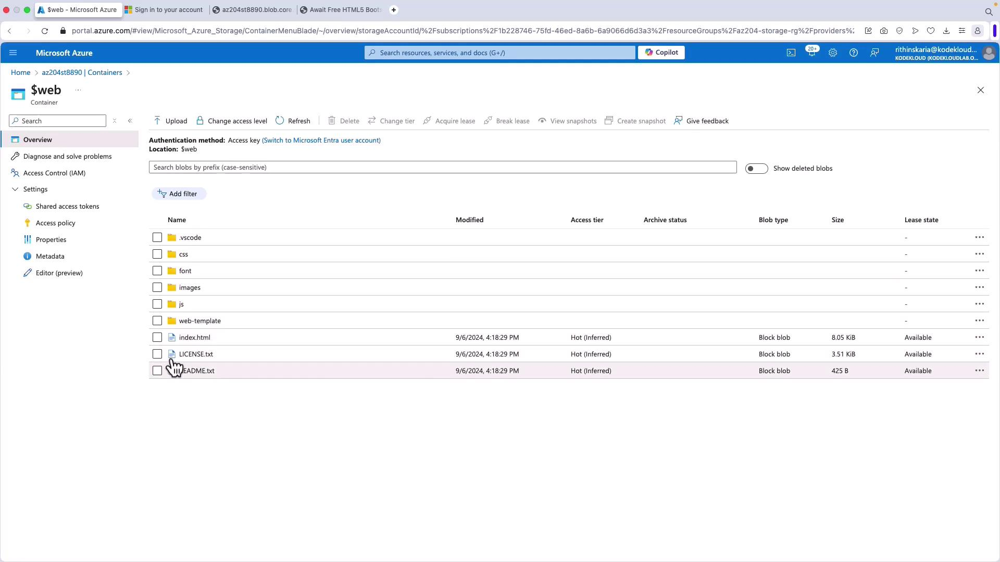
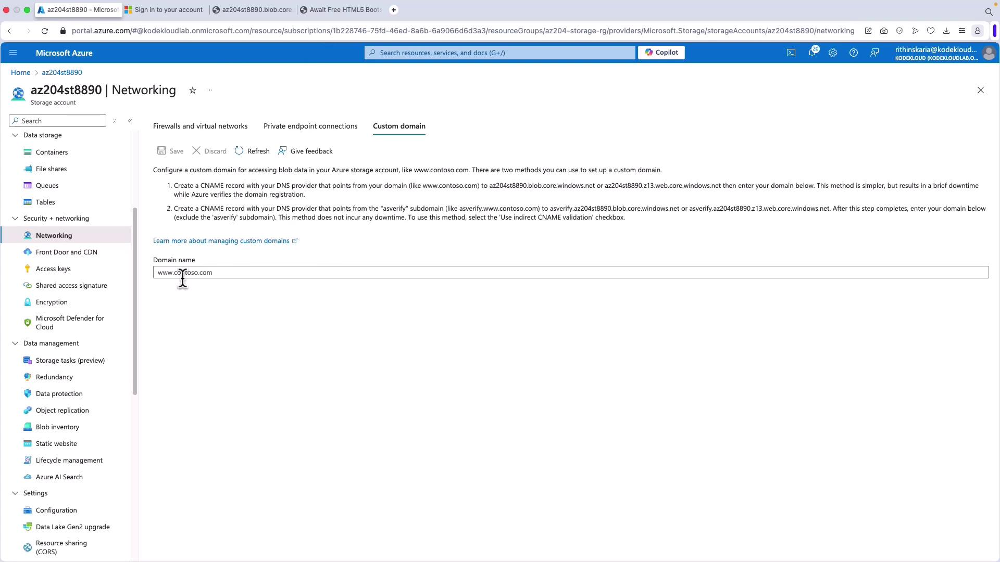
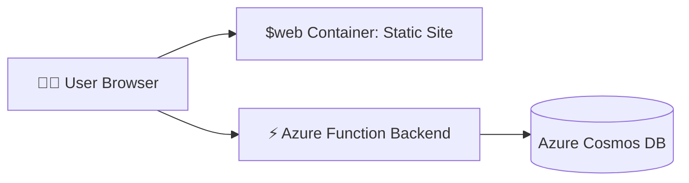

# 🌐 Developing Static Websites on Azure

## 🛑 **Problem** – Why Static Website Hosting?

You want to host a **lightweight, cost-effective website** (HTML, CSS, JS, images) without managing VMs, IIS, or App Service.
Examples:

- 👨‍💻 Portfolio site
- 🚀 Product landing page
- 📖 Documentation site
- 🖼️ Frontend-only apps that talk to APIs

> 🔹 Traditional hosting = **overkill & expensive**.  
> 🔹 Solution → **Azure Blob Storage** with Static Website Hosting.

---

## ✅ **Solution: Static Website Feature in Blob Storage**

- Use a special container called **`$web`**.
- Upload your files → instantly hosted via `https://<storageaccount>.z*.web.core.windows.net/`.
- No servers, no OS patching, no scaling issues.
- Integrates with **Azure CDN, Front Door, Functions** for advanced scenarios.

---

## 🖼 **Architecture Overview**



👉 Your users hit a CDN/endpoint → CDN fetches from Blob Storage → website is served.

---

## ⚡ **Benefits**

- **Super Cheap** – pay for storage + bandwidth only.
- **Scales automatically** – no infra management.
- **Custom Domains** – map `www.mysite.com` to Blob endpoint.
- **Serverless Friendly** – add **Azure Functions** as backend if needed.

---

## ⚠️ **Limitations**

- ❌ **No custom headers** (CSP, cache control) → use **Azure CDN** as workaround.
- ❌ **No built-in auth** → integrate with **Entra ID, Functions, or API Management**.

---

## 🪜 **Step-by-Step Setup**

### 1️⃣ Enable Static Website

1. Go to your **Storage Account** in Azure Portal.
2. Find **Static website** (under _Data Management_).
3. Click **Enable**.
4. Enter:

   - `index.html` (default page).
   - `error.html` (optional).
     👉 This creates a **`$web` container** automatically.

<div align="left">
  
</div>

---

### 2️⃣ Configure Container Access

- Go to **Containers** → **\$web**.
- Change **Access level** → `Blob` (so anonymous users can read files).

<div align="left">
  
</div>

---

### 3️⃣ Upload Your Website Files

Options:

- **Azure Portal** → click _Upload_.
- **Azure Storage Explorer** (desktop tool).
- **AzCopy CLI** (recommended for bulk).

<div align="left">
  
</div>

Example with AzCopy:

```bash
azcopy copy "web-template/" "https://<account>.blob.core.windows.net/\$web" --recursive
```

👉 Remember: escape `$` as `\$web`.

---

### 4️⃣ Verify Website

- Go to **index.html blob → Properties → URL**.
- Example:

  ```ini
  https://az204demo.blob.core.windows.net/$web/index.html
  ```

- Open in browser → 🎉 Website is live.

> 🚨 Fix Subdirectory Issues:  
> If your files get nested like `.../$web/web-template/index.html`:
>
> ```bash
> azcopy copy "web-template/" "https://<account>.blob.core.windows.net/\$web" --recursive --as-subdir=false
> ```

---

### 5️⃣ Map Custom Domain

- Add **CNAME record** in your DNS:

  ```ini
  www.mysite.com → <account>.z13.web.core.windows.net
  ```

- Optionally add **Azure Front Door / CDN** for global caching + HTTPS.

<div align="left">
  
</div>

---

## 📚 **Pro Tips**

- 🏎 Use **Azure CDN** → solve caching + headers.
- 🔒 Use **Private Endpoints** if website is internal-only.
- ⚙️ Automate uploads in CI/CD with:

  ```yaml
  - task: AzureCLI@2
    inputs:
      scriptType: bash
      scriptLocation: inlineScript
      inlineScript: |
        azcopy copy "dist/" "https://<account>.blob.core.windows.net/\$web" --recursive --as-subdir=false
  ```

- 🎯 Perfect for JAMStack apps (React/Angular frontend in Blob, API via Functions).

---

## 🖥 **Example:** Static Website + Serverless Backend

- **Frontend** = HTML/CSS/JS in Blob Storage.
- **Backend** = Azure Functions (handles forms, payments, etc.).

---

<div align="center">



</div>

---

## 🔑 **Key Takeaway**

- **Static Website in Blob** = cheapest + simplest way to host frontends.
- Best for **content-heavy sites, portfolios, product pages, SPAs**.
- Add **Functions + CDN + Auth** when you need **dynamic power**.
