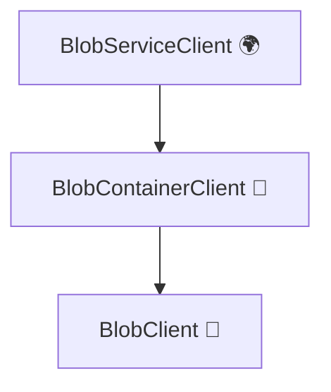

# 📦 **Developing with Azure Blob Storage Client Library in .NET**

## 🛑 **Problem – Why Use the Client Library?**

Azure Blob Storage is great for storing **files, images, documents, backups, static sites**, etc.
But raw REST API calls are painful 😩 → you’d have to manually handle **auth, retries, timeouts, URIs, SAS tokens**…

👉 Instead, Microsoft provides the **Azure Blob Storage Client Library**.
It gives you typed clients (`BlobServiceClient`, `BlobContainerClient`, `BlobClient`) with **easy methods** for CRUD operations.

---

## ✅ **Solution – Blob Client Classes Overview**

| Class                   | Purpose                                                 | Example Usage                      |
| ----------------------- | ------------------------------------------------------- | ---------------------------------- |
| **BlobServiceClient**   | Works at the **account level**                          | List containers, create containers |
| **BlobContainerClient** | Manages a **specific container**                        | Upload/list blobs in one container |
| **BlobClient**          | Directly interacts with a **single blob**               | Upload, download, delete one file  |
| **BlobClientOptions**   | Configures settings (retry policies, timeouts, logging) | Adjust client behavior             |
| **BlobUriBuilder**      | Build/manipulate Blob URIs (useful with SAS tokens)     | Generate a secure link             |

👉 Think of it like a hierarchy:

<div align="center">



</div>

---

## 🪜 **Step 1: Setup Project in .NET**

### 🔹 Create Console App

```bash
dotnet new console -n BlobDemoApp
cd BlobDemoApp
```

### 🔹 Add NuGet Packages

```bash
dotnet add package Azure.Storage.Blobs
dotnet add package Azure.Identity
```

---

## 🪜 **Step 2: Authenticate & Connect**

Use **DefaultAzureCredential** → automatically tries:

- Azure CLI (`az login`)
- Managed Identity (VMs, App Services, Functions)
- Visual Studio / VS Code credentials

### Example – Create Service Client

```csharp
using Azure.Identity;
using Azure.Storage.Blobs;
using System;
using System.Threading.Tasks;

class Program
{
    static async Task Main(string[] args)
    {
        string accountName = "yourstorageaccount";
        string endpoint = $"https://{accountName}.blob.core.windows.net/";

        var credential = new DefaultAzureCredential();

        BlobServiceClient blobServiceClient = new BlobServiceClient(new Uri(endpoint), credential);

        Console.WriteLine($"✅ Connected to: {endpoint}");

        await ListContainers(blobServiceClient);
    }

    static async Task ListContainers(BlobServiceClient blobServiceClient)
    {
        Console.WriteLine("📂 Containers:");
        await foreach (var container in blobServiceClient.GetBlobContainersAsync())
        {
            Console.WriteLine($" - {container.Name}");
        }
    }
}
```

👉 Run with:

```bash
dotnet run
```

Output:

```ini
✅ Connected to: https://yourstorageaccount.blob.core.windows.net/
📂 Containers:
 - $web
 - images
 - backups
```

---

## 🪜 **Step 3: Container Operations**

```csharp
// Create a new container
BlobContainerClient containerClient = await blobServiceClient.CreateBlobContainerAsync("demo-container");

Console.WriteLine($"🎉 Created container: {containerClient.Name}");
```

👉 You can also delete:

```csharp
await containerClient.DeleteAsync();
```

---

## 🪜 **Step 4: Blob Operations**

### 🔹 Upload a Blob

```csharp
BlobClient blobClient = containerClient.GetBlobClient("hello.txt");

// Upload from string
using var stream = new MemoryStream(System.Text.Encoding.UTF8.GetBytes("Hello Blob Storage!"));
await blobClient.UploadAsync(stream, overwrite: true);

Console.WriteLine("📤 Uploaded hello.txt");
```

### 🔹 Download a Blob

```csharp
BlobClient blobClient = containerClient.GetBlobClient("hello.txt");

var download = await blobClient.DownloadContentAsync();
string text = download.Value.Content.ToString();

Console.WriteLine($"📥 Downloaded Content: {text}");
```

### 🔹 Delete a Blob

```csharp
await blobClient.DeleteIfExistsAsync();
Console.WriteLine("🗑️ Blob deleted");
```

---

## 🪜 **Step 5: Generate SAS URL (Temporary Access)**

Sometimes you need to **share a file securely** without giving account keys.

```csharp
using Azure.Storage.Sas;

if (blobClient.CanGenerateSasUri)
{
    var sasBuilder = new BlobSasBuilder
    {
        BlobContainerName = containerClient.Name,
        BlobName = "hello.txt",
        Resource = "b",
        ExpiresOn = DateTimeOffset.UtcNow.AddHours(1)
    };
    sasBuilder.SetPermissions(BlobSasPermissions.Read);

    Uri sasUri = blobClient.GenerateSasUri(sasBuilder);

    Console.WriteLine($"🔗 SAS URL: {sasUri}");
}
```

👉 Now you can share this SAS URL → file accessible for **1 hour** only.

---

## 🔑 **Key Takeaways**

- **BlobServiceClient** → manage account & containers.
- **BlobContainerClient** → manage blobs inside one container.
- **BlobClient** → operate on a single file.
- Use **DefaultAzureCredential** → safest way for auth.
- Use **SAS tokens** for temporary file sharing.
- Great for: **file uploads, backups, static sites, secure file sharing**.
