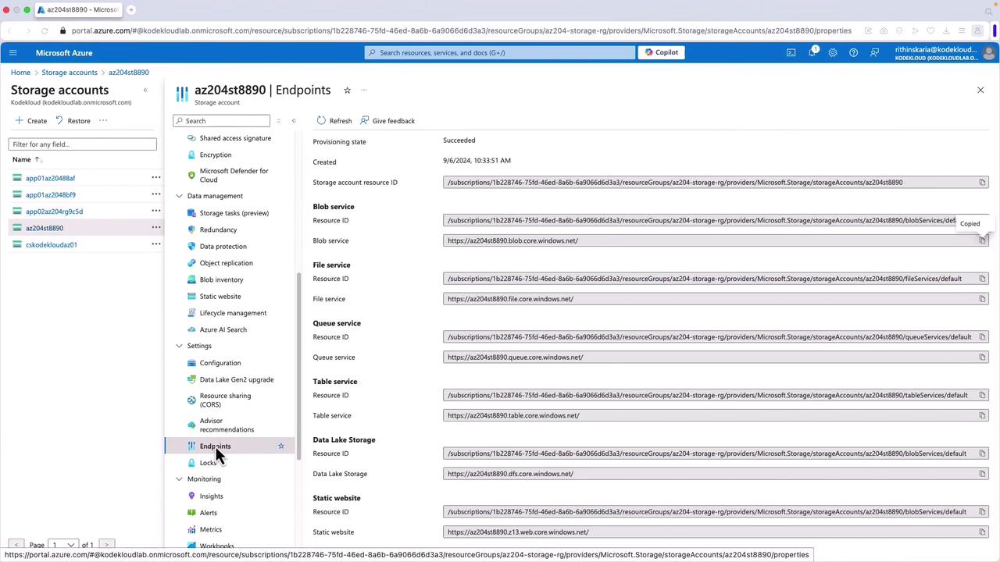

# 📦 Project: Profile Picture Upload → Download → Share (SAS)

Here’s a **complete, end-to-end hands-on** to build a tiny service that lets users:

1. **upload** a profile picture
2. **download** it
3. **generate a time-limited SAS URL** to share

We’ll use **.NET 8 minimal API** + **Azure Blob Storage** with **Azure.Identity** (no secrets in code).
You can run locally (via `az login`) and later deploy to App Service with Managed Identity.

## ✅ What you’ll build

REST endpoints:

- `POST /upload` → accept image (multipart/form-data)
- `GET /download/{fileName}` → stream the image back
- `POST /share/{fileName}` → return a **time-limited SAS URL** (user delegation SAS)

All blobs live in one container, e.g., `profiles`.

---

## 🛠 Prereqs

- .NET 8 SDK
- Azure CLI (`az`) logged in: `az login`
- Your Azure user needs **Storage Blob Data Contributor** on the storage account (for data plane ops)

---

## 1) Create Azure resources

```bash
# Vars
RG=rg-blob-demo
LOC=eastus
ST=st$RANDOM$RANDOM   # must be globally unique, or set manually like az204storage123
CONTAINER=profiles

# Resource group
az group create -n $RG -l $LOC

# Storage account (GPv2)
az storage account create -g $RG -n $ST -l $LOC --sku Standard_LRS --kind StorageV2

# Give your signed-in user data-plane rights (read/write blobs)
ME=$(az ad signed-in-user show --query id -o tsv)
az role assignment create \
  --assignee $ME \
  --role "Storage Blob Data Contributor" \
  --scope $(az storage account show -g $RG -n $ST --query id -o tsv)

# Create container
az storage container create --name $CONTAINER \
  --account-name $ST \
  --auth-mode login

echo "Storage endpoint: https://$ST.blob.core.windows.net/"
```

> If you’ll call the SAS URL from browsers on a different origin, configure **CORS** on the storage account later (optional).

---

## 2) Create the .NET 8 API

```bash
dotnet new web -n ProfileApi
cd ProfileApi
dotnet add package Azure.Storage.Blobs
dotnet add package Azure.Identity
```

Create `appsettings.json`:

```json
{
  "Storage": {
    "AccountName": "REPLACE_ME",
    "ContainerName": "profiles"
  }
}
```

> Set `AccountName` to your storage account (e.g., `"st123456"`).
> `ContainerName` must match what you created.

Replace the contents of `Program.cs`:

```csharp
using Azure;
using Azure.Identity;
using Azure.Storage.Blobs;
using Azure.Storage.Sas;
using Microsoft.AspNetCore.Http;

var builder = WebApplication.CreateBuilder(args);

// Bind config
var accountName = builder.Configuration["Storage:AccountName"]
    ?? throw new InvalidOperationException("Storage:AccountName missing");
var containerName = builder.Configuration["Storage:ContainerName"] ?? "profiles";

// Clients
var serviceUri = new Uri($"https://{accountName}.blob.core.windows.net");
var credential = new DefaultAzureCredential(); // az login locally; MSI in Azure
var blobService = new BlobServiceClient(serviceUri, credential);
var container = blobService.GetBlobContainerClient(containerName);

// Ensure container exists (idempotent)
await container.CreateIfNotExistsAsync();

var app = builder.Build();

// POST /upload (multipart/form-data; field: file, optional x-user-id header)
app.MapPost("/upload", async (HttpRequest req) =>
{
    if (!req.Form.Files.Any())
        return Results.BadRequest("No file uploaded. Use multipart/form-data with field name 'file'.");

    IFormFile file = req.Form.Files["file"] ?? req.Form.Files.First();

    // Basic validation: only images up to 5 MB (tweak as needed)
    var allowed = new[] { "image/png", "image/jpeg", "image/gif", "image/webp" };
    if (!allowed.Contains(file.ContentType))
        return Results.BadRequest("Only PNG/JPEG/GIF/WEBP allowed.");

    if (file.Length == 0 || file.Length > 5 * 1024 * 1024)
        return Results.BadRequest("File must be >0 and <= 5MB.");

    // Unique name: {yyyyMMdd}/{guid}-{safeName}
    var safeName = Path.GetFileName(file.FileName).Replace(' ', '-');
    var uniqueName = $"{DateTime.UtcNow:yyyyMMdd}/{Guid.NewGuid()}-{safeName}";

    var blob = container.GetBlobClient(uniqueName);

    // Set HTTP headers & metadata
    var headers = new Azure.Storage.Blobs.Models.BlobHttpHeaders
    {
        ContentType = file.ContentType
    };
    var metadata = new Dictionary<string, string>
    {
        ["uploadedBy"] = req.Headers["x-user-id"].FirstOrDefault() ?? "anonymous",
        ["uploadedAtUtc"] = DateTime.UtcNow.ToString("o")
    };

    await using var stream = file.OpenReadStream();
    await blob.UploadAsync(stream, new Azure.Storage.Blobs.Models.BlobUploadOptions
    {
        HttpHeaders = headers,
        Metadata = metadata
    });

    return Results.Ok(new
    {
        fileName = uniqueName,
        size = file.Length,
        contentType = file.ContentType
    });
});

// GET /download/{fileName} (streams the blob back)
app.MapGet("/download/{*fileName}", async (string fileName) =>
{
    var blob = container.GetBlobClient(fileName);
    if (!await blob.ExistsAsync()) return Results.NotFound();

    var props = await blob.GetPropertiesAsync();
    var stream = await blob.OpenReadAsync(); // server-side streaming
    var contentType = props.Value.ContentType ?? "application/octet-stream";
    var dlName = Path.GetFileName(fileName);

    return Results.File(stream, contentType, dlName);
});

// POST /share/{fileName}?minutes=60 -> returns a time-limited SAS URL (user delegation SAS)
app.MapPost("/share/{*fileName}", async (string fileName, int minutes) =>
{
    if (minutes <= 0 || minutes > 24 * 60) // cap at 24h for safety
        return Results.BadRequest("minutes must be between 1 and 1440");

    var blob = container.GetBlobClient(fileName);
    if (!await blob.ExistsAsync()) return Results.NotFound();

    // With AAD creds, we generate a User Delegation SAS:
    // 1) get a user delegation key
    var startsOn = DateTimeOffset.UtcNow.AddMinutes(-5);
    var expiresOn = DateTimeOffset.UtcNow.AddMinutes(minutes);
    var delegationKey = await blobService.GetUserDelegationKeyAsync(startsOn, expiresOn);

    // 2) build SAS with read permission
    var sas = new BlobSasBuilder
    {
        BlobContainerName = container.Name,
        BlobName = fileName,
        Resource = "b",
        StartsOn = startsOn,
        ExpiresOn = expiresOn
    };
    sas.SetPermissions(BlobSasPermissions.Read);

    var sasUri = new UriBuilder(blob.Uri)
    {
        Query = sas.ToSasQueryParameters(delegationKey, accountName).ToString()
    }.Uri;

    return Results.Ok(new { url = sasUri.ToString(), expiresOn });
});

// Optional: list user files (prefix filter)
app.MapGet("/list", async (string? prefix) =>
{
    var list = new List<object>();
    await foreach (var item in container.GetBlobsAsync(prefix: prefix))
        list.Add(new { item.Name, item.Properties.ContentType, item.Properties.ContentLength });

    return Results.Ok(list);
});

app.Run();
```

Run it:

```bash
dotnet run
```

You’ll see something like:

```ini
Now listening on: http://localhost:5180
```

---

## 3) Try the endpoints

### 🔼 Upload (multipart/form-data)

```bash
curl -X POST http://localhost:5180/upload \
  -H "x-user-id: u123" \
  -F "file=@/path/to/photo.jpg"
```

Response:

```json
{
  "fileName": "20250922/8c3f...-photo.jpg",
  "size": 124567,
  "contentType": "image/jpeg"
}
```

### ⬇️ Download

```bash
curl -L "http://localhost:5180/download/20250922/8c3f...-photo.jpg" -o out.jpg
```

### 🔗 Share via SAS (valid 60 minutes)

```bash
curl -X POST "http://localhost:5180/share/20250922/8c3f...-photo.jpg?minutes=60"
```

Response:

```json
{
  "url": "https://<account>.blob.core.windows.net/profiles/20250922/8c3f...-photo.jpg?<SAS>",
  "expiresOn": "2025-09-22T14:30:00+00:00"
}
```

Open the `url` in a browser — it will work **without auth** until expiry.
(We used **User Delegation SAS**, so we never touched account keys.)

---

## 4) Tips, Security, & Production Notes

- **Auth**: Locally, `DefaultAzureCredential` uses your `az login`. In Azure App Service, it will use **Managed Identity** automatically (no secrets).
- **RBAC**: Your app’s identity (local user or Managed Identity) needs **Storage Blob Data Contributor** on the account or container.
- **Validation**: Enforce file type/size limits (already included). Add antivirus/scan if needed.
- **Naming**: We used a date prefix to keep container tidy and enable prefix queries (cheap list operations).
- **Headers**: We set `ContentType` so downloads render properly in browsers.
- **CORS**: If a browser front-end will hit the SAS URLs, configure storage CORS (allowed origins/headers/methods).
- **CDN**: For public sharing at scale, front your container with **Azure CDN/Front Door** for caching and custom domains.
- **Soft delete/versioning**: Consider enabling blob versioning/soft delete to protect against accidental deletes.

---

## 5) (Optional) Deploy to App Service with Managed Identity

```bash
APP=profileapi$RANDOM

# App Service Plan (Linux, B1 or P1v3)
az appservice plan create -g $RG -n asp-profile --is-linux --sku B1

# Web App
az webapp create -g $RG -p asp-profile -n $APP --runtime "DOTNET:8"

# Enable system-assigned managed identity
az webapp identity assign -g $RG -n $APP
PRINCIPAL_ID=$(az webapp identity show -g $RG -n $APP --query principalId -o tsv)

# Grant the web app access to blobs
az role assignment create \
  --assignee $PRINCIPAL_ID \
  --role "Storage Blob Data Contributor" \
  --scope $(az storage account show -g $RG -n $ST --query id -o tsv)

# App settings
az webapp config appsettings set -g $RG -n $APP --settings \
  "Storage__AccountName=$ST" "Storage__ContainerName=$CONTAINER"

# Deploy (from local folder)
dotnet publish -c Release
zip -r site.zip ./bin/Release/net8.0/publish/*
az webapp deploy -g $RG -n $APP --src-path site.zip

echo "Live: https://$APP.azurewebsites.net"
```

<div align="center">
  
</div>

Done ✅  
You now have a working service that **uploads**, **downloads**, and **shares** images via **time-limited SAS** — all **without secrets** and ready for production hardening.
