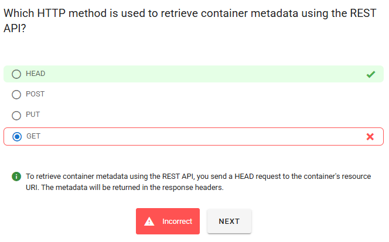
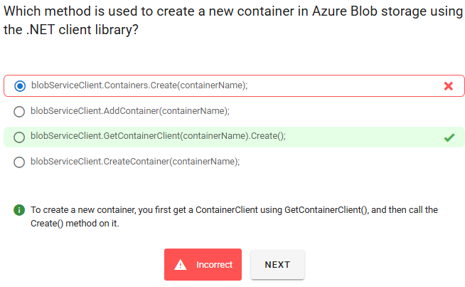
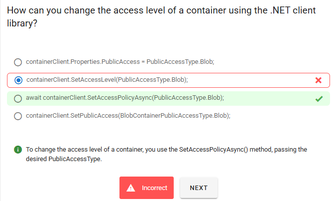

# 📦 Hands-On: Managing Container Properties & Metadata

## 🧠 Quick Recap — What’s Metadata vs Properties?

- **Properties** → System-defined info about a container (last modified, lease status, public access level).
- **Metadata** → Custom key/value tags you define (e.g., `owner=admin`, `environment=production`).

  - Keys: lowercase, alphanumeric, `-` allowed.
  - Values: any string (ASCII, case-sensitive).

Think of **metadata** like sticky notes 📌 on your container for categorization.

---

## 🛠 Part 1: Setup Resources

```bash
RG=rg-cont-meta
LOC=eastus
ST=stcontmeta$RANDOM

az group create -n $RG -l $LOC

az storage account create -g $RG -n $ST -l $LOC --sku Standard_LRS --kind StorageV2

# Create a container
az storage container create \
  --account-name $ST \
  --name mycontainer \
  --auth-mode login

echo "Storage endpoint: https://$ST.blob.core.windows.net/mycontainer"
```

---

## 💻 Part 2: .NET SDK Hands-On

### 1. Create Project & Add Packages

```bash
dotnet new console -n ContainerMetaDemo
cd ContainerMetaDemo
dotnet add package Azure.Storage.Blobs
dotnet add package Azure.Identity
```

### 2. Add Code (`Program.cs`)

```csharp
using Azure.Identity;
using Azure.Storage.Blobs;
using Azure.Storage.Blobs.Models;
using System;
using System.Collections.Generic;
using System.Threading.Tasks;

class Program
{
    static async Task Main()
    {
        string accountName = "stcontmetaXXXX";   // your storage account
        string containerName = "mycontainer";

        var serviceUri = new Uri($"https://{accountName}.blob.core.windows.net");
        var credential = new DefaultAzureCredential();
        var blobService = new BlobServiceClient(serviceUri, credential);
        var containerClient = blobService.GetBlobContainerClient(containerName);

        await containerClient.CreateIfNotExistsAsync();

        // STEP 1: Set metadata
        var metadata = new Dictionary<string, string>
        {
            { "owner", "admin" },
            { "environment", "production" },
            { "costcenter", "finance" }
        };
        await containerClient.SetMetadataAsync(metadata);
        Console.WriteLine("✅ Metadata set.");

        // STEP 2: Get properties
        BlobContainerProperties props = await containerClient.GetPropertiesAsync();

        Console.WriteLine($"Container: {containerClient.Name}");
        Console.WriteLine($"  Last Modified: {props.LastModified}");
        Console.WriteLine($"  Public Access: {props.PublicAccess}");

        Console.WriteLine("  Metadata:");
        foreach (var kv in props.Metadata)
            Console.WriteLine($"    {kv.Key}: {kv.Value}");
    }
}
```

### 3. Run It

```bash
dotnet run
```

✅ Expected Output:

```ini
✅ Metadata set.
Container: mycontainer
  Last Modified: 9/22/2025 3:02:11 PM +00:00
  Public Access: None
  Metadata:
    owner: admin
    environment: production
    costcenter: finance
```

---

## ⚡ Part 3: PowerShell (Raw REST API)

Sometimes you need full control (e.g., debugging or automation).
Here’s how metadata looks at the HTTP header level.

### 1. Variables

```powershell
$accountName   = "stcontmetaXXXX"
$containerName = "mycontainer"
$accountKey    = (az storage account keys list -g $RG -n $accountName --query "[0].value" -o tsv)
$baseUri       = "https://$accountName.blob.core.windows.net/$containerName"
```

### 2. Set Metadata (PUT)

```powershell
$headers = @{
  "x-ms-version" = "2021-04-10"
  "x-ms-date"    = (Get-Date).ToString("R")
  "x-ms-meta-owner"       = "admin"
  "x-ms-meta-environment" = "production"
}

# Build auth header (SharedKey)
# Simplified for demo: here we let Az CLI inject auth
az rest --method put --uri "$baseUri?restype=container&comp=metadata" --headers `
  "x-ms-meta-owner=admin" `
  "x-ms-meta-environment=production"
```

### 3. Get Metadata (GET)

```powershell
az rest --method get --uri "$baseUri?restype=container&comp=metadata"
```

You’ll see headers like:

```ini
x-ms-meta-owner: admin
x-ms-meta-environment: production
Last-Modified: Mon, 22 Sep 2025 15:04:22 GMT
```

<div align="center">
  
</div>

<div align="center">
  
</div>

<div align="center">
  
</div>

---

## 🧪 Real-World Use Cases

- **Tagging environments** → `env=dev`, `env=prod`
- **Ownership tracking** → `owner=teamA`
- **Cost management** → `costcenter=finance`
- **Lifecycle rules** → apply policies to containers with metadata labels

---

## 🔑 Key Takeaways

- Use **`SetMetadataAsync` + `GetPropertiesAsync`** for simple code-based workflows.
- Metadata is just **key/value tags** – keep keys lowercase.
- Properties give you **system-level details** like public access, lease, last modified.
- For **automation** or when account keys are involved → use REST/PowerShell.
- Combine metadata with **Azure Policies / Tags** for governance at scale.
