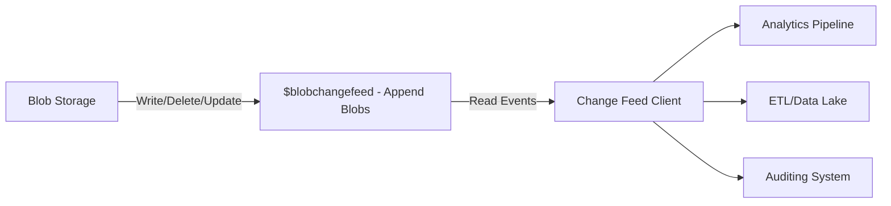

# 📡 Azure Blob Storage Change Feed

## 📖 1. What is the Change Feed?

The **Change Feed** in Azure Blob Storage is a **durable, ordered, and append-only log of all changes** that happen to blobs in a storage account.

Think of it as a **transaction log** (like in databases) but for **blobs**.

It allows you to:

- Capture **create, update, and delete events**.
- Process events in **order of occurrence**.
- Replay events at any time (since they are persisted).

---

## 🔑 2. Why Use Change Feed?

- 📊 **Analytics & Auditing** – track changes to blobs for compliance.
- 🔄 **Data Movement** – trigger pipelines when blobs are added/modified.
- 🛠 **Event-driven Apps** – real-time reaction to blob operations.
- 🧾 **Historical Replay** – reprocess old events if downstream systems fail.

> ✅ Unlike **Blob Event Grid events**, Change Feed is **persistent and replayable**.

---

## 🧩 3. Supported Operations

The Change Feed logs the following blob-level operations:

- **Blob Created** (upload, put block list, copy, etc.)
- **Blob Deleted** (soft delete, permanent delete)
- **Blob Properties Updated** (metadata, ACL changes, tier change, lease, etc.)
- **Snapshot Created**

---

## ⚙️ 4. Architecture & Storage

- Change Feed data is stored as **append blobs** inside a **special system container**:

```ini
$blobchangefeed
```

- Data is organized into:

  - **Segments** → immutable chunks of events.
  - **Shards** → parallel streams inside a segment.
  - **Events** → individual blob change records (JSON).

---

## 📖 5. Event Structure

Each change event is stored in **JSON format**.

Example:

```json
{
  "schemaVersion": 1,
  "topic": "/subscriptions/<sub-id>/resourceGroups/<rg>/providers/Microsoft.Storage/storageAccounts/mystorage",
  "subject": "/blobServices/default/containers/mycontainer/blobs/invoice123.pdf",
  "eventType": "BlobCreated",
  "eventTime": "2025-10-03T12:34:56Z",
  "id": "abc123",
  "data": {
    "api": "PutBlob",
    "contentLength": 2048,
    "blobType": "BlockBlob",
    "sequencer": "0000000000000001000000000000000000000000000",
    "storageDiagnostics": {
      "batchId": "xyz-789"
    }
  }
}
```

---

## 🔄 6. How to Consume the Change Feed?

You have **two main ways**:

### 1️⃣ SDK (Recommended)

Using Azure SDKs (C#, Python, Java, etc.):

```csharp
BlobServiceClient blobServiceClient = new BlobServiceClient("<connection-string>");
ChangeFeed changeFeed = blobServiceClient.GetChangeFeedClient().GetChanges();

await foreach (BlobChangeFeedEvent change in changeFeed)
{
    Console.WriteLine($"Event: {change.EventType}, Blob: {change.Subject}");
}
```

---

### 2️⃣ Direct Blob Reads

- Change feed is just blobs in `$blobchangefeed`.
- You can read them like any blob → parse JSON manually.

---

## 🔄 7. Comparison: Event Grid vs. Change Feed

| Feature        | Event Grid              | Change Feed                              |
| -------------- | ----------------------- | ---------------------------------------- |
| **Delivery**   | Push (near real-time)   | Pull (client reads log)                  |
| **Durability** | Ephemeral (24h retry)   | Persistent (kept until retention policy) |
| **Replay**     | ❌ No                   | ✅ Yes                                   |
| **Use Case**   | Real-time notifications | Auditing, replay, large-scale pipelines  |

👉 Best practice:

- Use **Event Grid** for **real-time triggers**.
- Use **Change Feed** for **durability, replay, analytics**.

---

## 🖼 Visual Diagram



---

## 📦 8. Pricing

- Change Feed events are stored as **append blobs**.
- You pay only for **storage** and **read operations**:

  - Blob storage cost for the `$blobchangefeed` container.
  - Read/Write transactions when consuming.

No extra cost for enabling change feed.

---

## ⚡ 9. Advanced Features

- **Retain indefinitely** – change feed data persists until you delete it.
- **Resume from checkpoint** – continue where you left off.
- **Partitioned feed** – handles massive throughput using shards.
- **Supports hierarchical namespace** – works with ADLS Gen2.

---

## ✅ 10. Summary

- **Blob Storage Change Feed** = **durable, ordered log of blob changes**.
- Stored in `$blobchangefeed` container as append blobs.
- Supports **create, delete, update, snapshot** events.
- **Replayable** (unlike Event Grid).
- Best for **auditing, analytics, pipelines, historical reprocessing**.
- Access via **SDK** or directly reading JSON blobs.

---

🔥 Mnemonic:

> **Event Grid = Push Now** > **Change Feed = Replay Later**

---

👉 Do you want me to also create a **real-world demo** (step-by-step) where we:

1. Enable Change Feed in a storage account,
2. Upload blobs,
3. Read and parse change feed events with .NET/Python SDK,
   so you can see how it works end-to-end?
