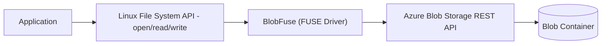

# ☁️ Azure BlobFuse

## 🌟 1. What is BlobFuse?

**BlobFuse** is an **open-source virtual file system driver** for Linux that lets you **mount an Azure Blob Storage container** as if it were part of the local file system.

👉 Think of it as **“mapping a cloud blob container into a local folder”**.

- Local apps can read/write blobs as **normal files**.
- No need to rewrite apps to use the Azure Storage SDK.

---

## 🔑 2. Why BlobFuse?

- ✅ Use **legacy apps** that expect a local file system, but store data in cloud blobs.
- ✅ Works with **HPC, big data, and ML workloads** where blob storage is the backend.
- ✅ Enables **streaming** large files (no need to fully download).
- ✅ Useful in **containerized workloads** (e.g., mount blob storage into a Docker container).

---

## ⚙️ 3. Architecture

BlobFuse sits between:

- **Local Linux file system (FUSE driver)**
- **Azure Blob Storage REST APIs**



---

## 🛠 4. BlobFuse Versions

- **BlobFuse v1**: Stable, widely used, requires **temporary local disk** for caching.
- **BlobFuse v2**: Newer, better performance, supports **streaming directly** from blob without full local cache.

👉 Most new deployments use **BlobFuse v2**.

---

## 📦 5. Installation (Linux Example)

### Prerequisites

- Linux VM (Ubuntu, CentOS, etc.).
- Azure Storage Account + Blob Container.

### Install BlobFuse v2

```bash
sudo rpm -Uvh https://packages.microsoft.com/config/centos/7/packages-microsoft-prod.rpm
sudo yum install blobfuse2 -y
```

---

## 🔐 6. Authentication Options

You can authenticate BlobFuse in multiple ways:

1. **Storage Account Key**
2. **SAS Token**
3. **Managed Identity (MSI)** → best for VMs/AKS (no secrets stored).

Example config file (`fuse_connection.cfg`):

```ini
accountName mystorageaccount
accountKey <your-key>
containerName mycontainer
```

---

## 📂 7. Mounting a Blob Container

### Create mount directory

```bash
mkdir /mnt/mycontainer
```

### Mount with BlobFuse v2

```bash
blobfuse2 mount /mnt/mycontainer --config-file=fuse_connection.cfg
```

✅ Now `/mnt/mycontainer` behaves like a local folder but backed by Azure Blob Storage.

---

## 📊 8. Example Usage

```bash
# Write a file (stored in Blob)
echo "Invoice Data" > /mnt/mycontainer/invoice101.txt

# List files
ls /mnt/mycontainer

# Remove a file
rm /mnt/mycontainer/invoice101.txt
```

👉 These commands **translate to Blob REST operations** in the backend.

---

## 🧩 9. Advanced Features

1. **Streaming Mode**

   - Stream file chunks directly from blob instead of downloading fully.
   - Ideal for **big data files**.

2. **Caching**

   - Can use local SSD for hot data caching.
   - Improves performance for repeated access.

3. **Parallel Reads/Writes**

   - BlobFuse v2 optimizes large parallel reads → useful in **AI/ML workloads**.

4. **Containerization**

   - Mount blob into **Docker or Kubernetes pods** using CSI drivers.

5. **HPC Workloads**

   - Common in **Azure CycleCloud + HPC** for scientific workloads.

---

## ⚖️ 10. BlobFuse vs Alternatives

| Feature                  | BlobFuse             | AzCopy                | SDK                |
| ------------------------ | -------------------- | --------------------- | ------------------ |
| **Mount as File System** | ✅ Yes               | ❌ No                 | ❌ No              |
| **Performance**          | High (with caching)  | Very High (bulk copy) | Depends            |
| **Streaming**            | ✅ Yes               | ❌ No                 | Depends            |
| **Use Case**             | Legacy apps, HPC, ML | Bulk data transfer    | Custom development |

👉 **BlobFuse** is best when you want **apps to think blobs = files**.
👉 **AzCopy** is best for **bulk transfer/migration**.
👉 **SDK** is best for **programmatic control**.

---

## 💰 11. Pricing

- BlobFuse itself is **free** (open-source).
- You only pay for:

  - **Blob storage capacity**.
  - **Transactions (read/write/delete)**.
  - **Data egress** if crossing regions.

---

## ✅ 12. Summary

- **BlobFuse** = Mount Blob Storage as a **local Linux file system**.
- Supports **file-like access** to blob containers.
- Great for **legacy apps, HPC, ML workloads, and container integration**.
- **BlobFuse v2** = better performance + streaming + less local cache dependency.
- Authentication via **account key, SAS, or managed identity**.

---

🔥 Mnemonic:

> **BlobFuse = Blobs as Files**
