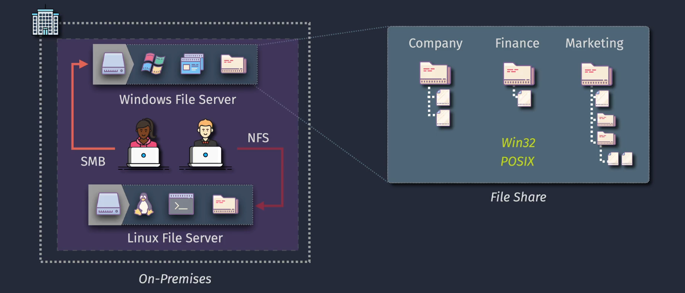
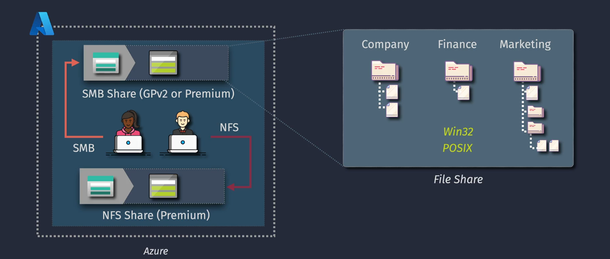
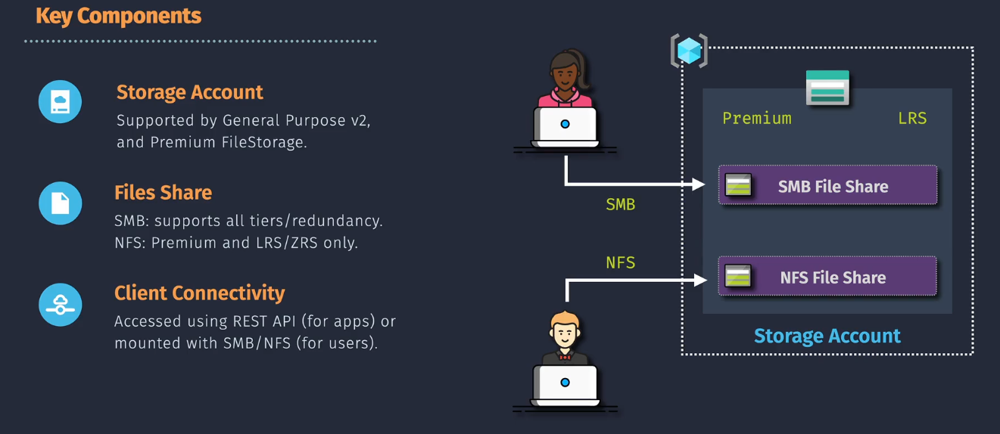
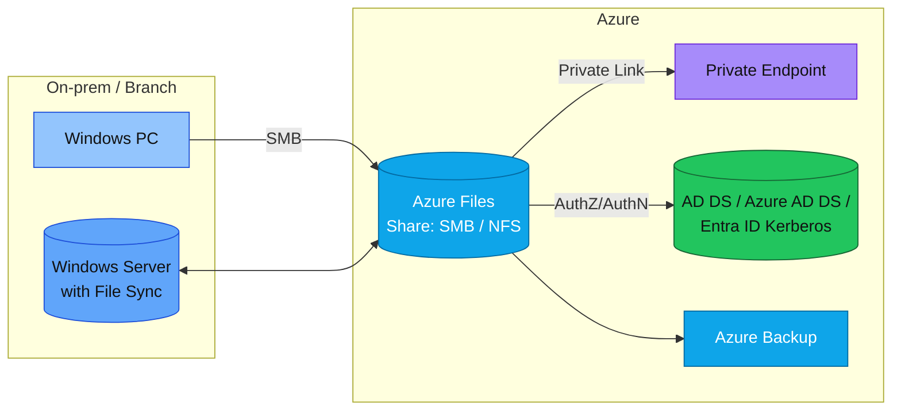
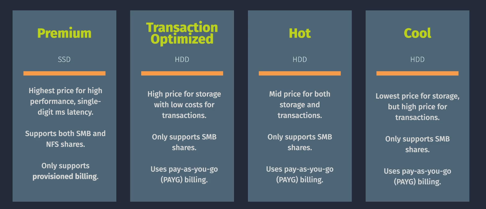

# 🗂️ **Azure Files** — the Cloud File Server

> 📖 **Official definition**: _“Azure Files offers fully managed file shares in the cloud accessible via SMB or NFS protocols, mountable concurrently by cloud or on-premises machines.”_

---

## 💡 **What is it?**

**Azure Files** gives you **fully managed** **SMB/NFS** file shares in Azure.
Mount it like a network drive from Windows/Linux/macOS, or hit it via REST/SDKs. No servers, no patches, no RAID tears.

---

## ✨ **Core Features**

- **Protocols:** It is Support **SMB 2.1/3.x** (Win/Linux/macOS) & **NFS 4.1** (Linux; premium FileStorage shares).
- **Mountable:** Map as a drive on VMs or on-prem devices.
- **Scale:** Shares up to **100 TiB**, millions of files.
- **Performance tiers:**

  - **Premium (SSD / FileStorage)** → low latency, high IOPS (AVD/FSLogix, databases, CAD).
  - **Standard**:

    - **Transaction Optimized** (balanced)
    - **Hot** (read/write often)
    - **Cool** (cheap + infrequent access)

---

## 🏢 **On-Premises** vs ☁️ **Azure File Server**

### 🖥️ **On-Premises File Server**

<div style="text-align:center;">

</div>

- Requires **hardware (servers, SAN/NAS)** and **software licenses (Windows Server, CALs)**.
- Ongoing costs for **maintenance, power, cooling, and staff**.
- **Scaling up** means buying more hardware.
- Backups and DR (disaster recovery) = extra tools, effort, \$\$\$.

### ☁️ **Azure File Server**

<div style="text-align:center;">

</div>

- **No hardware** → Azure manages it.
- **Pay as you go** → scale capacity & performance dynamically.
- **Built-in redundancy** → your data is safe across zones/regions.
- **Hybrid-ready** → integrate with on-prem via **Azure File Sync**.

💡 Imagine retiring your old rack of file servers 🔌 and instead having a **global, elastic file share** that’s always available.

---

## 🔑 **Key Components**

<div style="text-align:center;">

</div>

---

1. **📦 Storage Account**

   - The foundation. Every Azure Files share lives inside a storage account.
   - Defines redundancy (LRS, ZRS, GRS).
   - Controls how data is replicated.

2. **📁 File Shares**

   - The actual **network shares** (`\\server\share`).
   - You mount them on VMs or on-prem servers.
   - Support **SMB & NFS**.

3. **🛜 Client Connectivity**

   - **REST API**
   - **Mount with SMB/NFS**

---

## 🔐 **Security**

Azure Files security works in layers:

### 1. **📌 Encryption**

- **At rest** → Always encrypted by Storage Service Encryption (SSE).
- **In transit** → SMB 3.x encryption or TLS for NFS.

### 2. **📌 Authentication**

- **Storage Account Keys** (not recommended, too powerful).
- **Azure AD / Entra ID integration** → Kerberos authentication, no secrets exposed.
- **AD DS / AAD DS NTLM/kerberos** for hybrid identity.

### 3. **📌 Authorization**

- **NTFS ACLs**: File/folder permissions like normal Windows shares.
- **Share-level RBAC**: Role-based access at the share scope.

### 4. **📌 Networking**

- **Public endpoint with firewalls**.
- **Private Endpoints** (recommended) → Only accessible inside your VNet.

---

## 🔄 **Backup & Disaster Recovery**

- **Snapshots**: Point-in-time backups, instant restore of single files/folders.
- **Azure Backup**: Centralized protection, policy-based.
- **Geo-Redundancy**: Failover to another region.

---

## 🌍 **Hybrid with Azure File Sync**

This is where Azure Files really becomes interesting for enterprises.

### **👉🏻 Without File Sync:**

- If you move to Azure Files directly, your office users in London/NYC/Tokyo all mount the same cloud share over WAN. Latency hurts.

### **👉🏻 With File Sync:**

- You keep **local file servers** at each branch.
- Azure File Sync makes them act like a **cache** → hot files stay local, cold files offloaded to Azure.
- Users still see the full folder structure, but rarely used files only download when needed (“cloud tiering”).

---

## 🧪 **Hands-On Examples**

### 🪟 **Mount on Windows (SMB)**

```powershell
# Map Z: drive using a storage key (automation-friendly)
$acct   = "mystorageacct"
$share  = "teamshare"
$key    = "<STORAGE-ACCOUNT-KEY>"

cmd /c "net use Z: \\$acct.file.core.windows.net\$share /u:$acct $key /persistent:yes"
```

### 🐧 **Mount on Linux (SMB)**

```bash
sudo mkdir -p /mnt/teamshare
sudo mount -t cifs //mystorageacct.file.core.windows.net/teamshare /mnt/teamshare \
  -o vers=3.0,username=mystorageacct,password='<STORAGE-ACCOUNT-KEY>',serverino,dir_mode=0770,file_mode=0660
```

### 🐧 **Mount on Linux (NFS 4.1, Premium FileStorage)**

```bash
sudo mkdir -p /mnt/premium-nfs
sudo mount -t nfs -o rw,soft,timeo=600,retrans=2 \
  mystorageacct.privatelink.file.core.windows.net:/mystorageacct/mynfsshare /mnt/premium-nfs
```

### 🛠️ **Create a Share (CLI)**

```bash
# Standard account
az storage share-rm create \
  --resource-group rg1 --storage-account mystorageacct \
  --name teamshare --quota 1024  # GiB

# Premium (FileStorage) - provision capacity drives IOPS/throughput
az storage share-rm create \
  --resource-group rg1 --storage-account mystoragepremium \
  --name avdprofiles --access-tier Premium --quota 5120
```

---

## ⚖️ **Azure Files vs. Blob Storage** (when to choose what)

| Capability      | **Azure Files** 🗂️                     | **Blob Storage** 🫙                        |
| --------------- | -------------------------------------- | ----------------------------------------- |
| Protocols       | SMB / NFS / REST                       | REST (Blobfuse for POSIX-like)            |
| Mount as drive  | ✅ Native                              | ⚠️ Blobfuse only (user-mode)              |
| Directory model | Real folders + NTFS ACLs               | Flat namespace (ADLS Gen2 adds hierarchy) |
| Best for        | Lift-and-shift shares, AVD, app shares | Cloud-native apps, data lake, backups     |

---

## 🧭 **Architecture at a Glance**



---

## 🧾 **Sizing & Tiers**

Azure Files offers **different performance tiers** to balance **cost, performance, and use cases**. These tiers help you decide whether you need **super-fast SSDs** ⚡ or **cost-efficient HDDs** 💰 depending on how often you access your files.

---

<div style="text-align:center;">

</div>

---

### 1️⃣ **Premium Tier** 💎 (SSD-based)

- **What it is**: Uses **SSD disks** for **high-performance** and **low latency** (single-digit milliseconds).
- **Cost**: **Most expensive** tier, but gives the **fastest speed**.
- **Protocols**: Supports **both SMB and NFS** shares.
- **Billing**: Only **provisioned billing** (you reserve capacity up-front, not pay-as-you-go).

✅ **Best for**:

- Databases needing **fast I/O** (like SQL or SAP).
- Virtual machines that need **low-latency file access**.
- Applications where **speed > cost**.

**Example**:
Running a **financial trading app** where milliseconds matter ⏱️. Premium ensures you don’t lose performance due to slow storage.

---

### 2️⃣ **Transaction Optimized Tier** 🔄 (HDD-based)

- **What it is**: HDD-based tier with **higher storage cost** but **low transaction (per operation) cost**.
- **Cost**: Good if you perform **lots of read/write operations**.
- **Protocols**: Supports **only SMB**.
- **Billing**: Uses **Pay-As-You-Go (PAYG)** billing.

✅ **Best for**:

- Apps with **frequent transactions** (read/write).
- Workloads where transaction cost matters more than storage size.

**Example**:
An **ERP system** with thousands of small file changes daily. Here, reducing transaction cost saves more money than reducing storage cost.

---

### 3️⃣ **Hot Tier** 🔥 (HDD-based)

- **What it is**: HDD storage with **mid-range cost** for both storage and transactions.
- **Cost**: Balanced (not too high, not too low).
- **Protocols**: Supports **only SMB**.
- **Billing**: Uses **Pay-As-You-Go (PAYG)**.

✅ **Best for**:

- Frequently accessed files 📂.
- Collaboration & team file sharing.
- General-purpose workloads.

**Example**:
A **shared folder for your dev team** where everyone frequently uploads/downloads code, docs, and images.

---

### 4️⃣ **Cool Tier** ❄️ (HDD-based)

- **What it is**: HDD storage with the **lowest cost for storage** but **high transaction costs**.
- **Cost**: Cheap to keep files stored, expensive if you constantly access them.
- **Protocols**: Supports **only SMB**.
- **Billing**: Uses **Pay-As-You-Go (PAYG)**.

✅ **Best for**:

- Data that is rarely accessed.
- Archival or compliance storage.
- Backup storage.

**Example**:
Old **HR documents** or **legal contracts** that must be kept for 7+ years for compliance reasons but are almost never opened.

---

### 📊 **Comparison Table**

| Tier                         | Disk Type | Cost 💰 | Performance ⚡        | Protocols | Best Use Case                         |
| ---------------------------- | --------- | ------- | --------------------- | --------- | ------------------------------------- |
| **💎 Premium**               | SSD       | Highest | Lowest latency        | SMB + NFS | Databases, high-performance apps      |
| **🔄 Transaction Optimized** | HDD       | High    | Good for frequent ops | SMB       | ERP, apps with many small writes      |
| **🔥 Hot**                   | HDD       | Medium  | Balanced              | SMB       | Team shares, frequently accessed data |
| **❄️ Cool**                  | HDD       | Lowest  | Higher latency        | SMB       | Backup, archives, compliance          |

---

### 📝 **Key Notes**

- Only **Premium supports NFS**, others only support SMB.
- Premium requires **provisioned billing**, others are **PAYG**.
- Choose **Hot** if files are **actively used**; choose **Cool** if files are **rarely touched**.

---

## 🧰 **Typical Use Cases**

- **Lift-and-shift**: Replace aging NAS/Windows file servers.
- **AVD / FSLogix**: Premium shares for user profiles.
- **Shared app data**: Config, reports, media libraries.
- **Branch offices**: Azure File Sync + cloud tiering.
- **Linux engineering workloads**: NFS 4.1 premium shares.

---

## 🛡️ **Best Practices**

- Enforce **SMB encryption** + **minimum SMB version**.
- Use **Private Endpoints**; disable public network access if possible.
- Prefer **AD-based auth** + NTFS ACLs over storage keys for users.
- Enable **Defender for Storage** + **Azure Backup**.
- For hybrid, deploy **Azure File Sync** with **cloud tiering**.
- For AVD/FSLogix, go **Premium** (SSD) and keep an eye on IOPS.

---

## 🧠 **Quick Troubleshooting**

- **Access denied:** Check both **share RBAC** _and_ **NTFS ACLs**.
- **Slow performance:** Wrong tier? SMB vs NFS? Premium sizing too small? Network path using Internet instead of **Private Link**?
- **Mount fails on Linux (SMB):** Ensure `cifs-utils`, `vers=3.0`, and DNS/PE routing are correct.
