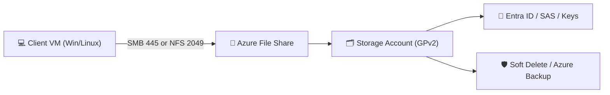

# 📁 Demo: Creating an Azure File Share

Azure File Share = **cloud SMB/NFS share** you can mount on **Windows, Linux, or macOS** just like a network drive.

---

## 🛠️ Step 1: Create a Storage Account

1. Go to **Azure Portal** → `+ Create a resource` → **Storage account**.
2. Fill the fields:

   - **Subscription**: Choose your sub.
   - **Resource group**: Select or create new.
   - **Storage account name**: Unique, lowercase (e.g., `myfilestorage2025`).
   - **Region**: Closest to your VMs or users.
   - **Performance**:

     - _Premium_ → SSD, high IOPS (best for enterprise).
     - _Standard_ → HDD, cheaper.

   - **Redundancy**: Choose (LRS/ZRS/GRS/RA-GRS).

3. ✅ Click **Review + Create** → then **Create**.

> ⚠️ Requirement: File shares only work with **General-purpose v2 (GPv2)** `storage accounts.`

---

## 🛠️ Step 2: Create the File Share

1. Open your **Storage Account**.
2. From the left panel → **Data storage** → **File shares**.
3. Click `+ File share`.
4. Configure:

   - **Name**: e.g., `myfileshare`.
   - **Quota** (optional): e.g., 100 GB (prevents runaway usage).
   - **Tier**:

     - _Transaction Optimized_ → default.
     - _Hot_ → frequent access.
     - _Cool_ → infrequent access.
     - _Premium_ → SSD, max performance.

5. ✅ Click **Create**.

---

## 🛠️ Step 3: Connect the File Share

Azure generates **ready-to-use scripts** for connecting.

### ▶️ Windows (SMB)

1. Open your File Share → click **Connect** → choose **Windows**.
2. Copy the PowerShell script:

   ```powershell
   net use Z: \\myfilestorage2025.file.core.windows.net\myfileshare /user:Azure\myfilestorage2025 <storage-account-key>
   ```

3. Run in **PowerShell**.
4. 🎉 You’ll see a new **Z: drive** mapped to Azure Files.

---

### ▶️ Linux (SMB)

```bash
sudo mkdir /mnt/myfileshare
sudo mount -t cifs //myfilestorage2025.file.core.windows.net/myfileshare /mnt/myfileshare \
  -o vers=3.0,username=myfilestorage2025,password=<storage-account-key>,dir_mode=0777,file_mode=0777,serverino
```

---

### ▶️ Linux (NFS – if enabled)

```bash
sudo mkdir /mnt/myfileshare
sudo mount -t nfs myfilestorage2025.file.core.windows.net:/myfileshare /mnt/myfileshare -o vers=4,sec=sys
```

⚠️ Requirements for NFS:

- **Port TCP 2049** must be open.
- Works only over **Private Endpoints / VNet** (no public Internet).

---

## 🛡️ Key Considerations

- **Authentication**:

  - Prefer **Azure AD DS / Entra ID** over access keys.
  - Use **SAS tokens** for limited/time-bound access.

- **Networking**:

  - SMB uses **TCP 445** (may be blocked by ISPs).
  - NFS uses **TCP 2049** (requires Private Endpoint).

- **Security**:

  - Enable **Private Endpoints** for internal access.
  - Use **Azure Backup** + **soft delete** for protection.

- **Performance**:

  - Premium tier for heavy workloads.
  - Standard tier for general storage.
  - Use **Azure File Sync** for hybrid on-prem + cloud scenarios.

---

## 🌍 Visual Overview



---

## ✅ Quick Recap

1. **Create GPv2 storage account**.
2. **Add File Share** (name, quota, tier).
3. **Mount it** from Windows/Linux via SMB or NFS.
4. **Secure it** with AD, SAS, private endpoints, and backup.
