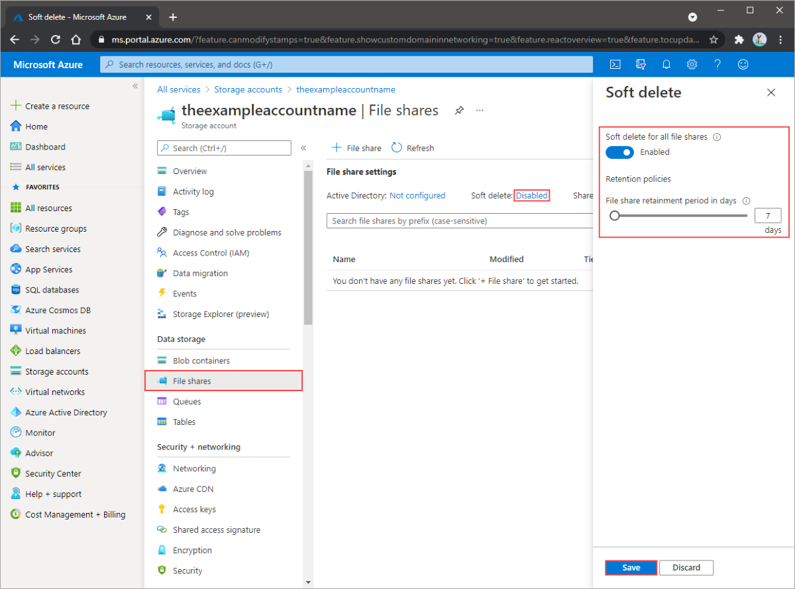

# 🛡️ Azure Files — Snapshots & Backup

Azure Files offers **two levels of data protection**:

1. **Snapshots** → Point-in-time copies of a file share (within the same storage account).
2. **Backup (Azure Backup)** → A managed, policy-driven protection solution that stores file share backups in a separate vault with additional security and retention.

Both can be used together depending on your **business continuity and disaster recovery (BCDR)** needs.

---

## 📸 **1. Snapshots**

A **snapshot** is a **read-only, point-in-time copy** of a file share.

### 🔑 Characteristics

- **Incremental** → only changed blocks are stored, making snapshots space-efficient.
- **Instant** → created in seconds, regardless of share size.
- **Same account** → snapshots live in the same storage account as the file share.
- **Granular recovery** → restore a single file, folder, or entire share.
- **Billing** → only changed data consumes additional capacity.

### 📂 How Snapshots Work

- Every time you take a snapshot → Azure stores metadata + differences from previous snapshot.
- Files that haven’t changed don’t consume extra space.
- You can **browse snapshots** via:

  - Azure portal.
  - Windows Explorer (if SMB-mounted).
  - REST API.

### ⚡ Use Cases

- Quick **point-in-time protection**.
- Protect against **accidental deletions or modifications**.
- **Short-term retention** (hours/days).

### ⚠️ Limitations

- Stored **in the same storage account** (not geo-redundant).
- Vulnerable to accidental/malicious deletion of the storage account.
- Retention management must be **manual**.

---

## ♻️ **2. Azure Backup for Azure Files**

Azure Backup provides **centralized, automated protection** for Azure Files with **policy-based backup and long-term retention**.

### 🔑 Characteristics

- **Independent backups** → stored in a **Recovery Services Vault (RSV)** separate from the storage account.
- **Policy-driven** → define schedules (daily/hourly) and retention (days/months/years).
- **Secure** → soft delete protection, vault-level security, and role-based access.
- **Application-consistent** → ensures backups integrate smoothly with workloads.
- **Granular restore** → recover a file, folder, or full share.

### ⚡ Benefits

- **Protection against accidental deletion** → even if file share/storage account is deleted, backups remain safe in RSV.
- **Compliance** → long-term retention policies (up to 10 years).
- **Centralized monitoring** → across multiple subscriptions/accounts.
- **Zero infrastructure** → fully managed by Azure.

### 🔒 Security Features

- **Soft Delete for Backups** → keeps backups for 14 days even after deletion requests.
- **MFA (Multi-Factor Auth) protection** for critical operations (e.g., stopping protection, deleting backups).
- **Immutable backups** → cannot be altered or deleted by ransomware or malicious insiders.

---

## ⚡ **Snapshots vs Azure Backup**

| Feature                              | Snapshots             | Azure Backup                   |
| ------------------------------------ | --------------------- | ------------------------------ |
| **Location**                         | Same storage account  | Recovery Services Vault        |
| **Retention**                        | Manual, short-term    | Policy-based, long-term        |
| **Granularity**                      | File, folder, share   | File, folder, share            |
| **Protection from account deletion** | ❌ No                 | ✅ Yes                         |
| **Management**                       | Manual scripts/portal | Centralized policies           |
| **Use Case**                         | Quick, local rollback | Enterprise backup & compliance |

---

## 🔄 **Recovery Scenarios**

### 1. **File-Level Restore**

- Accidentally deleted/modified a file.
- Browse snapshots/backups → restore single file.

### 2. **Folder Restore**

- Ransomware encrypts a folder.
- Restore from snapshot (fast) or backup (more secure).

### 3. **Full Share Restore**

- Corruption spreads across share.
- Use Azure Backup → restore entire share to a new one.

### 4. **Disaster Recovery**

- Storage account deleted or region outage.
- Azure Backup ensures data exists in **vault**, independent of account.

---

## 🛠️ Implementation Steps (Azure Backup for Azure Files)

1. **Create a Recovery Services Vault (RSV)** in the Azure portal.
2. **Register the storage account** hosting the file share.
3. **Configure backup policy**:

   - Frequency: Daily/Hourly.
   - Retention: Days → Months → Years.

4. **Enable Backup** → Azure starts protecting the file share.
5. **Monitor & Restore** via:

   - Azure portal.
   - PowerShell/CLI.
   - REST API.

---

## ✅ Best Practices

- Use **snapshots** for **short-term operational recovery**.
- Use **Azure Backup** for **long-term compliance & DR**.
- Enable **Soft Delete** for file shares (14-day grace period).
- Combine with **Azure RBAC** & **Entra ID-based access control** for layered security.
- Regularly test **restore scenarios** → don’t wait for real incidents.

---

💡 **Quick Recap:**

- **Snapshots = quick & cheap rollback inside same storage account.**
- **Azure Backup = enterprise-grade, policy-driven, secure, long-term protection.**
- Best practice: **Use both together** — snapshots for fast restores + backups for compliance and DR.

## 🗑️ **3. Soft Delete**

Azure Files offers soft delete for file shares. Soft delete lets you recover deleted files and file shares.

  

---

### 🌟 **Characteristics**

- Soft delete for file shares is enabled at the file share level.

- Soft delete transitions content to a soft deleted state instead of being permanently erased.

- Soft delete lets you configure the retention period. The retention period is the amount of time that soft deleted file shares are stored and available for recovery.

- Soft delete provides a retention period between 1 and 365 days.

- Soft delete can be enabled on either new or existing file shares.
