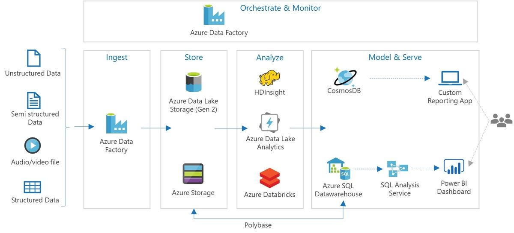
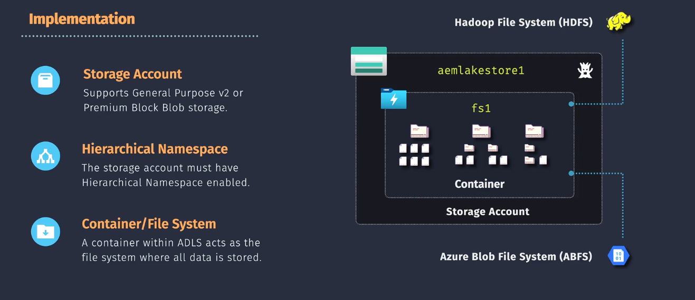
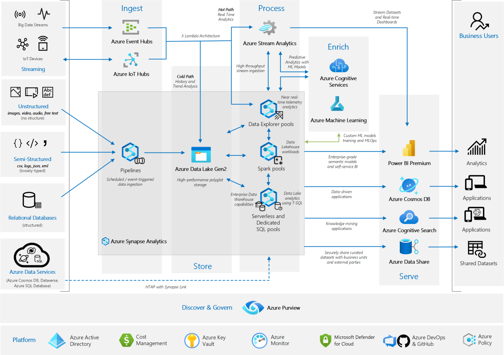

# 🌊 Azure Data Lake Storage (ADLS)

## 🎯 What It Is

**Azure Data Lake Storage (ADLS)** is a **scalable, secure, and cost-efficient data repository** designed to **store and analyze massive amounts of data** — both **structured (like tables)** and **unstructured (like logs, images, videos, JSON files)**.

👉 Think of it as a **giant, organized folder system in the cloud**, optimized for **big data analytics**.

---

## 📖 Official Definition

> **Azure Data Lake Storage** is an **enterprise-grade storage** built on top of **Azure Blob Storage**, enhanced with:
>
> - 🗂️ Hierarchical folder structure
> - 🔐 Fine-grained access control
> - ⚙️ Integration with big data tools (**Spark**, **Databricks**, **Synapse**, etc.)

So basically — **Blob Storage + analytics power = ADLS** 💪

---

<div style="text-align:center; background-color:#ffff; border-radius: 10px;">

</div>

---

## 🛠️ Key Features

<div style="text-align:center;">

</div>

---

## 🏗️ Architecture Overview

<div style="text-align:center;">

</div>

### 🧩 Components:

1. **Data Sources:**

   - On-prem files, IoT data, logs, databases, SaaS apps, etc.

2. **ADLS (the heart ❤️):**

   - Stores raw, processed, and curated data in layers.

3. **Analytics & ML Tools:**

   - Tools like **Azure Databricks**, **Synapse**, **HDInsight** process the data.

4. **Visualization:**

   - Power BI dashboards consume curated datasets.

---

## 🪜 Two Generations of ADLS

| Version       | Description                                                            | Built On               | Used For                       |
| ------------- | ---------------------------------------------------------------------- | ---------------------- | ------------------------------ |
| **ADLS Gen1** | Legacy version with HDFS-like file system                              | Custom platform        | Deprecated                     |
| **ADLS Gen2** | Latest version (default) with Blob foundation + Hierarchical namespace | **Azure Blob Storage** | Big data + analytics workloads |

💡 Today, when you create **Storage Account → enable Hierarchical Namespace**, it becomes **ADLS Gen2**.

---

## 🧮 How Data Is Organized

ADLS uses a **multi-layered data structure** for clean processing:

| Layer            | Purpose                                 | Example Folder                  |
| ---------------- | --------------------------------------- | ------------------------------- |
| **Raw Zone**     | Stores unmodified source data           | `/raw/sensor_data/2025/10/09`   |
| **Staging Zone** | Temporary area for cleaning, validation | `/staging/sensor_data/cleaned/` |
| **Curated Zone** | Final, analytics-ready data             | `/curated/sales/aggregated/`    |

This is sometimes called a **Medallion Architecture** (Bronze → Silver → Gold).

---

## 💾 Hierarchical Namespace (the secret sauce)

Unlike normal Blob Storage (flat structure), ADLS has a **hierarchical namespace** —
it means it understands **folders and files** (like Windows or Linux).

✅ Benefits:

- Rename/move entire folders in one operation
- Directory-level security (ACLs)
- Faster operations for big data tools

---

## 🔐 Security Features

| Feature                | Description                                |
| ---------------------- | ------------------------------------------ |
| **Azure RBAC**         | Control who can manage the storage account |
| **POSIX-style ACLs**   | File/folder-level access control           |
| **Private Endpoints**  | Limit access to internal networks          |
| **Encryption**         | Data encrypted at rest and in transit      |
| **Managed Identities** | Secure app authentication without secrets  |

---

## ⚡ Integration Power (ADLS is everywhere!)

| Service                     | Purpose                                        |
| --------------------------- | ---------------------------------------------- |
| **Azure Synapse Analytics** | Query data directly from ADLS (serverless SQL) |
| **Azure Databricks**        | Perform ETL & machine learning on ADLS data    |
| **Azure Data Factory**      | Ingest and orchestrate pipelines               |
| **Power BI**                | Directly visualize curated datasets            |
| **Azure Machine Learning**  | Train models on data from the lake             |

---

## 🧠 Example: How a Company Uses ADLS

### Scenario:

A retail company collects:

- 🧾 POS transactions
- 🌐 Website click logs
- 📱 Mobile app telemetry

They:

1. **Ingest** all data → into **ADLS raw zone** using **Data Factory**
2. **Process** it → in **Azure Databricks** (clean, transform)
3. **Store** the refined output → in **curated zone**
4. **Query** it → in **Synapse** or **Power BI**

---

## 🔍 ADLS vs Blob Storage

| Feature                              | Azure Blob | ADLS Gen2 |
| ------------------------------------ | ---------- | --------- |
| Hierarchical folders                 | ❌ No      | ✅ Yes    |
| File/folder ACLs                     | ❌ No      | ✅ Yes    |
| Optimized for analytics              | ❌ No      | ✅ Yes    |
| Integration with Synapse, Databricks | ⚠️ Limited | ✅ Deep   |
| Rename/move operations               | Slow       | Fast      |

🟩 **If you enable Hierarchical Namespace in Blob → it becomes ADLS Gen2.**

---

## 💡 Quick CLI Example

```bash
# Create a storage account with hierarchical namespace
az storage account create \
  --name mystorageaccount \
  --resource-group myRG \
  --location eastus \
  --sku Standard_LRS \
  --kind StorageV2 \
  --hierarchical-namespace true
```

---

## 🏁 Summary Table

| Concept          | Description                                                |
| ---------------- | ---------------------------------------------------------- |
| **Purpose**      | Store and process massive data (structured & unstructured) |
| **Built On**     | Azure Blob Storage                                         |
| **Key Feature**  | Hierarchical namespace for folder/file management          |
| **Security**     | RBAC + ACLs + encryption                                   |
| **Integrations** | Synapse, Databricks, Data Factory, Power BI                |
| **Use Cases**    | Big data analytics, ML, IoT, ETL pipelines                 |

---

Would you like me to explain next how **Azure Synapse Analytics** directly connects to ADLS (for querying data using Serverless SQL and Spark)?
That’s the next natural step in mastering Azure Data Engineering and Migration.

---

## ❓ FAQs

## 📌 1. Is It Just Object Storage with Labels?

**No—it’s more than that. ADLS Gen2 offers a true hierarchical namespace.**

Let’s compare:

| Feature                     | Blob Storage (Flat Namespace) | ADLS Gen2 (Hierarchical Namespace)   |
| --------------------------- | ----------------------------- | ------------------------------------ |
| Structure                   | Key-value object store        | True folders and subfolders          |
| File operations             | No native rename/move         | Native rename, move, delete          |
| Performance for directories | Slower                        | Faster due to directory indexing     |
| Hadoop compatibility        | Limited                       | Full (via ABFS driver)               |
| Access control              | Container-level               | File/folder-level (POSIX-style ACLs) |

So yes—**ADLS Gen2 behaves like a real filesystem**, not just a tagged object store. You can:

- Create folders and subfolders like in Linux or Windows.
- Apply ACLs at the folder/file level.
- Rename/move files without rewriting the entire blob.

---

## 📌 2. Is Azure Data Lake Like Hadoop?

**Yes, conceptually—but with cloud-native enhancements.**

- Hadoop Distributed File System (HDFS) is designed for **distributed storage and processing** across clusters.
- Azure Data Lake Storage Gen2 (ADLS Gen2) is **Hadoop-compatible**, meaning tools like Spark, Hive, and Hadoop can read/write to it using the **ABFS driver**.
- But ADLS is **cloud-native**, scalable, and integrates with Azure security, monitoring, and analytics tools.

Think of ADLS Gen2 as **“HDFS-as-a-service”** with better integration, security, and cost control.

---

Excellent question, Hady—and you're thinking like a true cloud engineer. Here's the core idea:

---

## 📌 3. Does Azure “Move” the Data to Analyze It?

**No, it doesn’t move the data. It brings compute to the data.**

This is a key cloud-native principle: **“data gravity”** means large datasets are expensive and slow to move, so Azure services like Synapse, Databricks, and ADLA **mount or stream from ADLS Gen2 directly**, without copying.

---

### 🛠️ How Analysis Actually Happens

Let’s break it down by platform:

#### 1. **Azure Synapse Analytics**

- Uses **serverless SQL pools** or **Spark pools**.
- When you query ADLS, Synapse **streams data in chunks**, processes it in parallel, and returns results.
- No full import—just **on-demand scan and compute**.

#### 2. **Azure Databricks**

- Mounts ADLS Gen2 using **ABFS driver**.
- Spark jobs **read data in parallel from ADLS**, apply transformations, and write results back.
- You can cache data in memory for speed, but the source stays in ADLS.

#### 3. **Azure Data Lake Analytics (ADLA)**

- You submit a **U-SQL job**.
- ADLA **reads directly from ADLS**, applies logic across distributed compute units, and writes output to ADLS.
- No need to “install” anything—it's **serverless and ephemeral**.

#### 4. **HDInsight**

- You spin up a Hadoop/Spark cluster.
- It accesses ADLS as a native filesystem (via ABFS).
- Jobs run on the cluster, but **data stays in ADLS** unless explicitly copied.

---

### 🧠 Analogy: Remote Filesystem + Cloud Compute

Think of **Azure Data Lake Storage Gen2 (ADLS)** as a **remote filesystem**, and your analysis tools (Databricks, Synapse, etc.) as **cloud-hosted apps** that mount it and run compute jobs on top of it.

But unlike mounting a remote drive to your local machine, here’s what’s different:

### ⚙️ What Actually Happens

#### ✅ ADLS Gen2:

- Acts like a **distributed filesystem** with folders, files, and POSIX-style ACLs.
- Supports **ABFS driver** (Azure Blob File System) for Hadoop/Spark compatibility.

#### ✅ Analysis Tools:

- **Don’t install on your machine**—they run in Azure as **managed services**.
- They **mount ADLS Gen2** virtually (via ABFS or direct API access).
- They **stream or scan data in parallel**, apply transformations, and write results back.

---

### 🔍 Example: Azure Databricks

- You spin up a Spark cluster in Azure.
- It mounts ADLS Gen2 using:

  ```python
  dbutils.fs.mount(
    source = "abfss://mycontainer@myaccount.dfs.core.windows.net/",
    mount_point = "/mnt/datalake",
    extra_configs = {"fs.azure.account.auth.type": "OAuth"}
  )
  ```

- You run a job like:

  ```python
  df = spark.read.csv("/mnt/datalake/raw/sensor.csv")
  df.filter(df.temp > 80).groupBy("device").count().show()
  ```

- The data **never leaves ADLS**—Spark reads it in parallel, processes it, and writes results to another folder.

---

### 🧪 Summary

| Concept       | Local Analogy           | Azure Reality                               |
| ------------- | ----------------------- | ------------------------------------------- |
| Storage       | Remote drive            | ADLS Gen2 (cloud filesystem)                |
| Compute       | Installed software      | Cloud-native services (Databricks, Synapse) |
| Mounting      | SMB/NFS mount           | ABFS driver or REST API                     |
| Data movement | Reads from remote drive | Streams from ADLS, no full copy             |
| Execution     | On your CPU             | On Azure-managed clusters                   |

---

<div style="text-align:center; background-color:#ffff; border-radius: 10px;">

</div>
