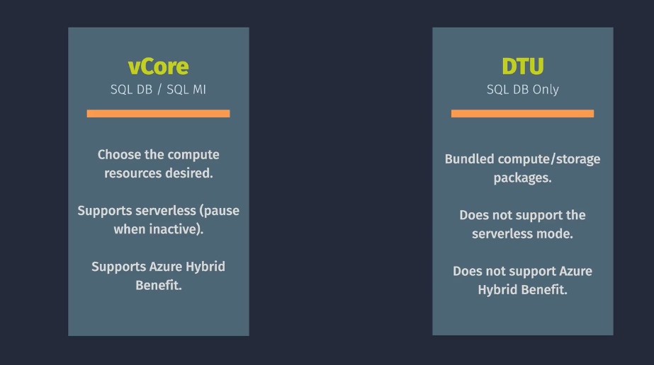

# 🧠 Azure SQL: Overview of Pricing Models and Service Tiers

Azure SQL offers two main purchasing models—**vCore** and **DTU**—and multiple **service tiers** to match performance, availability, and cost needs. You can deploy Azure SQL as:

- **Single Database**
- **Elastic Pool**
- **Managed Instance**

Let’s focus on the pricing and tier structure for **Single Database and Managed Instance**, using both **vCore** and **DTU** models.

---

## 💰 Purchasing Models

  

---

### 1. **vCore-Based Model** (Recommended)

- **vCore = virtual CPU core**; you choose compute, memory, and storage independently.
- Offers **greater transparency**, **predictable scaling**, and **license reuse** via **Azure Hybrid Benefit**.
- Two compute tiers:
  - **Provisioned**: Fixed resources, always-on.
  - **Serverless**: Auto-scales based on usage, pauses when idle (Single DB only).

  

---

---

### 2. **DTU-Based Model** (Legacy)

- **DTU = Database Transaction Unit**; bundles CPU, memory, and I/O.
- Simpler but less flexible.
- Good for small apps or predictable workloads.
- No support for serverless or Azure Hybrid Benefit.

  

---

## 🏷️ Service Tiers (vCore Model)

| Tier                  | Compute      | Storage                          | Backups                             | Availability                    | Best For                  |
| --------------------- | ------------ | -------------------------------- | ----------------------------------- | ------------------------------- | ------------------------- |
| **General Purpose**   | 2–128 vCores | Premium remote (1GB–4TB)         | Geo/zone/local (1–35d STR, 10y LTR) | Zone-redundant HA               | Balanced workloads        |
| **Business Critical** | 2–128 vCores | Local SSD (1GB–4TB)              | Geo/zone/local                      | 3 replicas + read-scale         | High IOPS, low latency    |
| **Hyperscale**        | 2–128 vCores | SSD cache + remote (100GB–100TB) | Geo/zone/local                      | Multiple replicas, fast restore | Large datasets, analytics |

---

## 🧱 Service Tiers (DTU Model)

| Tier         | Compute         | Storage      | Backups            | Availability                | Best For              |
| ------------ | --------------- | ------------ | ------------------ | --------------------------- | --------------------- |
| **Basic**    | Low CPU         | Up to 2GB    | 7d STR, 7d LTR     | One replica                 | Dev/test, small apps  |
| **Standard** | Low–High CPU    | 250GB–1024GB | 7–35d STR, 10y LTR | One replica + optional HA   | Business apps         |
| **Premium**  | Medium–High CPU | 500GB–4096GB | 7–35d STR, 10y LTR | Zone-redundant + read-scale | High-performance OLTP |

---

## ⚙️ Serverless vs Provisioned (vCore Only)

| Feature          | Serverless             | Provisioned         |
| ---------------- | ---------------------- | ------------------- |
| Auto-pause       | ✅                     | ❌                  |
| Auto-scale       | ✅                     | ❌                  |
| Cost during idle | Storage only           | Full compute        |
| Best for         | Intermittent workloads | Always-on workloads |

---

---

## 💸 Pricing Factors

- **vCore count**: More cores = higher cost.
- **Storage size and type**: Premium SSD vs remote.
- **Backup redundancy**: Geo-redundant costs more.
- **Region**: Prices vary by location.
- **License model**: Azure Hybrid Benefit can save ~40%.

Example (East US, Gen5):

- 4 vCores General Purpose: ~\$549/month
- 4 vCores Business Critical: ~\$704/month
- Hyperscale: Variable based on usage

---

## 🧪 Strategic Recommendations for You

- Use **vCore model** for flexibility and cost transparency.
- Start with **General Purpose tier** for modular projects.
- Consider **Serverless** for dev/test or low-traffic apps.
- Use **Business Critical** for latency-sensitive workloads.
- Use **Hyperscale** if showcasing large-scale analytics or fast restore.
