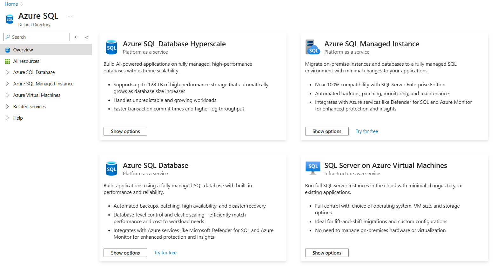
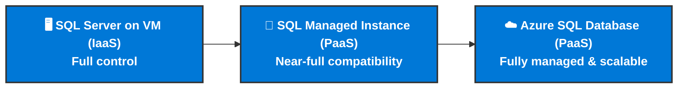
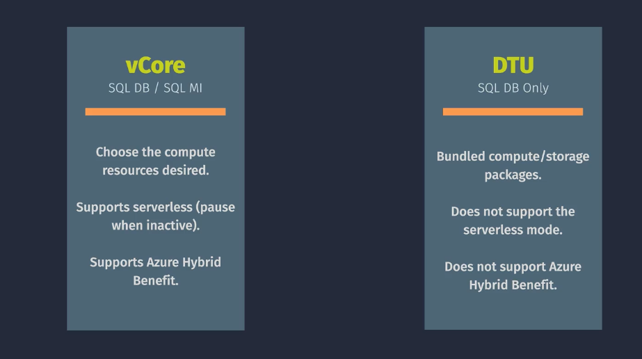
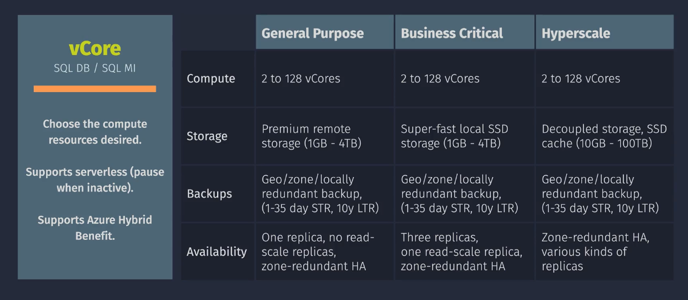
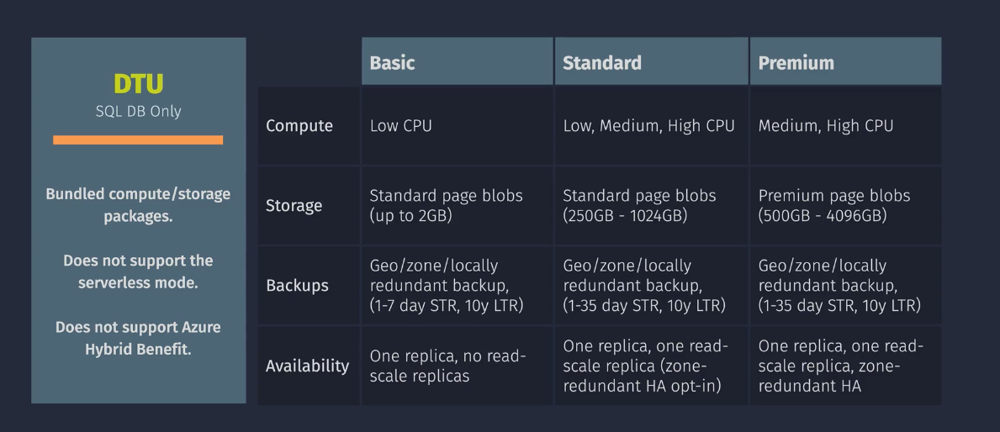

# ☁️ **Azure SQL Overview**

> 💡 _Your first step toward mastering every flavor of SQL in Azure._

---

## 🧠 What Is Azure SQL?

**Azure SQL** is not a single service — it’s a **family** of fully managed or partially managed **SQL Server–based offerings** built on the Microsoft Azure cloud.

They all use the **same SQL engine** as Microsoft SQL Server —
so your existing **T-SQL, stored procedures, and tools (like SSMS)** work without rewriting your code.

---

## 🧩 The Azure SQL Family

| Service                                | Type                   | Description                                                           | Best For                  |
| -------------------------------------- | ---------------------- | --------------------------------------------------------------------- | ------------------------- |
| 🖥️ **SQL Server on Azure VM**          | **IaaS**               | Full SQL Server instance running inside your own VM                   | Legacy apps, full control |
| 🏰 **Azure SQL Managed Instance (MI)** | **PaaS (almost full)** | Fully managed SQL instance with nearly 100% SQL Server compatibility  | Lift-and-shift workloads  |
| ☁️ **Azure SQL Database**              | **Pure PaaS**          | Individual database with automatic scaling, patching, HA, and backups | Modern cloud-native apps  |

---

  

---

## ⚙️ Management Responsibility Spectrum

| Feature            | SQL on VM           | Managed Instance | SQL Database                    |
| ------------------ | ------------------- | ---------------- | ------------------------------- |
| OS Management      | ✅ You              | ❌ Azure         | ❌ Azure                        |
| SQL Engine Updates | ✅ You              | ✅ Azure         | ✅ Azure                        |
| Backups            | ✅ You / IaaS Agent | ✅ Azure         | ✅ Azure                        |
| HA/DR              | ✅ Optional         | ✅ Built-in      | ✅ Built-in                     |
| Networking         | VNet / Public       | Private VNet     | Public / Private                |
| Elastic Scaling    | Manual              | Limited          | Automatic (serverless or pools) |

---

### 📊 Visual Summary

---

## 🧭 Choosing the Right Option

| Scenario                                      | Recommended Option                   |
| --------------------------------------------- | ------------------------------------ |
| Full control over OS & SQL                    | 🖥️ SQL Server on Azure VM            |
| Need full SQL compatibility + managed service | 🏰 SQL Managed Instance              |
| Modern apps with minimal maintenance          | ☁️ Azure SQL Database                |
| Many small DBs with shared resources          | ☁️ Azure SQL Database (Elastic Pool) |
| Migrate on-prem SQL with minimal change       | 🏰 SQL Managed Instance              |
| Require legacy SQL Agent jobs or SSRS         | 🖥️ SQL on VM                         |

---

## 🧠 Key Azure SQL Features (across all models)

| Category                | Description                                                                     |
| ----------------------- | ------------------------------------------------------------------------------- |
| **🔐 Security**         | Transparent Data Encryption (TDE), Always Encrypted, Threat Detection, Auditing |
| **🧾 Backup & Restore** | Automatic backups with configurable retention (up to 35 days)                   |
| **⚡ Performance**      | Intelligent tuning, serverless compute, Hyperscale support                      |
| **📈 Monitoring**       | Built-in performance insights via Azure Monitor, Log Analytics, and Query Store |
| **🧩 Integration**      | Works with Power BI, Azure Synapse, Azure Data Factory                          |
| **🧮 Scalability**      | Scale compute and storage independently (especially in vCore model)             |

---

## 💡 Quick Memory Trick

> 🧱 **SQL on VM** → “I do everything.”  
> 🏰 **Managed Instance** → “Azure does everything except my schema.”  
> ☁️ **SQL Database** → “I just write queries — Azure handles the rest.”

---

## 💰 Pricing Models

  

---

  

---

  

---

## ✅ Summary

| Concept                      | Summary                                            |
| ---------------------------- | -------------------------------------------------- |
| **Azure SQL Family**         | Unified group of SQL-based cloud services          |
| **Same Engine**              | All built on Microsoft SQL Server engine           |
| **Different Control Levels** | IaaS → PaaS → Serverless spectrum                  |
| **Fully Integrated**         | Security, backup, scaling, and monitoring built in |
| **Choose Based On**          | Your control, compatibility, and automation needs  |

---

## 📚 Next Topics in the Series

Here’s the roadmap we’ll follow to **master Azure SQL step-by-step** 🧭:

- 1️⃣ **Azure SQL Overview** ← _(you’re here)_
- 2️⃣ **SQL Server on Azure Virtual Machines (IaaS)**
- 3️⃣ **Azure SQL Managed Instance (PaaS)**
- 4️⃣ **Azure SQL Database (PaaS)**
- 5️⃣ **Azure SQL Logical Server & Elastic Pools**
- 6️⃣ **Azure SQL Security & Encryption (TDE, Always Encrypted)**
- 7️⃣ **Monitoring, Backup, and Restore in Azure SQL**
- 8️⃣ **Scaling and Performance Optimization (DTU vs vCore, Hyperscale)**
- 9️⃣ **Connectivity & Private Endpoints**
- 🔟 **Migration Paths (from on-prem SQL Server to Azure SQL)**
