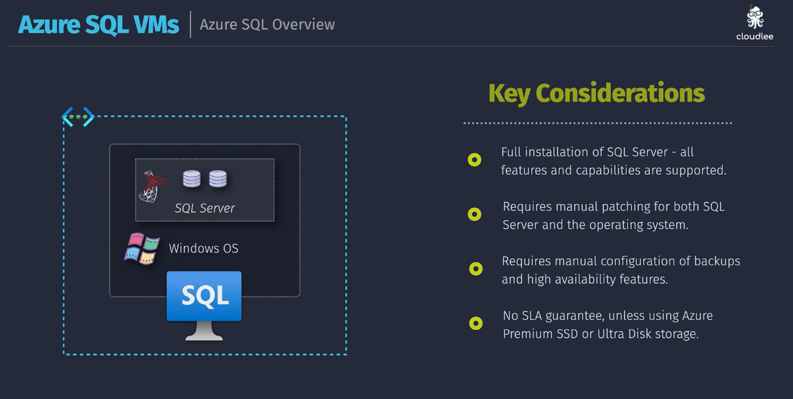
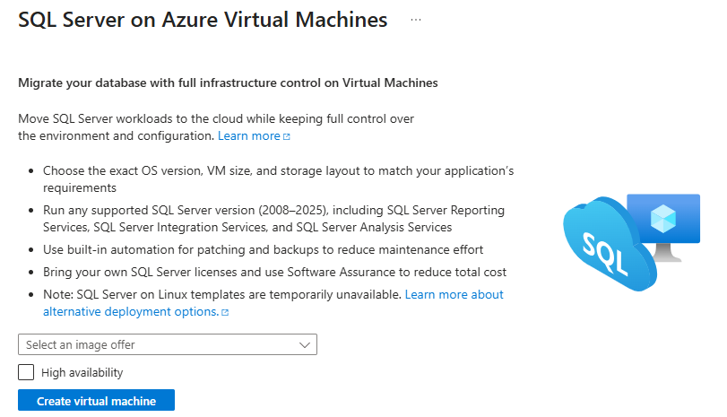
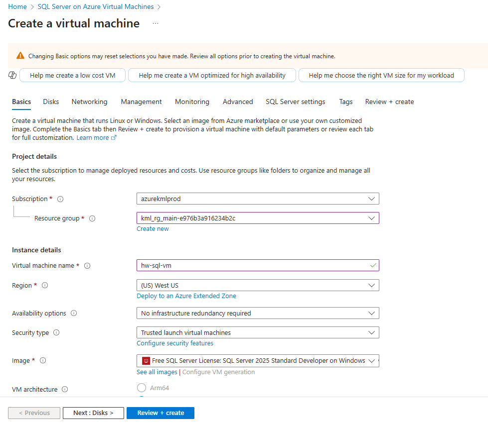
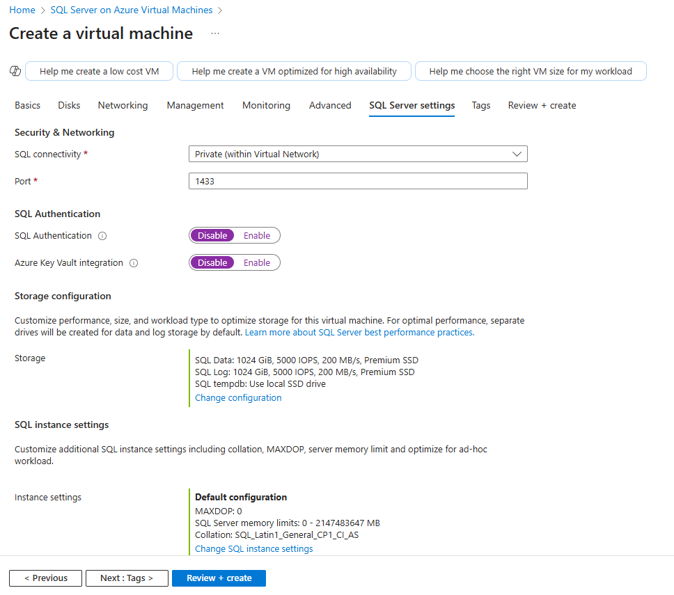
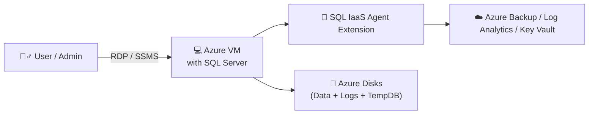

# 🖥️ **SQL Server on Azure Virtual Machines (IaaS)**

> 💡 _Full control like on-prem, with cloud-scale flexibility._

---

## 🧠 **Concept Summary**

**SQL Server on Azure Virtual Machines (IaaS)** =

- ✅ A **Virtual Machine** running in Azure +
- ✅ **SQL Server pre-installed** from the **Azure Marketplace**

You control the **OS, SQL settings, backups, performance tuning, and updates** —
while Azure manages the **hardware, storage, and networking**.

---

<div align="center" style="background-color: #242A3A ;border-radius: 10px;border: 2px solid white">
  
</div>

### 📊 Comparison Snapshot

<div align="center" style="background-color: #1b3f47ff; border-radius: 10px;">

| Aspect     | On-Prem SQL        | SQL on Azure VM           | Managed Instance | SQL Database |
| ---------- | ------------------ | ------------------------- | ---------------- | ------------ |
| OS Control | ✅ Full            | ✅ Full                   | ❌               | ❌           |
| Patching   | Manual             | You / Auto via IaaS Agent | Azure            | Azure        |
| Backup     | Manual             | You / Auto via IaaS Agent | Azure            | Azure        |
| HA/DR      | Manual             | You configure             | Built-in         | Built-in     |
| Cost Model | Hardware + License | Pay-as-you-go or BYOL     | PaaS pricing     | PaaS pricing |

</div>

---

## 🧱 **When to Choose SQL on Azure VM**

<div align="center" style="background-color: #1b3f47ff; border-radius: 10px;">

| Scenario                              | Why It Fits                                         |
| ------------------------------------- | --------------------------------------------------- |
| 🧩 **Lift-and-shift migration**       | You want same SQL environment in the cloud          |
| ⚙️ **Full SQL feature control**       | You use Agent jobs, SSIS, SSRS, linked servers      |
| 🧰 **Custom SQL or OS configuration** | You manage OS, SQL version, and tuning              |
| 🔄 **Hybrid integration**             | You need VPN, AD domain join, or complex networking |
| 💾 **Large data workloads**           | You control disk layout, caching, and storage tiers |

</div>

---

## ⚙️ **Step-by-Step**: Create SQL Server on Azure VM (Portal)

> 🎯 _We’ll deploy a VM with SQL Server preinstalled from the Marketplace._

---

### 1️⃣ Step — Go to Azure Marketplace

- In **Azure Portal**, select **Create a Resource → Compute → See all**
- Search for:

  ```ini
  SQL Server 2022 on Windows Server 2022
  ```

  or choose your preferred edition/version:

  - SQL Server 2019 / 2022
  - Standard / Enterprise / Web
  - Windows / Linux

💡 _These images come with the SQL IaaS Agent Extension by default._

---

### 2️⃣ Step — Basics Tab

<div align="center" style="background-color: #1b3f47ff; border-radius: 10px;">

| Setting                  | Description                                                            |
| ------------------------ | ---------------------------------------------------------------------- |
| **Subscription**         | Choose your Azure subscription                                         |
| **Resource Group**       | Existing or create new                                                 |
| **VM Name**              | e.g., `sql-prod-vm01`                                                  |
| **Region**               | Same as your other app resources                                       |
| **Availability Options** | Zone or Availability Set                                               |
| **Image**                | Choose SQL Server edition                                              |
| **VM Size**              | Choose CPU/RAM (e.g., D4s_v5 for mid workloads)                        |
| **Authentication Type**  | Password (Windows) or SSH (Linux)                                      |
| **Admin Credentials**    | Username & password                                                    |
| **Licensing**            | Pay-as-you-go or Azure Hybrid Benefit (if you already own SQL license) |

</div>

---

### 3️⃣ Step — Disks

<div align="center" style="background-color: #1b3f47ff; border-radius: 10px;">

| Setting          | Description                                       |
| ---------------- | ------------------------------------------------- |
| **OS Disk**      | Premium SSD recommended                           |
| **Data Disks**   | Add for data/log/tempdb separation                |
| **Host Caching** | ReadOnly for data; None for logs                  |
| **Storage Type** | Premium SSD or Ultra Disk for I/O-heavy workloads |

</div>

💡 Best Practice:

- Use **separate disks** for:

  - `C:` → OS
  - `F:` → Data (`.mdf`)
  - `G:` → Logs (`.ldf`)
  - `H:` → TempDB

---

### 4️⃣ Step — Networking

<div align="center" style="background-color: #1b3f47ff; border-radius: 10px;">

| Setting                | Description                                          |
| ---------------------- | ---------------------------------------------------- |
| **VNet/Subnet**        | Choose or create a new one                           |
| **Public IP**          | Optional (use Bastion for secure access)             |
| **NSG (Firewall)**     | Allow inbound port `1433` for SQL access if required |
| **NIC Security Group** | Restrict RDP (3389) to trusted IPs                   |

</div>

💡 _Use private IPs for internal access or Azure Bastion for secure RDP._

---

### 5️⃣ Step — SQL Server Settings (✨ Special Section)

This section appears **only** for SQL images.

<div align="center" style="background-color: #1b3f47ff; border-radius: 10px;">

| Setting                         | Description                              |
| ------------------------------- | ---------------------------------------- |
| **SQL Connectivity**            | Local / Private / Public                 |
| **SQL Port**                    | Default 1433                             |
| **Authentication**              | SQL + Windows / Azure AD                 |
| **Azure Key Vault Integration** | For TDE key management                   |
| **Automatic Patching**          | Enable to auto-patch OS + SQL            |
| **Automated Backup**            | Enable to store backups to Azure Blob    |
| **Backup Retention**            | 1–30 days                                |
| **Monitoring**                  | Enable telemetry to Log Analytics        |
| **SQL IaaS Agent Extension**    | Auto-installed for management automation |

</div>

---

### 6️⃣ Step — Management & Monitoring

<div align="center" style="background-color: #1b3f47ff; border-radius: 10px;">

| Feature           | Description                                    |
| ----------------- | ---------------------------------------------- |
| **Identity**      | Enable system-assigned managed identity        |
| **Diagnostics**   | Boot diagnostics and guest metrics             |
| **Auto-Shutdown** | Enable to save cost                            |
| **Tags**          | Apply consistent naming for billing visibility |

</div>

---

### 7️⃣ Step — Review + Create

- Validate → **Create**
- Deployment takes ~10 minutes ⏳
- VM is ready with SQL Server installed

---

<div align="center" style="background-color: #ffffffff ;border-radius: 10px;border: 2px solid white">
  
</div>

---

<div align="center" style="background-color: #ffffffff ;border-radius: 10px;border: 2px solid white">
  
</div>

---

<div align="center" style="background-color: #ffffffff ;border-radius: 10px;border: 2px solid white">
  
</div>

---

## 🧪 **Post-Deployment Configuration**

### 1. Connect to VM

- Use **Azure Bastion** or **RDP**
- Login with admin credentials

### 2. Verify SQL

- Open **SQL Server Management Studio (SSMS)**
- Confirm connection to `localhost`
- Check SQL services (SQL Server, SQL Agent)

### 3. Configure Firewall

- Allow inbound traffic on **port 1433** (Windows Firewall + NSG)
- Or use private endpoint only

### 4. Install / Verify SQL IaaS Agent Extension

- Go to:
  `VM → Extensions + Applications → SQLIaaSExtension`
- If missing, add manually (Marketplace → SQL IaaS Agent Extension)

---

## 🎁 **What Is the SQL IaaS Agent Extension?**

It’s a built-in agent that lets **Azure manage your SQL Server VM** more intelligently — without taking control away from you.

<div align="center" style="background-color: #1b3f47ff; border-radius: 10px;">

| Feature                       | Description                                     |
| ----------------------------- | ----------------------------------------------- |
| 🧩 **Automated Backup**       | Schedule and store in Blob storage              |
| ⚙️ **Patching Automation**    | Windows + SQL updates                           |
| 💰 **License Management**     | Toggle between PAYG and AHB                     |
| 📈 **Monitoring Integration** | Send SQL telemetry to Log Analytics             |
| 🧮 **Portal Management**      | View SQL configuration directly in Azure Portal |

</div>

---

## 📘 **Architecture Diagram**

<div align="center" style="background-color: #1b3f47ff; border-radius: 10px;">



</div>

---

## 💡 **Best Practices**

<div align="center" style="background-color: #1b3f47ff; border-radius: 10px;">

| Area           | Recommendation                                                        |
| -------------- | --------------------------------------------------------------------- |
| **Disks**      | Separate OS, Data, Log, TempDB disks                                  |
| **Backup**     | Use IaaS Agent with Blob Storage                                      |
| **Security**   | Use private IP + Azure Bastion (avoid public RDP)                     |
| **Patching**   | Enable automatic patching                                             |
| **HA/DR**      | Use Always On Availability Groups (AGs) or Failover Cluster Instances |
| **Monitoring** | Integrate with Azure Monitor or Log Analytics                         |

</div>

---

## 💬 **Comparison to On-Prem SQL**

<div align="center" style="background-color: #1b3f47ff; border-radius: 10px;">

| Category       | On-Prem          | Azure SQL VM                     |
| -------------- | ---------------- | -------------------------------- |
| Infrastructure | You buy hardware | Azure provides                   |
| Maintenance    | Manual           | Partially automated              |
| Backup         | Local / tape     | Azure Blob Storage               |
| Cost           | CapEx (hardware) | OpEx (pay-as-you-go)             |
| HA             | Manual setup     | Built-in Azure zones, AG support |

</div>

---

## 📚 **Summary**

<div align="center" style="background-color: #1b3f47ff; border-radius: 10px;">

| Concept                | Description                                          |
| ---------------------- | ---------------------------------------------------- |
| **What It Is**         | SQL Server running inside an Azure VM                |
| **Management Level**   | Full control (IaaS)                                  |
| **Key Differentiator** | SQL IaaS Agent for Azure integration                 |
| **Best For**           | Legacy apps, lift-and-shift workloads, full control  |
| **Next Step**          | Configure automatic backup, patching, and monitoring |

</div>
